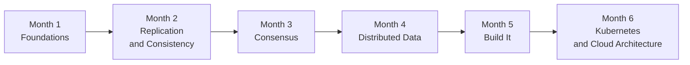
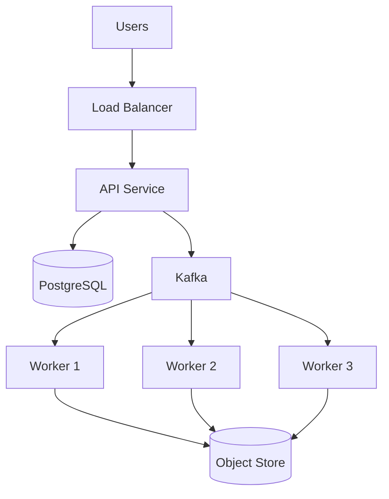

# Six-Month Roadmap

24 weeks at **8–10 hours per week**, roughly 220 hours total.

Each week has a theme, a set of concept notes to write, and at least one lab
or concrete artefact. A week is "done" when the notes have a written
**My Understanding** section and the lab has an **Actual Result** — not when
the reading is finished.

## Progress

| Month | Theme | Progress |
| --- | --- | --- |
| 1 | Foundations | `░░░░░░░░░░░░` 0% |
| 2 | Replication and Consistency | `░░░░░░░░░░░░` 0% |
| 3 | Consensus | `░░░░░░░░░░░░` 0% |
| 4 | Distributed Data Systems | `░░░░░░░░░░░░` 0% |
| 5 | Hands-on Distributed Systems | `░░░░░░░░░░░░` 0% |
| 6 | Kubernetes and Cloud Architecture | `░░░░░░░░░░░░` 0% |

---

## Month 1 — Foundations

Goal: acquire the vocabulary and the habit of thinking in terms of partial
failure.

### Week 1 — Distributed systems fundamentals

**Topics:** distributed system, partial failure, latency, throughput,
scalability, availability, reliability.

- Notes: `Distributed System`, `Partial Failure`, `Latency and Throughput`
- Lab: [01 — RPC](../04-Labs/01-RPC/README.md) (first half: get a working client/server)
- Reading: DDIA ch. 1; DDIA ch. 8 §"Faults and Partial Failures"

**Week is done when:** I can state, without notes, three things that can go
wrong in a two-process system that cannot go wrong in one process.

### Week 2 — RPC and the network

**Topics:** RPC, HTTP, gRPC, timeouts, retries, exponential backoff, jitter,
idempotency.

- Notes: `RPC`, `Timeouts and Retries`, `Idempotency`
- Labs: [01 — RPC](../04-Labs/01-RPC/README.md),
  [02 — Timeouts and Retries](../04-Labs/02-Timeouts-Retries/README.md)
- Reading: *Timeouts, retries and backoff with jitter* (AWS Builders' Library)

**Week is done when:** I can explain why naive retries make an overloaded
system worse, and I have measured it.

### Week 3 — Cloud computing fundamentals

**Topics:** VM, container, serverless, object storage, block storage,
managed services, the shared responsibility model.

- Notes: `Compute Models`, `Storage Models`
- Lab: deploy the same trivial service three ways (VM, container, serverless)
  and record cold-start, cost and operational burden for each
- Reading: cloud provider documentation for one provider, chosen and recorded
  in [Documentation](../07-Resources/Documentation.md)

### Week 4 — Cloud networking

**Topics:** VPC, subnets, routing, NAT, load balancing, DNS, security groups.

- Notes: `VPC and Subnets`, `Load Balancing`
- Lab: build a VPC with a public and a private subnet; put a service in the
  private subnet and reach it only through a load balancer
- **Review week:** re-read Weeks 1–3 `My Understanding` sections and fix them

---

## Month 2 — Replication and Consistency

Goal: understand what it costs to keep more than one copy of the data.

### Week 5 — Replication

**Topics:** replication, leader/follower, primary/replica, synchronous vs.
asynchronous replication, replication lag.

- Notes: `Replication`, `Database Replication`
- Lab: [04 — Replication](../04-Labs/04-Replication/README.md)
- Reading: DDIA ch. 5

### Week 6 — Consistency models

**Topics:** strong consistency, eventual consistency, linearizability,
causal consistency, read-your-writes.

- Notes: `Consistency Models`, `Linearizability`
- Lab: demonstrate a stale read against an async replica, then eliminate it
  with a read-your-writes strategy
- Reading: DDIA ch. 9 §"Linearizability"

### Week 7 — CAP and partitions

**Topics:** CAP theorem, network partitions, split brain, availability under
partition, PACELC.

- Notes: `CAP Theorem`
- Lab: partition a two-node cluster with firewall rules and record what each
  side believes about the world
- Reading: Kleppmann, *A Critique of the CAP Theorem*

### Week 8 — Quorums

**Topics:** read quorum, write quorum, majority, `w + r > n`, sloppy quorums.

- Notes: `Quorum`
- Lab: work out and then verify the quorum arithmetic for a 3- and 5-node
  cluster, including what happens at exactly half
- **Review week**

---

## Month 3 — Consensus

Primary course: **MIT 6.5840 Distributed Systems** —
<https://pdos.csail.mit.edu/6.5840/>

### Week 9 — Failure detection and leader election

**Topics:** heartbeats, failure detectors, terms/epochs, fencing tokens,
leases.

- Notes: `Leader Election`, `Failure Detection`
- Lab: [05 — Leader Election](../04-Labs/05-Leader-Election/README.md)

### Week 10 — Raft

**Topics:** Raft elections, log replication, commit index, majorities,
safety properties.

- Notes: [Raft](../03-Concepts/Distributed-Systems/Consensus/Raft.md),
  `Replicated Log`
- Reading: Ongaro & Ousterhout, *In Search of an Understandable Consensus
  Algorithm* (the extended version)
- Course: 6.5840 Lab 3A (leader election)

### Week 11 — Failure recovery

**Topics:** snapshots, persistent state, log compaction, node restart,
catching up a lagging follower.

- Notes: `Failure Recovery`
- Course: 6.5840 Lab 3B (log replication) and 3C (persistence)

### Week 12 — Consolidate

Implement or finish a small consensus/replication experiment end to end and
write it up properly.

- Write the ADR for the consensus approach used in the Month 5 project
- **Review week:** all of Month 3

---

## Month 4 — Distributed Data Systems

### Week 13 — Transactions

**Topics:** ACID, isolation levels, MVCC, write-ahead logging.

- Notes: `ACID`, `MVCC`, `Write-Ahead Log`
- Lab: reproduce a lost update and a write skew in PostgreSQL, then fix each
  with the correct isolation level
- Reading: DDIA ch. 7

### Week 14 — Partitioning and distributed transactions

**Topics:** sharding, partitioning strategies, rebalancing, two-phase commit,
saga pattern.

- Notes: `Sharding and Partitioning`, `Two-Phase Commit`
- Lab: shard a table by hash and by range; measure a query that crosses shards
- Reading: DDIA ch. 6 and ch. 9 §"Distributed Transactions"

### Week 15 — Messaging

**Topics:** queues, pub/sub, Kafka, topics, partitions, consumer groups,
offsets, ordering guarantees.

- Notes: `Queues and Pub-Sub`, `Kafka`
- Lab: [06 — Kafka Delivery](../04-Labs/06-Kafka-Delivery/README.md)
- Reading: Kafka documentation, "Design" and "Implementation" sections

### Week 16 — Delivery semantics

**Topics:** at-most-once, at-least-once, exactly-once, idempotent consumers,
the transactional outbox.

- Notes: `Message Delivery Semantics`, `Outbox Pattern`
- Labs: [03 — Idempotency](../04-Labs/03-Idempotency/README.md), finish
  [06 — Kafka Delivery](../04-Labs/06-Kafka-Delivery/README.md)
- **Review week**

---

## Month 5 — Hands-on Distributed Systems

Build the [Distributed Job Platform](../05-Projects/Distributed-Job-Platform/README.md).
Everything from Months 1–4 gets used or exposed as not-actually-understood.

### Week 17 — API and persistence

Job submission API, PostgreSQL schema, job state machine, migrations.
Deliverable: a job can be submitted, stored and queried.

### Week 18 — Kafka and workers

Producer in the API, consumer group of workers, results written to object
storage. Deliverable: a submitted job is executed asynchronously.

### Week 19 — Retries, idempotency and failure handling

Idempotency keys, retry with exponential backoff and jitter, dead-letter
topic, the outbox pattern for the write-to-DB-and-publish problem.
Deliverable: killing a worker mid-job loses no work and duplicates no
side effects.

### Week 20 — Observability and failure testing

Structured logs, RED metrics, distributed tracing across API → Kafka →
worker. Then [07 — Failure Testing](../04-Labs/07-Failure-Testing/README.md):
inject latency, packet loss and process kills, and record what breaks.

---

## Month 6 — Kubernetes and Cloud Architecture

### Week 21 — Kubernetes architecture

**Topics:** API server, scheduler, controller manager, etcd, kubelet,
desired vs. observed state, reconciliation.

- Notes: `Kubernetes Control Plane`, `etcd`, `Reconciliation`
- Lab: run a local cluster, read `etcd` directly, and watch the scheduler
  place a pod

### Week 22 — Distributed systems inside Kubernetes

**Topics:** watches and resource versions, controller patterns, leader
election in controllers, level-triggered vs. edge-triggered logic, eventual
consistency of the control plane.

- Notes: `Controllers and Operators`
- Lab: write a tiny controller that reconciles a ConfigMap; kill it mid-loop
  and confirm it converges anyway

### Week 23 — Cloud reliability

**Topics:** high availability, availability zones, multi-region, backups,
disaster recovery, RPO, RTO.

- Notes: `High Availability`, `Disaster Recovery`
- Lab: define RPO/RTO for the Month 5 project, then actually restore it from
  a backup and time the restore

### Week 24 — Capstone

- Full architecture review of the Distributed Job Platform
- Write the remaining ADRs in [06-Architecture/ADRs](../06-Architecture/ADRs/README.md)
- Write the capstone document: what was built, what failed, what I would do
  differently
- Re-read every `My Understanding` section written in the last six months and
  correct what is now visibly wrong

---

## What "done" looks like at week 24

- [ ] A running distributed job platform with documented failure behaviour
- [ ] MIT 6.5840 labs through Raft persistence
- [ ] ~40 concept notes, each with a written **My Understanding** section
- [ ] 7 labs with recorded predictions and actual results
- [ ] A set of ADRs explaining every significant design decision
- [ ] A published site that a colleague could learn from
