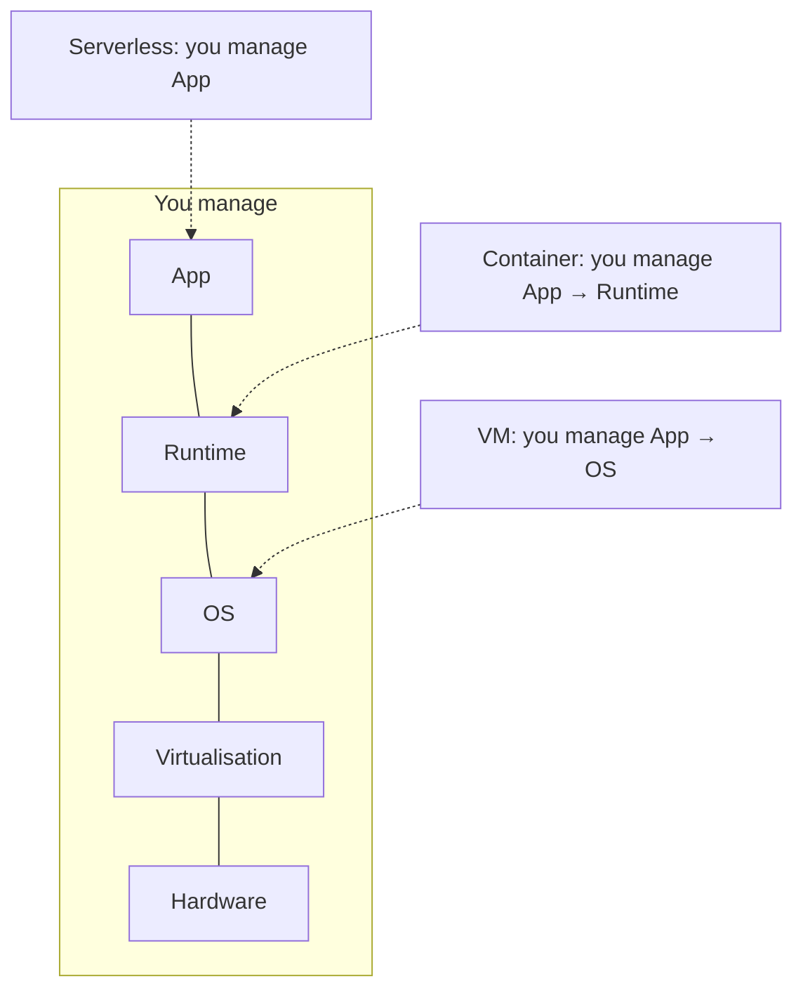

# Compute Models

## Learning Goals

- [ ] Compare VMs, containers and serverless on isolation, startup and cost
- [ ] Explain what the provider operates in each model
- [ ] Choose a model for a given workload and defend the choice

## What Is It?

The unit in which the cloud sells execution.

| Model | Isolation | Cold start | Billing | You operate |
| --- | --- | --- | --- | --- |
| **Bare metal** | Physical | Minutes | Per hour/month | Everything above the hardware |
| **VM** | Hypervisor | ~30 s | Per second, while running | OS, patching, scaling |
| **Container** | Kernel namespaces + cgroups | ~1 s | Per second (or per pod) | Image, orchestration |
| **Serverless / FaaS** | MicroVM (Firecracker) or sandbox | 100 ms – few s | Per request + GB-second | Function code only |

## Why Does It Matter?

The model determines what you are responsible for at 3 a.m. Moving up the list
trades control and predictability for operational surface area. The
**shared responsibility model** is the formal version: the provider secures
*of* the cloud, you secure *in* the cloud, and the line moves with the model.

## Core Concepts

- **Cold start** — the latency of creating an execution environment. Decisive
  for latency-sensitive, spiky workloads
- **Scale to zero** — serverless costs nothing when idle; a VM costs the same
  at 3 a.m. as at peak
- **Right-sizing** — most cloud overspend is oversized instances, not bad
  architecture
- **Spot/preemptible** — 60–90% cheaper, can be reclaimed with ~2 minutes'
  notice. Excellent for the job platform's workers, unusable for its database
- **Stateless vs. stateful** — every model above assumes the compute is
  disposable; state must live elsewhere

## Failure Scenarios

| Failure | Consequence | Mitigation |
| --- | --- | --- |
| Instance terminated | In-flight work lost | Idempotent, retryable jobs; graceful shutdown handlers |
| Spot reclamation | Sudden capacity loss | Mixed instance policy; drain on the 2-minute warning |
| Cold start on a latency path | p99 spikes | Provisioned concurrency, or do not use FaaS there |
| Noisy neighbour | Unpredictable performance | Dedicated instances for latency-critical work |
| AZ outage | Whole zone gone | Spread across AZs — see [High Availability](../Reliability/High%20Availability.md) |

## Real-World Systems

- AWS: EC2, ECS/EKS/Fargate, Lambda
- GCP: Compute Engine, GKE, Cloud Run, Cloud Functions
- Azure: VMs, AKS, Container Apps, Functions

## Hands-on Experiment

Week 3: deploy the same trivial HTTP service as a VM, a container and a
function. Record cold-start latency, p99 under load, monthly cost at 1 req/s
and at 1000 req/s, and the number of things you had to configure.

## My Understanding

> Sources closed. Explain when serverless is more expensive than a VM, and why.

## Questions

- [ ] Which compute model fits the job platform's workers? What about its API?
- [ ] Are spot instances viable for the workers given the retry design?

## Related Concepts

- [Storage Models](../Storage/Storage%20Models.md)
- [High Availability](../Reliability/High%20Availability.md)
- [Kubernetes Control Plane](../../Kubernetes/Architecture/Kubernetes%20Control%20Plane.md)

## Resources

- [AWS Well-Architected Framework](https://docs.aws.amazon.com/wellarchitected/latest/framework/welcome.html)
- [Firecracker: Lightweight Virtualization for Serverless Applications](https://www.usenix.org/conference/nsdi20/presentation/agache) (NSDI 2020)
