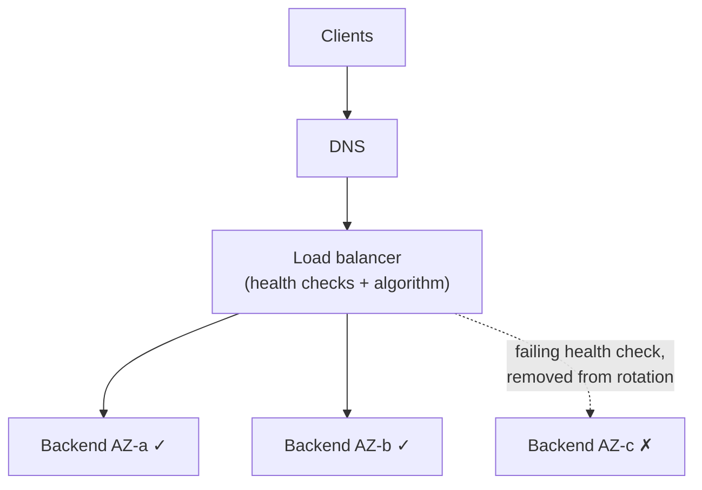

# Load Balancing

## Learning Goals

- [ ] Compare L4 and L7 load balancing and say when each is required
- [ ] Explain why round-robin is often the wrong algorithm
- [ ] Describe how health checks can amplify an outage

## What Is It?

Distributing incoming requests across multiple backends to gain capacity and
availability.

| Layer | Operates on | Can do | Cannot do |
| --- | --- | --- | --- |
| **L4** (TCP/UDP) | Connections | Very high throughput, low latency, any protocol | Route by path/header, retry a request |
| **L7** (HTTP) | Requests | Path/header routing, TLS termination, retries, per-request balancing | Match L4 throughput; needs to parse the protocol |

An important practical consequence: **L4 balances connections, not requests**.
With HTTP/2 or gRPC, one long-lived connection carries thousands of requests,
so an L4 balancer will pin all of them to one backend. gRPC behind an L4
balancer is a recurring production surprise, and the fix is L7 (or client-side)
balancing.

## Algorithms

| Algorithm | Behaviour | Watch out for |
| --- | --- | --- |
| Round robin | Even distribution of requests | Ignores backend load; a slow backend gets its full share |
| **Least connections** | Prefers the least busy | Usually the better default |
| **Least request / EWMA** | Uses observed latency | Best general choice; what Envoy defaults toward |
| Consistent hash | Same key → same backend | Cache affinity; hot keys become hot backends |
| Random with two choices | Pick 2, use the lesser loaded | Nearly as good as least-connections, far cheaper |

## Health checks

- **Liveness** — is the process alive? Failing means restart it
- **Readiness** — can it serve *right now*? Failing means take it out of
  rotation, but leave it running
- **Deep vs. shallow** — a deep check exercises dependencies and detects gray
  failure; it also removes *every* backend when a shared dependency blips.
  Most load balancers therefore implement **fail-open**: if all backends are
  unhealthy, send traffic anyway, because serving something beats serving
  nothing

## Failure Scenarios

| Failure | Consequence | Mitigation |
| --- | --- | --- |
| All backends fail a deep health check | Total outage from a dependency blip | Fail-open; shallow readiness checks |
| Backend removed while holding requests | Dropped in-flight work | Connection draining / graceful shutdown |
| Load balancer in one AZ | Single point of failure | Multi-AZ, DNS with multiple records |
| Slow backend still marked healthy | Tail latency; retries pile on | Outlier detection, latency-aware algorithms |
| Sticky sessions with a dead backend | Those users hard-fail | Externalise session state |
| DNS caching after failover | Clients keep hitting a dead IP | Low TTLs; do not rely on DNS for fast failover |

## Real-World Systems

- AWS ALB (L7), NLB (L4); GCP Cloud Load Balancing (global anycast)
- Envoy, HAProxy, NGINX — and Envoy as the data plane of most service meshes
- Kubernetes Service (L4, via kube-proxy) and Ingress/Gateway API (L7)

## Hands-on Experiment

Put three backends behind a load balancer; make one respond in 2 s while the
others take 10 ms. Compare p99 under round-robin and under least-request.

## My Understanding

> Sources closed. Explain why a load balancer that removes unhealthy backends
> can turn a small problem into a total outage.

## Questions

- [ ] Does the job platform's API need L7, or is L4 sufficient?
- [ ] What should the readiness check touch — and what must it *not* touch?

## Related Concepts

- [Latency and Throughput](../../Distributed-Systems/Fundamentals/Latency%20and%20Throughput.md)
- [High Availability](../Reliability/High%20Availability.md)
- [VPC and Subnets](VPC%20and%20Subnets.md)
- [Failure Detection](../../Distributed-Systems/Fault-Tolerance/Failure%20Detection.md)

## Resources

- [AWS Builders' Library: Implementing health checks](https://aws.amazon.com/builders-library/implementing-health-checks/)
- [Envoy: Load balancing](https://www.envoyproxy.io/docs/envoy/latest/intro/arch_overview/upstream/load_balancing/overview)
- Mitzenmacher, *The Power of Two Choices in Randomized Load Balancing*
