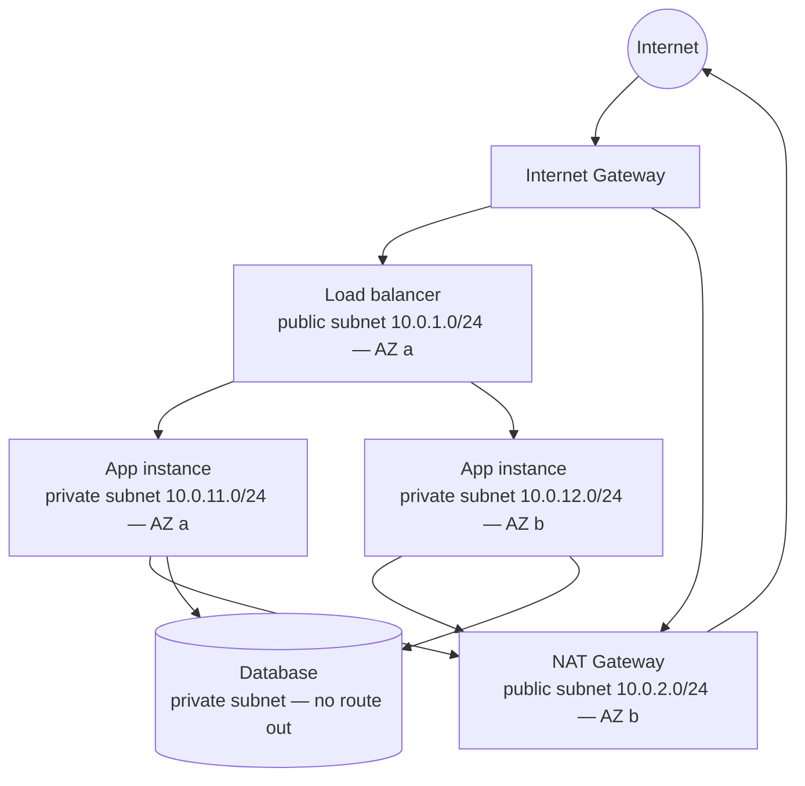

# VPC and Subnets

## Learning Goals

- [ ] Explain what makes a subnet public rather than private
- [ ] Trace a packet from the internet to a private instance and back
- [ ] Distinguish security groups from network ACLs

## What Is It?

A **VPC** is a logically isolated network inside a cloud region, with an
address range you choose (e.g. `10.0.0.0/16`). It is divided into **subnets**,
each living in exactly one **availability zone**.

The definition that matters: **a subnet is public if its route table has a
route to an internet gateway.** Nothing else. There is no "public" checkbox
that means anything else.

## Core Concepts

- **Route table** — per subnet; decides where traffic for a destination goes
- **Internet gateway** — bidirectional internet access for public subnets
- **NAT gateway** — *outbound only* for private subnets. Instances can reach
  the internet; the internet cannot reach them. Billed per hour **and per GB**,
  and is a classic surprise cost
- **Security group** — stateful firewall attached to an instance/ENI. Return
  traffic is automatically allowed. Allow rules only
- **Network ACL** — stateless firewall attached to a subnet. Return traffic
  needs an explicit rule. Allow *and* deny rules
- **VPC endpoints / Private Link** — reach cloud services without traversing
  the internet or a NAT gateway; often removes the NAT bill entirely
- **CIDR planning** — the VPC range cannot be shrunk later, and overlapping
  ranges make future peering impossible. Plan for growth on day one

## Failure Scenarios

| Failure | Symptom | Fix |
| --- | --- | --- |
| Private subnet with no NAT and no endpoint | Instances cannot pull packages or reach APIs | NAT gateway or VPC endpoint |
| NAT gateway in one AZ only | AZ failure takes out all egress | One NAT per AZ |
| Overlapping CIDRs | VPC peering impossible | Plan address space up front |
| Security group allows `0.0.0.0/0` on 22/3389 | Directly exposed to the internet | Bastion/SSM; never open management ports |
| Subnet too small | Cannot launch instances; no room to grow | Size subnets generously — addresses are free |
| Database in a public subnet | Internet-reachable data store | Private subnets, no route to IGW |

!!! danger "Never put a database in a public subnet"
    A security group is one misconfiguration away from exposure. A private
    subnet with no route to an internet gateway is a structural guarantee, not
    a rule that can be accidentally relaxed.

## Real-World Systems

AWS VPC, GCP VPC (global, with regional subnets — a genuine architectural
difference), Azure VNet.

## Hands-on Experiment

Week 4: build a VPC with public and private subnets across two AZs, put a
service in the private subnet, expose it only via a load balancer, and confirm
you cannot reach the instance directly. Then remove the NAT gateway and observe
exactly what breaks.

## My Understanding

> Sources closed. Explain the difference between a security group and a NACL,
> and when the stateless behaviour of a NACL bites.

## Questions

- [ ] What is the monthly NAT gateway cost for the job platform's traffic?
- [ ] Which VPC endpoints would remove most of that cost?

## Related Concepts

- [Load Balancing](Load%20Balancing.md)
- [High Availability](../Reliability/High%20Availability.md)
- [Compute Models](../Compute/Compute%20Models.md)

## Resources

- [AWS VPC documentation](https://docs.aws.amazon.com/vpc/latest/userguide/what-is-amazon-vpc.html)
- [Google Cloud VPC overview](https://cloud.google.com/vpc/docs/vpc)
