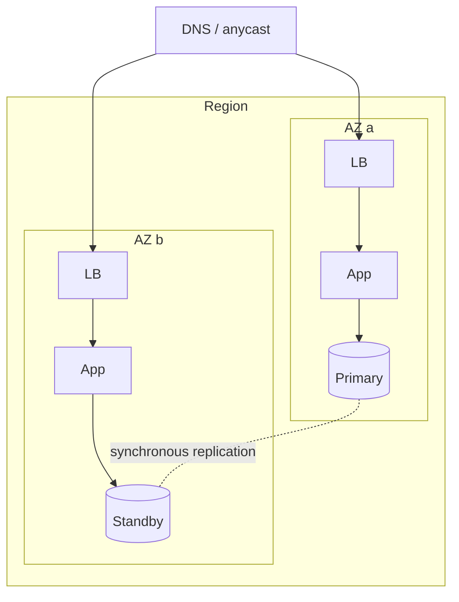

# High Availability

## Learning Goals

- [ ] Translate a nines target into a monthly error budget
- [ ] Explain why dependencies multiply and what that implies
- [ ] Distinguish availability from durability and from reliability

## What Is It?

The property that a system continues to serve despite component failure.
Achieved by removing single points of failure, detecting failure, and failing
over — all three, or none of it works.

## The arithmetic

| Availability | Downtime per year | Per month | Per week |
| --- | --- | --- | --- |
| 99% | 3.65 days | 7.3 h | 1.7 h |
| 99.9% | 8.8 h | 43.8 min | 10.1 min |
| 99.95% | 4.4 h | 21.9 min | 5.0 min |
| 99.99% | 52.6 min | 4.4 min | 1.0 min |
| 99.999% | 5.3 min | 26 s | 6 s |

**Serial dependencies multiply.** A service that requires five dependencies,
each 99.9% available, is at most `0.999^5 ≈ 99.5%` — 3.6 hours of downtime a
month before its own code has failed once. This is the single most useful piece
of arithmetic in availability design, and it argues for fewer hard
dependencies rather than more nines on each.

**Redundancy adds nines.** Two independent components each 99% available, where
either suffices, give `1 - 0.01² = 99.99%` — *if* the failures really are
independent. Shared power, shared network, shared control plane and shared bad
config all break that assumption.

## Core Concepts

- **Availability zone** — independent power, cooling and network within a
  region; the primary unit of redundancy. Low enough latency for synchronous
  replication
- **Region** — geographically separate; cross-region synchronous replication is
  usually too slow, so multi-region normally means async and an
  [RPO](Disaster%20Recovery.md) greater than zero
- **N+1 vs. 2N** — spare capacity for one failure, versus a full second copy
- **Graceful degradation** — serve a reduced experience rather than an error
- **Error budget** — `1 − SLO`. It is a *budget*: unspent budget means you are
  shipping too slowly, not that you are doing well
- **Blast radius** — cells, shuffle sharding and bulkheads limit how much of
  the system one failure can take with it

## Failure Scenarios

| Failure | Effect | Mitigation |
| --- | --- | --- |
| Single AZ outage | Loss of that AZ's capacity | Multi-AZ with capacity headroom for N−1 |
| Correlated failure (bad deploy) | Redundancy does not help — all replicas are identical | Canary, staged rollout, fast rollback |
| Failover never tested | It does not work when needed | Game days; regular forced failover |
| Capacity sized for N | Losing one AZ overloads the rest | Size for N−1 |
| Control plane dependency in the failure path | Cannot recover during a provider incident | Static stability: pre-provision, avoid needing the control plane to fail over |

!!! warning "Redundancy assumes independent failure"
    Three replicas running the same buggy release fail simultaneously. Most
    large outages are correlated failures, not component failures, which is why
    deployment practice matters as much as topology.

## Real-World Systems

- AWS Multi-AZ RDS: synchronous standby with automated failover
- Kubernetes: pod anti-affinity, topology spread constraints, PodDisruptionBudgets
- Cell-based architectures at AWS and Slack for blast-radius reduction

## Hands-on Experiment

Deploy across two AZs, then terminate every instance in one AZ and measure: how
long until traffic recovers, how many requests failed, whether the remaining
AZ had enough capacity.

## My Understanding

> Sources closed. Explain why adding a dependency can reduce availability even
> if that dependency is more available than your service.

## Questions

- [ ] What SLO does the job platform need, and what error budget does that give?
- [ ] Which of its dependencies are in the critical path, and which are optional?

## Related Concepts

- [Disaster Recovery](Disaster%20Recovery.md)
- [Load Balancing](../Networking/Load%20Balancing.md)
- [Replication](../../Distributed-Systems/Replication/Replication.md)
- [CAP Theorem](../../Distributed-Systems/Consistency/CAP%20Theorem.md)

## Resources

- [Google SRE Book](https://sre.google/sre-book/table-of-contents/), ch. 3–4
- [AWS Builders' Library: Static stability using Availability Zones](https://aws.amazon.com/builders-library/static-stability-using-availability-zones/)
