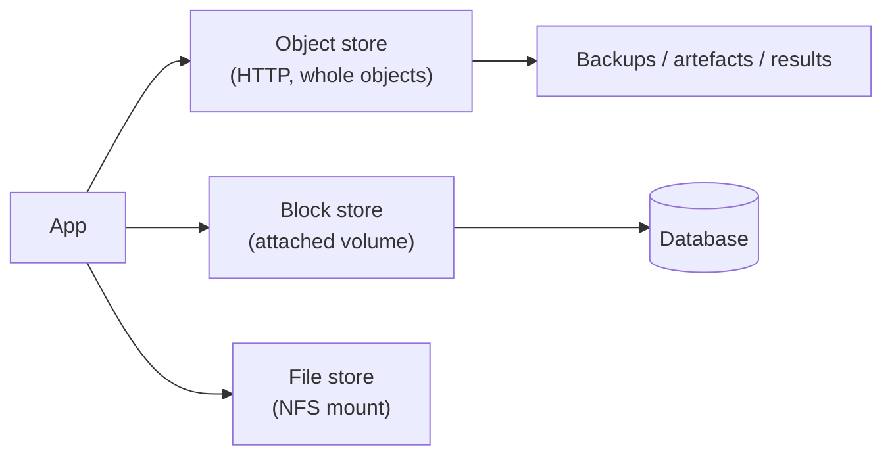

# Storage Models

## Learning Goals

- [ ] Compare object, block and file storage and pick correctly
- [ ] Explain object storage's consistency and durability guarantees
- [ ] Explain why egress and request counts, not capacity, dominate cost

## What Is It?

| Model | Unit | Access | Good for | Bad for |
| --- | --- | --- | --- | --- |
| **Object** (S3, GCS) | Whole object + key | HTTP API | Blobs, backups, logs, static assets, data lakes | Partial updates, low latency, POSIX |
| **Block** (EBS, PD) | Fixed-size blocks | Attached device | Databases, filesystems | Sharing across many hosts |
| **File** (EFS, Filestore) | Files in a hierarchy | NFS/SMB | Shared state, lift-and-shift | Cost, and latency at scale |

## Object storage properties worth knowing

- **Immutable objects.** There is no partial write: you replace the whole
  object. Appending means read-modify-write or multipart upload
- **Extremely durable, less available.** S3 advertises 11 nines of durability
  and ~4 nines of availability. *Durable* means the bytes are not lost;
  *available* means you can reach them right now. They are different promises
- **Strongly consistent** for reads after writes (S3 since 2020); older designs
  were eventually consistent, and a great deal of folklore predates the change
- **Flat namespace.** "Folders" are a UI fiction over key prefixes; listing is
  a prefix scan and is slow over millions of keys
- **Storage classes.** Hot/cool/archive tiers trade retrieval latency and cost.
  Archive retrieval can take hours — which is an
  [RTO](../Reliability/Disaster%20Recovery.md) constraint, not a detail

## Cost model

Capacity is usually the smallest line. The ones that surprise people:

- **Egress** — data leaving the cloud, or crossing regions, is billed heavily
- **Request counts** — millions of small `GET`s cost more than the bytes
- **Early deletion fees** on archive tiers
- **Cross-AZ traffic** — often billed even inside one region

## Failure Scenarios

| Failure | Consequence | Mitigation |
| --- | --- | --- |
| Object store unavailable | Reads/writes fail | Retry with backoff; degrade gracefully |
| Accidental deletion | Data gone | Versioning + MFA delete; lifecycle rules |
| Volume tied to one AZ | AZ outage takes the volume with it | Snapshots; multi-AZ database |
| Millions of keys under one prefix | Slow listing | Design key layout; maintain an index elsewhere |
| Unbounded growth | Runaway cost | Lifecycle policies, retention |

## Real-World Systems

S3, GCS, Azure Blob; EBS, Persistent Disk; EFS, Filestore. MinIO for a local
S3-compatible store — useful for the Month 5 project.

## Hands-on Experiment

Write 10,000 small objects and 10 large objects of the same total size to a
local MinIO. Compare wall-clock time, then compare the request counts a cloud
provider would bill.

## My Understanding

> Sources closed. Explain why "11 nines of durability" does not mean the
> service is never down.

## Questions

- [ ] Where should the job platform's job results live, and with what lifecycle?
- [ ] What is the egress cost if workers run outside the storage's region?

## Related Concepts

- [Compute Models](../Compute/Compute%20Models.md)
- [Disaster Recovery](../Reliability/Disaster%20Recovery.md)
- [Consistency Models](../../Distributed-Systems/Consistency/Consistency%20Models.md)

## Resources

- [AWS S3: Data consistency model](https://docs.aws.amazon.com/AmazonS3/latest/userguide/Welcome.html)
- [MinIO documentation](https://min.io/docs/minio/linux/index.html)
