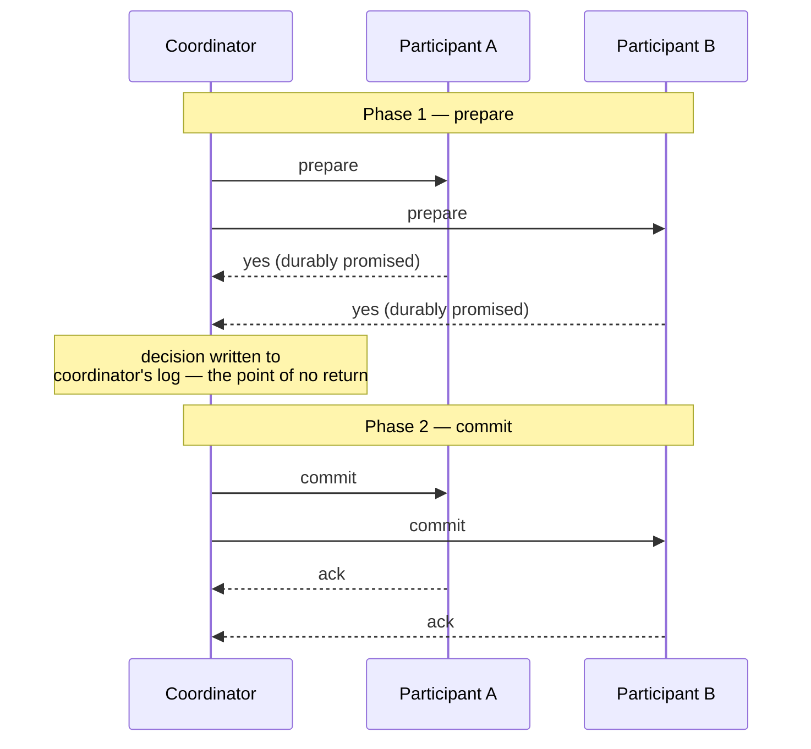

# Two-Phase Commit

## Learning Goals

- [ ] Trace both phases and identify the exact blocking window
- [ ] Explain why 2PC is a blocking protocol and consensus is not
- [ ] Describe the saga pattern and what it gives up

## What Is It?

An atomic commit protocol across multiple participants. A coordinator asks
every participant to *prepare*; if all vote yes, it tells them all to *commit*.

The critical property: once a participant votes **yes** it has given up the
right to abort unilaterally. It must hold its locks and wait, however long
that takes.

## Why Does It Matter?

2PC is the textbook way to make a write span two systems — the database and the
message broker, for example. It is also the reason most architectures avoid
needing that in the first place: it is a **blocking** protocol with a single
point of failure.

## The blocking problem

If the coordinator crashes after collecting votes but before broadcasting the
decision, participants are stuck **in doubt**. They cannot commit (the decision
may have been abort) and cannot abort (it may have been commit). They hold
locks until the coordinator returns. This is not a tuning problem; it is
inherent to the protocol.

The standard fix is to make the coordinator itself fault-tolerant with
[Raft](../../Distributed-Systems/Consensus/Raft.md), which is what modern
distributed databases do.

## 2PC vs. sagas

| | 2PC | Saga |
| --- | --- | --- |
| Atomicity | Real | Eventual, via compensation |
| Isolation | Yes | **No** — intermediate states are visible |
| Blocking | Yes | No |
| Failure handling | Coordinator recovery | Compensating transactions |
| Best for | Few participants, same trust domain | Long-running, cross-service workflows |

A saga executes local transactions in sequence and, on failure, runs
**compensating** transactions to undo the earlier ones. "Undo" is
business-level, not a rollback: you do not un-charge a card, you issue a refund.

## Failure Scenarios

| Failure | Consequence | Mitigation |
| --- | --- | --- |
| Coordinator crashes after prepare | Participants block, holding locks | Replicated coordinator; operator resolution as a last resort |
| Participant crashes after voting yes | Must recover and honour the vote | Durable prepare record |
| Network partition in phase 2 | Mixed state until healed | Retry the decision indefinitely; it is durable |
| Heterogeneous participants (DB + broker) | XA support is patchy and slow | Prefer the [Outbox Pattern](../../Messaging/Delivery-Semantics/Outbox%20Pattern.md) |

!!! tip "Usually the right answer is to avoid the distributed transaction"
    For the database-plus-broker case, the outbox pattern gives the same
    practical guarantee with a single local transaction and no blocking.

## Real-World Systems

- XA / JTA in Java application servers
- PostgreSQL `PREPARE TRANSACTION` (disabled by default, for good reason)
- Spanner: 2PC over Paxos groups — the coordinator is replicated, so it does
  not block
- Most microservice architectures: sagas or the outbox instead

## Hands-on Experiment

Run `PREPARE TRANSACTION` in PostgreSQL, kill the client, and observe the
prepared transaction holding locks indefinitely in `pg_prepared_xacts` until
manually resolved.

## My Understanding

> Sources closed. Explain why 2PC's failure mode is "stuck" rather than "wrong".

## Questions

- [ ] Where does the job platform have a write that spans PostgreSQL and Kafka?
- [ ] Is the outbox pattern sufficient there, or is a saga needed?

## Related Concepts

- [ACID](../Transactions/ACID.md)
- [Outbox Pattern](../../Messaging/Delivery-Semantics/Outbox%20Pattern.md)
- [Raft](../../Distributed-Systems/Consensus/Raft.md)
- [Sharding and Partitioning](../Sharding/Sharding%20and%20Partitioning.md)

## Resources

- Kleppmann, *DDIA*, ch. 9 §"Atomic Commit and Two-Phase Commit"
- Gray & Lamport, *Consensus on Transaction Commit*
- [Microservices.io: Saga pattern](https://microservices.io/patterns/data/saga.html)
