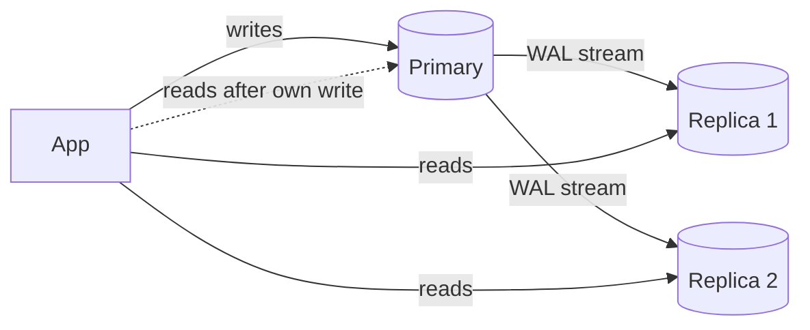

# Database Replication

## Learning Goals

- [ ] Compare statement, row-based and WAL/physical replication
- [ ] Explain what replication lag costs the application
- [ ] Describe a safe failover procedure

## What Is It?

Applying the same data changes to more than one database server. The general
theory is in [Replication](../../Distributed-Systems/Replication/Replication.md);
this note covers the database-specific mechanics.

## Replication methods

| Method | Ships | Strengths | Weaknesses |
| --- | --- | --- | --- |
| **Statement-based** | The SQL text | Compact | Non-deterministic SQL (`now()`, `rand()`) diverges replicas |
| **Write-ahead log (physical)** | Byte-level page changes | Exact, cheap | Replica must be the same major version; whole-cluster only |
| **Logical / row-based** | The resulting row values | Cross-version, per-table, filterable | More CPU, larger volume |
| **Trigger-based** | Application-level copies | Very flexible | Slow, fragile |

## Read replicas and their traps

Routing reads to replicas is the easiest scaling win and the easiest way to
introduce subtle bugs:

- **Read-your-writes** — after a user writes, route *that user's* reads to the
  primary for a short window, or wait for the replica's LSN to catch up
- **Monotonic reads** — pin a session to one replica, otherwise time can appear
  to run backwards across requests
- **Replication lag is bimodal** — normally 5 ms, occasionally 5 minutes during
  a bulk load, a long vacuum or a network event. Design for the second case

## Failover

1. Confirm the primary is genuinely gone (see
   [Failure Detection](../../Distributed-Systems/Fault-Tolerance/Failure%20Detection.md))
2. Choose the most up-to-date replica; **refuse to promote one beyond a lag
   threshold**
3. Promote it, and fence the old primary so it cannot accept writes
4. Repoint clients (DNS, virtual IP, connection proxy)
5. Rebuild the old primary as a replica — do not restart it in place

## Failure Scenarios

| Failure | Consequence | Mitigation |
| --- | --- | --- |
| Async primary loss | Acknowledged writes lost | Semi-sync for critical tables |
| Both primaries writable | Split brain, divergent data | Fencing, quorum-based promotion tooling |
| Promotion of a lagging replica | Silent data loss | Lag threshold on promotion |
| Long-running query on replica | Replication conflict or lag | `hot_standby_feedback`, query timeouts |
| App unaware of failover | Errors until connections cycle | Connection proxy (PgBouncer, RDS Proxy) |

## Real-World Systems

- PostgreSQL streaming replication + Patroni for automated, quorum-safe failover
- MySQL binlog replication (row-based recommended)
- Managed: RDS Multi-AZ, Cloud SQL HA — automated failover with a documented RTO

## Hands-on Experiment

[Lab 04 — Replication](../../../04-Labs/04-Replication/README.md): measure the
data loss window of an async replica under sustained writes.

## My Understanding

> Sources closed. Explain what a "read replica" cannot be used for.

## Questions

- [ ] Does the job platform tolerate stale job status reads? For how long?
- [ ] What is the measured failover time of the chosen managed database?

## Related Concepts

- [Replication](../../Distributed-Systems/Replication/Replication.md)
- [Write-Ahead Log](../Transactions/Write-Ahead%20Log.md)
- [Consistency Models](../../Distributed-Systems/Consistency/Consistency%20Models.md)
- [High Availability](../../Cloud/Reliability/High%20Availability.md)

## Resources

- [PostgreSQL: High Availability, Load Balancing, and Replication](https://www.postgresql.org/docs/current/high-availability.html)
- Kleppmann, *DDIA*, ch. 5
