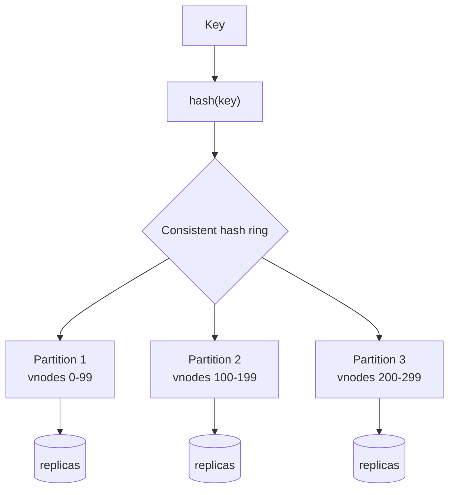

# Sharding and Partitioning

## Learning Goals

- [ ] Compare range, hash and consistent-hash partitioning
- [ ] Explain what a hot partition is and how to avoid one
- [ ] Describe why secondary indexes are the hard part

## What Is It?

Splitting one dataset across multiple machines so that each holds only a
subset. Replication makes copies; partitioning makes *pieces*. Real systems do
both: each partition is replicated.

## Partitioning strategies

| Strategy | Key → partition | Range queries | Hot-spot risk |
| --- | --- | --- | --- |
| **Range** | Ordered key ranges | Efficient | High — sequential keys land on one node |
| **Hash** | `hash(key) mod n` | Impossible without a scatter-gather | Low |
| **Consistent hashing** | Hash ring with virtual nodes | Impossible | Low; **rebalancing moves ~1/n of data** |
| **Directory / lookup** | Explicit mapping table | Depends | Low; the directory is a bottleneck |

`hash(key) mod n` has a fatal flaw at scale: changing `n` remaps almost every
key. Consistent hashing exists precisely to make adding a node move only its
fair share.

## Secondary indexes: the hard part

- **Local (document-partitioned)** — each partition indexes its own data.
  Writes are cheap; reads must **scatter-gather across every partition**, so
  read latency becomes the p99 of the slowest partition
- **Global (term-partitioned)** — the index is itself partitioned by term.
  Reads hit one partition; writes must update a *remote* index partition,
  which makes writes distributed transactions

There is no third option, and the choice determines the system's read/write
profile permanently.

## Failure Scenarios

| Failure | Consequence | Mitigation |
| --- | --- | --- |
| Hot partition (celebrity key) | One node saturated, rest idle | Add a random suffix to the key; dedicated handling |
| Sequential key with range partitioning | All writes on the last partition | Hash prefix, or partition on a compound key |
| Rebalancing during peak | Latency spike, possible cascade | Rate-limit rebalancing; schedule it |
| Cross-partition query | Fan-out, tail amplification | Denormalise; choose the key for the dominant query |
| Cross-partition transaction | Needs [2PC](../Distributed-Transactions/Two-Phase%20Commit.md) | Design so transactions stay within a partition |

!!! tip "Choose the partition key for the dominant access pattern"
    Partitioning by `tenant_id` keeps a tenant's data (and its transactions)
    on one node. Partitioning by `created_at` makes every write hit the newest
    partition. The key choice is very expensive to change later.

## Real-World Systems

- Cassandra / DynamoDB: consistent hashing with virtual nodes
- CockroachDB / TiKV / Spanner: range partitioning with automatic splits, one
  Raft group per range
- Kafka: topic partitions, `hash(key) % partitions` by default
- PostgreSQL: declarative partitioning (single-node), Citus for real sharding

## Hands-on Experiment

Load a table with sequential IDs into a range-partitioned and a
hash-partitioned setup. Measure write distribution across partitions, then
measure a range query on each.

## My Understanding

> Sources closed. Explain why "just add a shard" is not a routine operation.

## Questions

- [ ] What is the right partition key for the job platform's jobs table?
- [ ] Which of its queries would become scatter-gather after sharding?

## Related Concepts

- [Replication](../../Distributed-Systems/Replication/Replication.md)
- [Two-Phase Commit](../Distributed-Transactions/Two-Phase%20Commit.md)
- [Kafka](../../Messaging/Kafka/Kafka.md)
- [Latency and Throughput](../../Distributed-Systems/Fundamentals/Latency%20and%20Throughput.md)

## Resources

- Kleppmann, *DDIA*, ch. 6
- DeCandia et al., *Dynamo: Amazon's Highly Available Key-value Store*
