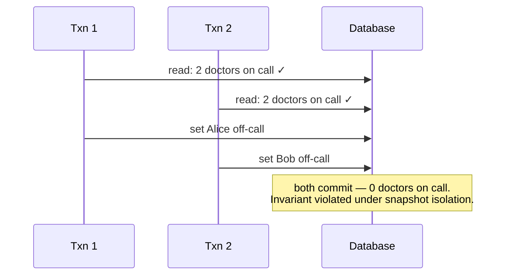

# ACID

## Learning Goals

- [ ] Define each letter, and note that C is the odd one out
- [ ] Map isolation levels to the anomalies each one permits
- [ ] Explain why most databases do not default to serializable

## What Is It?

Atomicity, Consistency, Isolation, Durability — the guarantees a transaction
provides.

| Letter | Guarantee | Provided by |
| --- | --- | --- |
| **Atomicity** | All-or-nothing; a failed transaction leaves no trace | Undo log / rollback |
| **Consistency** | Declared invariants hold before and after | *The application*, mostly — the DB only enforces constraints |
| **Isolation** | Concurrent transactions do not interfere | [MVCC](MVCC.md), locking |
| **Durability** | Committed data survives a crash | [WAL](Write-Ahead%20Log.md) + `fsync` |

The C is a marketing letter. Atomicity, isolation and durability are database
properties; consistency is an application property the database helps enforce.

## Isolation levels and the anomalies they allow

| Level | Dirty read | Non-repeatable read | Phantom | Write skew | Lost update |
| --- | --- | --- | --- | --- | --- |
| Read Uncommitted | possible | possible | possible | possible | possible |
| **Read Committed** (PostgreSQL default) | no | possible | possible | possible | possible |
| **Repeatable Read** / Snapshot | no | no | no (in PG) | **possible** | no (PG errors) |
| **Serializable** | no | no | no | no | no |

The dangerous one is **write skew**: two transactions each read a set of rows,
each verifies an invariant still holds, and each writes — leaving the invariant
violated. Snapshot isolation does not prevent it, and it is the source of most
"the database was supposed to stop this" bugs.

## Failure Scenarios

| Failure | Consequence | Mitigation |
| --- | --- | --- |
| Crash mid-transaction | Partial write | Atomicity via WAL undo |
| Concurrent read-modify-write | Lost update | `SELECT ... FOR UPDATE`, atomic ops, or Serializable |
| Invariant across rows | Write skew | Serializable, or explicit locking |
| `fsync` disabled or lying | "Durable" data lost on power failure | Verify storage behaviour; `synchronous_commit=on` |

## Real-World Systems

- PostgreSQL: MVCC, Serializable Snapshot Isolation (SSI) available and cheap
- MySQL/InnoDB: Repeatable Read by default, with gap locks
- Distributed: ACID across shards requires
  [Two-Phase Commit](../Distributed-Transactions/Two-Phase%20Commit.md) or a
  Spanner-style design

## Hands-on Experiment

Reproduce a lost update and a write skew in two `psql` sessions at Read
Committed, then re-run at Serializable and observe the serialization failure.

## My Understanding

> Sources closed. Explain why "the database is ACID" tells you almost nothing
> unless the isolation level is also stated.

## Questions

- [ ] What isolation level does the job platform's state machine require?
- [ ] What is the throughput cost of Serializable for that workload?

## Related Concepts

- [MVCC](MVCC.md)
- [Write-Ahead Log](Write-Ahead%20Log.md)
- [Consistency Models](../../Distributed-Systems/Consistency/Consistency%20Models.md)
- [Two-Phase Commit](../Distributed-Transactions/Two-Phase%20Commit.md)

## Resources

- Kleppmann, *DDIA*, ch. 7
- [PostgreSQL: Transaction Isolation](https://www.postgresql.org/docs/current/transaction-iso.html)
- Berenson et al., *A Critique of ANSI SQL Isolation Levels*
