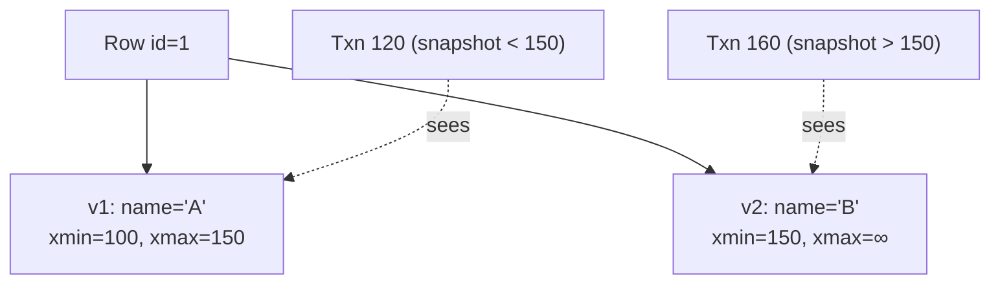

# MVCC

## Learning Goals

- [ ] Explain how readers avoid blocking writers
- [ ] Describe what a snapshot actually is, mechanically
- [ ] Explain why MVCC creates garbage and what vacuum does about it

## What Is It?

Multi-Version Concurrency Control: instead of overwriting a row, the database
writes a **new version** of it and keeps the old one. Each transaction sees the
set of versions that were committed when it started.

The payoff is the property that makes it universal: **readers never block
writers, and writers never block readers**.

## How It Works

Every row version carries the transaction IDs that created and deleted it
(`xmin`/`xmax` in PostgreSQL). A transaction takes a **snapshot** — essentially
"the highest committed transaction ID, plus the list of transactions still in
flight" — and a row version is visible to it if it was committed before the
snapshot and not deleted before it.

## Core Concepts

- **Snapshot** — the visibility rule, not a copy of the data
- **Version chain** — old versions kept until no transaction can see them
- **Vacuum / garbage collection** — reclaims dead versions
- **Bloat** — what happens when vacuum cannot keep up
- **Long-running transactions are toxic** — they hold back the visibility
  horizon, so *nothing* can be vacuumed while they run

## Failure Scenarios

| Failure | Consequence | Mitigation |
| --- | --- | --- |
| Long-running read transaction | Table bloat, degraded performance | Statement/idle timeouts |
| Autovacuum falling behind | Disk growth, slow scans | Tune autovacuum; monitor dead tuples |
| Transaction ID wraparound (PG) | Forced shutdown to prevent data loss | Monitor `age(datfrozenxid)` |
| Write-write conflict | Serialization failure | Retry the transaction (application must handle it) |

!!! warning "MVCC does not prevent write skew"
    Snapshot isolation gives a consistent *read* view. Two transactions can
    still each read a valid state and write conflicting updates. See
    [ACID](ACID.md).

## Real-World Systems

- PostgreSQL: versions in the heap, cleaned by autovacuum
- MySQL/InnoDB: old versions in the undo log rather than the heap
- Oracle, CockroachDB, TiDB, and effectively every modern OLTP engine

## Hands-on Experiment

Open a `REPEATABLE READ` transaction and leave it idle. In another session,
update the same table repeatedly. Watch `pg_stat_user_tables.n_dead_tup` grow
and refuse to fall until the idle transaction is closed.

## My Understanding

> Sources closed. Explain what an "idle in transaction" connection costs.

## Questions

- [ ] Which of the job platform's queries could hold a snapshot open too long?
- [ ] Where is the heap-vs-undo trade-off visible in practice?

## Related Concepts

- [ACID](ACID.md)
- [Write-Ahead Log](Write-Ahead%20Log.md)
- [Consistency Models](../../Distributed-Systems/Consistency/Consistency%20Models.md)

## Resources

- [PostgreSQL: Concurrency Control](https://www.postgresql.org/docs/current/mvcc.html)
- Kleppmann, *DDIA*, ch. 7 §"Snapshot Isolation and Repeatable Read"
