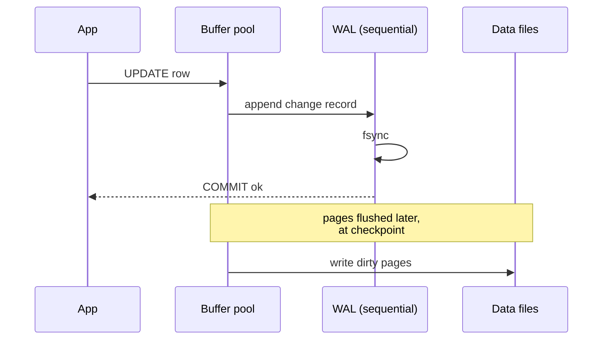

# Write-Ahead Log

## Learning Goals

- [ ] State the WAL rule and explain why it gives both atomicity and durability
- [ ] Explain why sequential log writes beat random data-page writes
- [ ] Connect the WAL to replication and point-in-time recovery

## What Is It?

The rule: **write the change to a durable log before modifying the data pages**.
The log record is flushed and `fsync`ed; the data pages can be written lazily.
On crash recovery, replay the log to redo committed changes and undo
uncommitted ones.

## Why Does It Matter?

Three separate wins from one mechanism:

1. **Durability** — a commit needs one sequential `fsync`, not scattered
   random writes
2. **Atomicity** — an incomplete transaction's records can be undone
3. **Replication and PITR** — the log is a complete, ordered description of
   every change, so shipping it to another machine reproduces the database.
   This is why the WAL and the [Replicated Log](../../Distributed-Systems/Consensus/Replicated%20Log.md)
   are the same idea

## Core Concepts

- **Checkpoint** — a known-good point; recovery only replays from there
- **Group commit** — batch many transactions into one `fsync` to amortise cost
- **Log shipping / streaming replication** — send WAL records to replicas
- **Archiving + PITR** — base backup plus archived WAL restores to any instant
- **`synchronous_commit`** — whether `COMMIT` waits for the `fsync`. Turning it
  off makes writes much faster and makes durability a lie

## Failure Scenarios

| Failure | Consequence | Mitigation |
| --- | --- | --- |
| Crash before checkpoint | Long recovery | Tune checkpoint interval |
| `fsync` not honoured by hardware | Committed data lost on power loss | Verify with `diskchecker`-style tooling |
| WAL disk fills | Database refuses writes / halts | Monitor; archive and recycle segments |
| Archiving fails silently | WAL accumulates, no PITR available | Alert on `archive_command` failures |
| Replication slot abandoned | WAL retained forever, disk fills | Monitor and drop stale slots |

## Real-World Systems

- PostgreSQL WAL — powers crash recovery, streaming replication and PITR
- SQLite WAL mode — concurrent readers with a single writer
- Kafka's partition log — the same design, exposed as the product
- etcd/Raft — the WAL *is* the consensus log

## Hands-on Experiment

Kill PostgreSQL with `kill -9` mid-write, restart, and read the recovery
messages in the log. Then compare commit throughput with `synchronous_commit`
on and off, and state exactly what durability was traded away.

## My Understanding

> Sources closed. Explain why writing the log first is faster *and* safer,
> which sounds like it should be a trade-off but is not.

## Questions

- [ ] What `synchronous_commit` setting does the job platform need for job
      records versus for metrics?
- [ ] How does WAL volume affect the RPO defined in
      [Disaster Recovery](../../Cloud/Reliability/Disaster%20Recovery.md)?

## Related Concepts

- [ACID](ACID.md)
- [MVCC](MVCC.md)
- [Replicated Log](../../Distributed-Systems/Consensus/Replicated%20Log.md)
- [Database Replication](../Replication/Database%20Replication.md)
- [Failure Recovery](../../Distributed-Systems/Fault-Tolerance/Failure%20Recovery.md)

## Resources

- Mohan et al., *ARIES: A Transaction Recovery Method* (1992)
- [PostgreSQL: Write-Ahead Logging](https://www.postgresql.org/docs/current/wal-intro.html)
