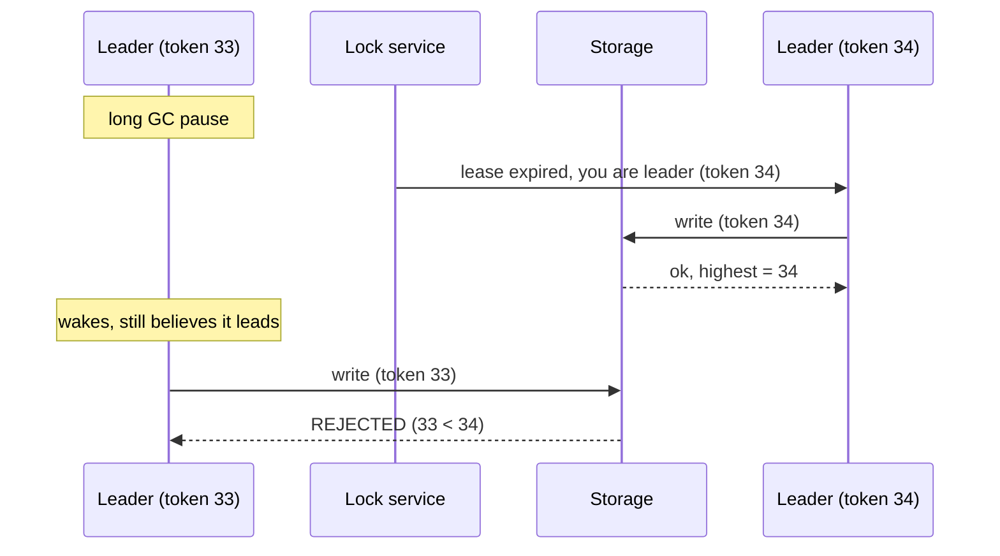

# Leader Election

## Learning Goals

- [ ] Explain why a lease alone is not enough, and what a fencing token adds
- [ ] Describe how randomised timeouts prevent split votes
- [ ] List what must happen between "old leader dies" and "new leader serves"

## What Is It?

Choosing exactly one node from a group to coordinate work, and — much harder —
ensuring the rest of the system agrees, including the previous leader.

Leadership simplifies enormously: one writer means no write conflicts, one
scheduler means no duplicate work. The cost is that leadership must be
*safely* transferred when the leader dies, and the leader is a bottleneck and
a failure domain.

## Core Concepts

- **Heartbeats** — the leader periodically asserts liveness; silence for an
  election timeout triggers an election
- **Election timeout, randomised** — prevents all followers from campaigning
  simultaneously
- **Term / epoch** — a monotonically increasing leadership generation number
- **Lease** — leadership granted for a bounded time; requires bounded clock
  drift to be safe
- **Fencing token** — a monotonically increasing number handed out with
  leadership and *checked by downstream resources*, so a stale leader's writes
  are rejected

### Why fencing tokens are mandatory

A leader can be paused (GC, VM migration, disk stall) for longer than its lease
without knowing it. It wakes up believing it is still leader and writes. The
lock service cannot stop it — but the storage system can, if every write
carries a token and storage refuses any token lower than the highest it has
seen.

## Failure Scenarios

| Failure | Consequence | Mitigation |
| --- | --- | --- |
| Leader crashes | Unavailable until a new election | Short heartbeat interval; accept the gap |
| Leader pauses (GC) | **Two leaders believe they lead** | Fencing tokens |
| Split vote | No leader this term | Randomised timeouts |
| Network partition | Both sides try to elect | Majority quorum: only one side can |
| Flapping leadership | Constant re-election, no progress | Timeouts ≫ p99 network latency |

## Real-World Systems

- Raft/etcd: elections are part of the consensus protocol
- Kubernetes controller-manager and scheduler: `LeaderElection` via a
  `Lease` object in the API server — active/passive HA for controllers
- Kafka: the controller broker, elected via KRaft

## Hands-on Experiment

[Lab 05 — Leader Election](../../../04-Labs/05-Leader-Election/README.md):
"What happens when the leader node crashes?" Measure the unavailability window.

## My Understanding

> Sources closed. Explain why a lock with a timeout is not sufficient for
> correctness, using the GC-pause story.

## Questions

- [ ] What is the actual leadership gap in etcd with default settings?
- [ ] Do the job platform's workers need leader election, or is a consumer
      group enough?

## Related Concepts

- [Raft](Raft.md)
- [Quorum](../Replication/Quorum.md)
- [Failure Detection](../Fault-Tolerance/Failure%20Detection.md)
- [Controllers and Operators](../../Kubernetes/Controllers/Controllers%20and%20Operators.md)

## Resources

- [Kleppmann, *How to do distributed locking*](https://martin.kleppmann.com/2016/02/08/how-to-do-distributed-locking.html) — the fencing-token argument
- Kleppmann, *DDIA*, ch. 8 §"Fencing tokens"
- [Kubernetes leader election documentation](https://kubernetes.io/docs/concepts/architecture/leases/)
