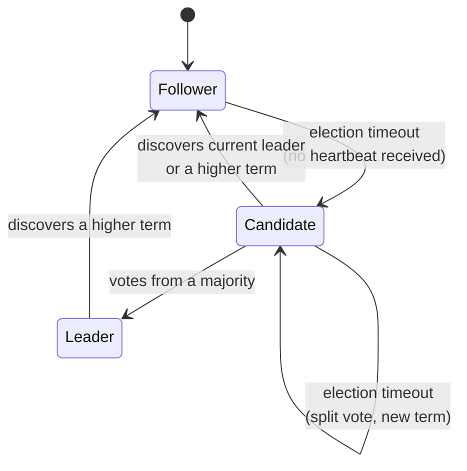
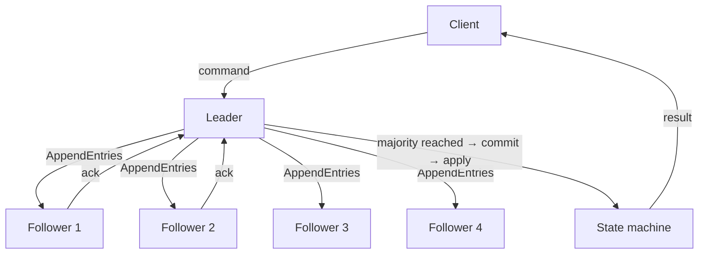
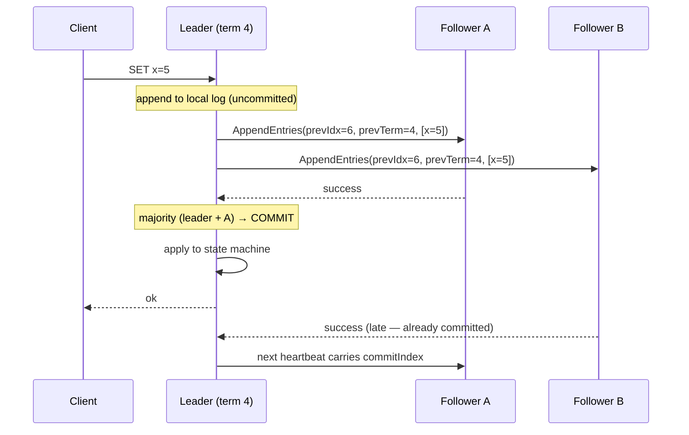

# Raft

!!! example "This note is the worked example for the vault"
    It shows what a finished concept note looks like: every section filled,
    diagrams that describe the real mechanism, a failure table, and a
    **My Understanding** section written in plain language. Use it as the bar
    for other notes.

## Learning Goals

- [x] Explain the three server states and the transitions between them
- [x] Describe how a term prevents two leaders from both committing
- [x] Explain why a log entry is committed only once replicated to a majority
- [ ] Implement leader election and log replication (MIT 6.5840 Lab 3A/3B)
- [ ] Explain snapshotting and log compaction without notes

## What Is It?

Raft is a consensus algorithm: it lets a cluster of servers agree on an
ordered sequence of commands — a [replicated log](Replicated%20Log.md) — such
that every server applies the same commands in the same order, and the cluster
keeps working as long as a majority of servers are alive and can talk to each
other.

It was designed by Diego Ongaro and John Ousterhout in 2014 for a single
stated reason: **to be understandable**. Paxos solves the same problem and had
been the standard for two decades, but was notoriously difficult to reason
about and to implement correctly. Raft decomposes the problem into three
sub-problems that can be understood separately — leader election, log
replication, and safety — and adds a strong constraint (a strong leader,
log entries only ever flow leader → follower) that eliminates whole classes of
edge case.

## Why Does It Matter?

Raft is the algorithm underneath a large share of the infrastructure this
knowledge base touches: `etcd` (and therefore Kubernetes), Consul, CockroachDB,
TiKV, MongoDB's replica sets and Kafka's KRaft mode. Understanding Raft
means understanding what "the control plane lost quorum" actually means, why
clusters are odd-sized, and why a write can be acknowledged and then still be
correct to lose.

It is also the cleanest available demonstration of the general principle that
**agreement in a distributed system is bought with majorities and rounds of
messages**, and that every guarantee has a latency price.

## Core Concepts

### Server states

Every server is in exactly one of three states:

| State | Behaviour |
| --- | --- |
| **Follower** | Passive. Responds to leaders and candidates. Becomes a candidate if it hears nothing for an election timeout. |
| **Candidate** | Requesting votes for itself in a new term. |
| **Leader** | Handles all client requests, replicates entries, sends heartbeats. |

### Terms

Time is divided into **terms**, numbered with consecutive integers. Each term
begins with an election and has **at most one leader**. Terms act as a logical
clock: every RPC carries a term number, and

- a server that sees a term greater than its own immediately steps down to
  follower and adopts the larger term;
- a server rejects any request carrying a term smaller than its own.

This single rule is what stops an old, partitioned-away leader from doing
damage when it comes back: its term is stale, so every message it sends is
rejected, and the first reply tells it to step down.

### The log

Each server holds a log of entries. An entry contains a command and the term
in which it was created. An entry is **committed** once the leader has
replicated it to a **majority** of servers; committed entries are then applied
to each server's state machine, in order.

## Architecture

## How It Works

### 1. Leader election

Every follower runs a randomised **election timeout**, typically 150–300 ms.
The randomisation is essential: it makes split votes rare, because one server
almost always times out meaningfully before the others.

When a follower's timer fires:

1. It increments its current term and becomes a candidate.
2. It votes for itself and sends `RequestVote` RPCs to all other servers.
3. Each server grants at most one vote per term, on a first-come basis — **and
   only if the candidate's log is at least as up to date as its own**.

Three outcomes are possible:

- **Wins** (majority of votes) → becomes leader, immediately sends heartbeats
  to suppress further elections.
- **Loses** (receives `AppendEntries` from a legitimate leader with a term
  ≥ its own) → returns to follower.
- **Split vote** (nobody gets a majority) → the timer fires again, a new term
  begins, and randomisation resolves it quickly.

That vote condition in step 3 is the **election restriction**, and it is the
key safety property: a server whose log is missing committed entries can never
gather a majority, so a leader always contains every committed entry.

### 2. Log replication

The leader appends a client command to its own log, then sends `AppendEntries`
to all followers. Each `AppendEntries` includes `prevLogIndex` and
`prevLogTerm` — the entry immediately preceding the new ones.

A follower **rejects** the RPC if its own log does not contain a matching
entry at `prevLogIndex` with `prevLogTerm`. On rejection, the leader decrements
its `nextIndex` for that follower and retries, walking backwards until the logs
agree, then overwrites everything after that point with its own entries.

This gives the **Log Matching Property**: if two logs contain an entry with the
same index and term, then the logs are identical in all entries up through that
index.

Note the ordering: the client is answered as soon as a **majority** has the
entry. Follower B's acknowledgement is not required and may never arrive.

### 3. Safety

Raft guarantees five properties. The two worth memorising:

- **Leader Completeness** — if an entry is committed in a term, it is present
  in the log of every leader of every later term. Guaranteed by the election
  restriction.
- **State Machine Safety** — if a server has applied an entry at a given index,
  no other server ever applies a different entry at that index.

There is one famous subtlety: **a leader never commits an entry from a previous
term by counting replicas.** It commits entries from earlier terms only
indirectly, by committing an entry from its *own* term. Skipping this rule
produces a real, reachable bug in which a committed entry is later overwritten
(Figure 8 in the paper).

### 4. Persistence and snapshots

Three pieces of state must survive a restart, written to stable storage
*before* responding to any RPC: `currentTerm`, `votedFor`, and the `log`.
Losing `votedFor` allows a server to vote twice in one term, which allows two
leaders in one term, which breaks everything.

The log cannot grow forever. **Snapshotting** writes the current state machine
state to disk and discards log entries up to that point. A follower that has
fallen too far behind — the leader has already discarded the entries it needs —
is caught up with an `InstallSnapshot` RPC instead of `AppendEntries`.

## Failure Scenarios

| Failure | What Raft does | Why it is safe |
| --- | --- | --- |
| Leader crashes | Followers time out, a new election starts, a new leader emerges in a higher term | Election restriction guarantees the new leader has all committed entries |
| Leader partitioned from the majority | Majority side elects a new leader in a higher term | Old leader cannot commit anything — it can never reach a majority |
| Old leader returns | Sees the higher term in the first reply and steps down | Term comparison; its uncommitted entries are overwritten |
| Split vote | Randomised timeouts, another term, another election | Elections are cheap; the system is unavailable for a few hundred ms |
| Follower falls behind | `nextIndex` walks back until logs match; or `InstallSnapshot` | Log Matching Property |
| Minority of nodes lost | Cluster continues normally | Majority still available |
| **Majority lost** | **Cluster stops accepting writes** | Correctness over availability — Raft is CP |
| Follower loses its disk | Must be treated as a new server, not restarted in place | It may otherwise vote twice in a term |

!!! warning "Acknowledged is not the same as committed"
    A client that times out on a write cannot conclude the write did not
    happen. The entry may have been committed and the response lost. This is
    [Partial Failure](../Fundamentals/Partial%20Failure.md) again, and it is
    why Raft-backed APIs still need
    [Idempotency](../Fundamentals/Idempotency.md).

## Real-World Systems

| System | Use of Raft |
| --- | --- |
| **etcd** | The reference production implementation; stores all Kubernetes state |
| **Consul** | Service catalogue and KV store |
| **CockroachDB** | One Raft group *per range* — thousands of concurrent groups |
| **TiKV** | Same multi-Raft design |
| **Kafka (KRaft)** | Replaced ZooKeeper for cluster metadata |
| **MongoDB** | Replica-set elections are Raft-derived |

The recurring production lesson: cluster size is a trade-off, not a
maximisation. 3 nodes tolerate 1 failure; 5 tolerate 2 but make every commit
wait for a larger majority. Beyond 5–7, the latency cost outweighs the
resilience gain — see [Quorum](../Replication/Quorum.md).

## Hands-on Experiment

1. **Observe an election.** Run a 3-node etcd cluster. `etcdctl endpoint status`
   shows the leader. `kill -9` it and watch a new leader appear within roughly
   one election timeout.
2. **Lose quorum.** Kill a second node. Writes now fail; note the exact error.
3. **Implement it.** MIT 6.5840 Lab 3A (elections), 3B (log replication),
   3C (persistence). This is the only way to genuinely learn Raft.
4. See [Lab 05 — Leader Election](../../../04-Labs/05-Leader-Election/README.md).

## My Understanding

> Written from memory. Rewrite this after finishing 6.5840 Lab 3B.

Raft is a way for several machines to agree on the same ordered list of
commands, so that they can all behave like a single reliable machine.

One machine is elected leader. All writes go through it. When the leader gets
a command, it does not act on it immediately — it first copies the command to
the other machines. Once more than half of the cluster has the command written
down, the leader considers it *committed*, applies it, and only then answers
the client. "More than half" is the entire trick: any two majorities of the
same cluster must share at least one machine, so two conflicting decisions can
never both be committed.

Leaders are found by timeout. Every follower waits a random interval for a
heartbeat; whichever gets bored first declares a new term and asks the others
to vote for it. A server votes at most once per term, and refuses to vote for
a candidate whose log is behind its own. That refusal is what makes the whole
thing safe: a machine that is missing committed data can never win, so the
winner always has everything that was committed.

The term number is a version counter for leadership. Any message stamped with
an older term is ignored, and any server that sees a newer term immediately
gives up being leader. So an old leader that was cut off by a network failure
does no damage when it reconnects — it is told it is out of date and steps
down. Its uncommitted entries get overwritten.

What Raft explicitly does *not* do is stay available when it loses a majority.
If 2 of 3 machines are gone, the cluster refuses writes rather than risk
disagreeing with itself. That is the CAP trade-off made concrete: Raft chooses
consistency, and Kubernetes inherits that choice through etcd.

## Questions

- [ ] Why can't a leader commit an entry from a previous term by counting
      replicas? Work through Figure 8 of the paper until it is obvious.
- [ ] How does membership change (adding/removing a node) avoid two
      disjoint majorities? Compare joint consensus with single-server changes.
- [ ] What exactly does a client see during the ~1 second of an election, and
      how should a client library behave then?
- [ ] How does CockroachDB run thousands of Raft groups without the heartbeat
      traffic overwhelming the network?
- [ ] Is a linearizable read possible without going through the log?
      (Read the ReadIndex and lease-read optimisations.)

## Related Concepts

- [Leader Election](Leader%20Election.md)
- [Replicated Log](Replicated%20Log.md)
- [Quorum](../Replication/Quorum.md)
- [Replication](../Replication/Replication.md)
- [Linearizability](../Consistency/Linearizability.md)
- [CAP Theorem](../Consistency/CAP%20Theorem.md)
- [Failure Recovery](../Fault-Tolerance/Failure%20Recovery.md)
- [etcd](../../Kubernetes/etcd/etcd.md)

## Resources

- Ongaro & Ousterhout, [*In Search of an Understandable Consensus Algorithm*](https://raft.github.io/raft.pdf) — read the **extended** version, not the conference version
- Ongaro, *Consensus: Bridging Theory and Practice* (PhD thesis) — the definitive treatment of membership changes and snapshots
- [The Raft website](https://raft.github.io/) — includes the interactive visualisation
- [Raft Scope visualisation](https://raft.github.io/raftscope/index.html) — step through elections by hand
- [MIT 6.5840](https://pdos.csail.mit.edu/6.5840/) Labs 3A–3D
- [etcd raft implementation](https://github.com/etcd-io/raft) — production-quality reference code
