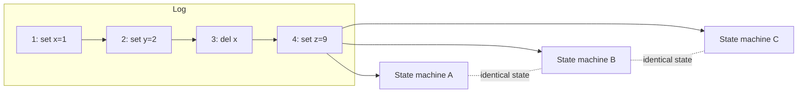

# Replicated Log

## Learning Goals

- [ ] Explain the state machine replication model in one paragraph
- [ ] Say why determinism is a hard requirement
- [ ] Describe why a log needs compaction and how snapshots provide it

## What Is It?

An append-only, totally ordered sequence of commands, replicated across nodes.
Combined with **deterministic** state machines, it produces
**state machine replication**: every node that applies the same log prefix
reaches the same state.

The log is the primitive; consensus ([Raft](Raft.md), Paxos) is merely the
mechanism for agreeing on its contents.

## Why Does It Matter?

The same idea appears everywhere once you recognise it:

- Raft's log → replicated key-value stores
- PostgreSQL's [WAL](../../Databases/Transactions/Write-Ahead%20Log.md) →
  crash recovery and streaming replication
- [Kafka](../../Messaging/Kafka/Kafka.md) partitions → a durable, replayable log
  as a product
- Event sourcing → the log *is* the system of record

## Core Concepts

- **Total order** — every replica sees the same commands in the same order
- **Determinism** — no wall-clock reads, no `random()`, no map iteration order,
  no non-deterministic external calls. A single non-deterministic command
  causes replicas to diverge silently
- **Commit index** — the highest entry known to be replicated to a majority
- **Applied index** — the highest entry applied to the state machine
- **Compaction / snapshotting** — the log cannot grow forever; snapshot state
  and discard the prefix

## Failure Scenarios

| Failure | Consequence | Mitigation |
| --- | --- | --- |
| Non-deterministic command | Replicas diverge silently | Move non-determinism into the leader; put the *result* in the log |
| Log grows without bound | Disk exhaustion, slow restarts | Snapshots + compaction |
| Follower needs a discarded prefix | Cannot catch up incrementally | `InstallSnapshot` |
| Applied but not persisted | Replay on restart | Idempotent apply, or persist the applied index |

!!! warning "Determinism is not optional"
    Putting `INSERT ... VALUES (now())` in a replicated log gives each replica
    a different timestamp. Resolve the value on the leader and log the resolved
    command.

## Real-World Systems

- etcd's Raft log, compacted by periodic snapshots
- Kafka: a partition is a replicated log with retention rather than compaction
  by default, and log compaction as an option
- Event sourcing / CQRS architectures

## Hands-on Experiment

Write a tiny state machine (a key-value map) that consumes a log file, then
replay the same log into three copies and diff the results. Then introduce a
`now()` command and watch them diverge.

## My Understanding

> Sources closed. Explain why the log, not the data, is the primary artefact.

## Questions

- [ ] Should the job platform's job state be modelled as an event log?
- [ ] What is the restart time cost of a large log versus frequent snapshots?

## Related Concepts

- [Raft](Raft.md)
- [Write-Ahead Log](../../Databases/Transactions/Write-Ahead%20Log.md)
- [Kafka](../../Messaging/Kafka/Kafka.md)
- [Failure Recovery](../Fault-Tolerance/Failure%20Recovery.md)

## Resources

- Schneider, *Implementing Fault-Tolerant Services Using the State Machine Approach* (1990)
- [Kreps, *The Log: What every software engineer should know*](https://engineering.linkedin.com/distributed-systems/log-what-every-software-engineer-should-know-about-real-time-datas-unifying)
