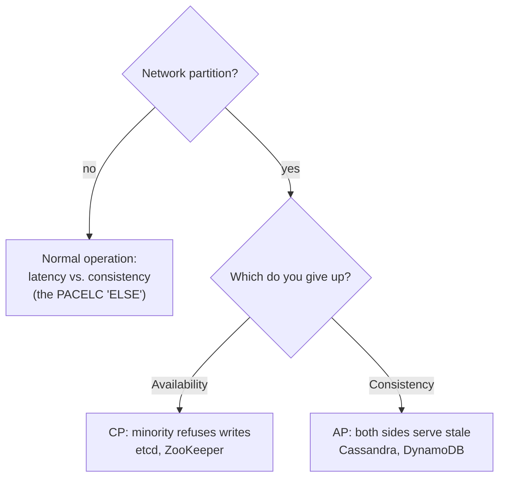

# CAP Theorem

## Learning Goals

- [ ] State CAP precisely, including what each letter actually means
- [ ] Explain why "pick two" is a misleading summary
- [ ] Use PACELC to describe the trade-off that applies the other 99.9% of the time

## What Is It?

Brewer's conjecture, proved by Gilbert and Lynch: a distributed data store
cannot simultaneously provide all three of

- **C**onsistency — here meaning [linearizability](Linearizability.md), *not*
  the C in ACID
- **A**vailability — every non-failing node returns a non-error response
- **P**artition tolerance — the system keeps working despite dropped messages

## Why "pick two" is wrong

Partitions are not a design choice. Networks partition; you do not get to opt
out. So P is mandatory, and the theorem reduces to a single decision that only
applies **while a partition is happening**:

> During a partition, do you return possibly-stale data (choose A), or refuse
> to answer (choose C)?

| Choice | Behaviour under partition | Examples |
| --- | --- | --- |
| **CP** | Minority side rejects requests | etcd, ZooKeeper, HBase, Spanner |
| **AP** | Both sides serve, reconcile later | Cassandra, DynamoDB (default), DNS |

## PACELC — the more useful formulation

Abadi's extension: *if there is a **P**artition, choose between **A** and
**C**; **E**lse, choose between **L**atency and **C**onsistency.*

This matters because partitions are rare and the latency/consistency trade-off
is continuous. A synchronous cross-region write is slow every single day; a
partition might happen twice a year.

- etcd is **PC/EC** — consistent always, at a latency cost
- Cassandra is **PA/EL** — available and fast, consistency is tunable

## Failure Scenarios

| Scenario | CP system | AP system |
| --- | --- | --- |
| Minority partition | Refuses writes | Accepts writes, will need reconciliation |
| Partition heals | Nothing to reconcile | Conflict resolution (LWW, CRDTs, app logic) |
| Both sides accept a write | Impossible | **Split brain**; last-write-wins can silently drop data |

!!! note "CAP's C is not ACID's C"
    CAP's *consistency* is linearizability. ACID's *consistency* means the
    database enforces declared invariants. Unrelated concepts, same word.

## Real-World Systems

- Kubernetes is CP: if `etcd` loses quorum, the control plane stops accepting
  changes, while already-running pods keep running (the data plane is AP)
- DNS is AP: stale records are served happily for the length of the TTL

## Hands-on Experiment

Partition a 3-node etcd cluster 2/1 with firewall rules. Write to both sides.
Record which succeeds, which fails, and what happens after the partition heals.

## My Understanding

> Sources closed. Explain why calling a system "CA" is almost always a mistake.

## Questions

- [ ] Which parts of the job platform should be CP, and which AP?
- [ ] What conflict resolution would be needed if job status went AP?

## Related Concepts

- [Consistency Models](Consistency%20Models.md)
- [Linearizability](Linearizability.md)
- [Quorum](../Replication/Quorum.md)
- [High Availability](../../Cloud/Reliability/High%20Availability.md)

## Resources

- Gilbert & Lynch, *Brewer's Conjecture and the Feasibility of Consistent, Available, Partition-Tolerant Web Services* (2002)
- Kleppmann, *A Critique of the CAP Theorem* (2015)
- Abadi, *Consistency Tradeoffs in Modern Distributed Database System Design* (PACELC)
