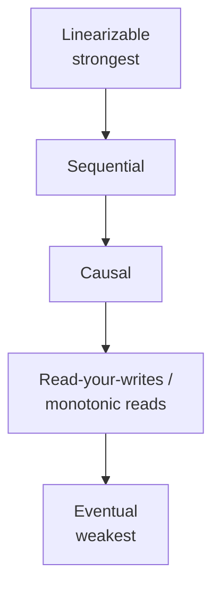

# Consistency Models

## Learning Goals

- [ ] Order the common models from strongest to weakest
- [ ] Give a concrete anomaly that each model permits or forbids
- [ ] Explain why "eventual consistency" says nothing about *when*

## What Is It?

A consistency model is a **contract between the storage system and the
application**: given a set of concurrent operations, which return values are
legal? Stronger models permit fewer histories and are therefore easier to
program against, and more expensive to implement.

## The Hierarchy

| Model | Guarantee | Forbids | Cost |
| --- | --- | --- | --- |
| **Linearizable** | Operations appear instantaneous, in real-time order | Stale reads entirely | Consensus; unavailable under partition |
| **Sequential** | All nodes see the same order; not necessarily real-time | Nodes disagreeing on order | Cheaper than linearizable |
| **Causal** | Causally related operations are seen in order | Seeing a reply before its message | Available under partition |
| **Read-your-writes** | You always see your own writes | Losing your own edit | Session routing |
| **Monotonic reads** | Time never appears to move backwards | Reading a newer then an older value | Sticky sessions |
| **Eventual** | Replicas converge *if writes stop* | Nothing, in finite time | Cheapest |

## Why Does It Matter?

The model is what determines whether an application bug is a bug or expected
behaviour. "The user updated their profile and then saw the old value" is a
violation under read-your-writes and perfectly legal under eventual
consistency.

Causal consistency is the practical sweet spot for many systems: it is the
**strongest model that remains available under a network partition**.

## Failure Scenarios

| Anomaly | Model that permits it | Real-world symptom |
| --- | --- | --- |
| Stale read | Everything below linearizable | "My change disappeared" |
| Reads going backwards | Eventual | Timeline shows older data on refresh |
| Causal violation | Eventual | A reply appears before the message |
| Lost update | Weak isolation on writes | Two edits, one survives |

## Real-World Systems

- etcd, ZooKeeper (linearizable writes; ZooKeeper reads are sequential by default)
- DynamoDB: eventually consistent reads by default, strongly consistent on request
  at double the cost — the trade-off made explicit and billed
- Cassandra: tunable per query via [Quorum](../Replication/Quorum.md) settings

## Hands-on Experiment

Write to a PostgreSQL primary, immediately read from an async replica, and
observe the stale read. Then route reads for that session to the primary and
confirm read-your-writes is restored.

## My Understanding

> Sources closed. Explain the difference between linearizability and
> serializability — they are frequently confused and are not the same thing.

## Questions

- [ ] Which model does the job platform actually need for job status reads?
- [ ] Where would eventual consistency be invisible to users, and where fatal?

## Related Concepts

- [Linearizability](Linearizability.md)
- [CAP Theorem](CAP%20Theorem.md)
- [Replication](../Replication/Replication.md)
- [ACID](../../Databases/Transactions/ACID.md)

## Resources

- Kleppmann, *DDIA*, ch. 9
- [Jepsen: Consistency Models](https://jepsen.io/consistency) — the reference map
- Viotti & Vukolić, *Consistency in Non-Transactional Distributed Storage Systems*
