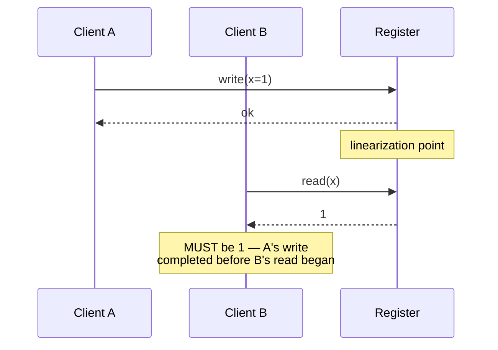

# Linearizability

## Learning Goals

- [ ] Define linearizability in terms of a linearization point
- [ ] Distinguish it from serializability
- [ ] Name the operations that genuinely require it

## What Is It?

A system is linearizable if every operation appears to take effect
**atomically at some instant between its invocation and its response**, and
that instant respects real time: if operation A completes before operation B
starts, every observer must see A's effect before B's.

Informally: the system behaves as if there were exactly one copy of the data
and all operations were applied one at a time. It is often called *atomic
consistency* or *strong consistency*.

## Linearizability vs. Serializability

These are the two most-confused terms in the field.

| | Linearizability | Serializability |
| --- | --- | --- |
| Scope | Single object | Multiple objects, grouped in transactions |
| Concern | Recency and real-time order | Equivalence to *some* serial order |
| Field | Distributed systems | Databases |
| Real time | Required | Not required |

They are orthogonal. **Strict serializability** is both at once, and is what
"strong consistency" usually means in a distributed database.

## Why Does It Matter?

A small number of things break without it, and they break badly:

- **Locks and leader election.** Two nodes must never both believe they hold
  the lock. See [Leader Election](../Consensus/Leader%20Election.md).
- **Uniqueness constraints.** Two concurrent registrations of the same
  username must not both succeed.
- **Cross-channel timing.** A service writes to storage, then publishes a
  message; the consumer reads storage and must not see the pre-write state.

Everything else can usually tolerate something weaker — and should, because
linearizability costs a consensus round trip on every operation and, by the
[CAP Theorem](CAP%20Theorem.md), forfeits availability under partition.

## How It Works

## Failure Scenarios

| Situation | Non-linearizable outcome | Consequence |
| --- | --- | --- |
| Read from an async replica | Returns the old value | "My write vanished" |
| Two leaders during a partition | Both grant the same lock | Split brain, data corruption |
| Cache in front of storage | Serves pre-write state | Cross-channel anomaly |

## Real-World Systems

- etcd and ZooKeeper: linearizable writes; used precisely because of it
- Spanner: externally consistent (strict serializability) via TrueTime
- DynamoDB `ConsistentRead=true`: linearizable reads on request

## Hands-on Experiment

Run a Jepsen-style check on a two-node setup: concurrent writers and readers,
record a history, and look for a read that returns a value older than one
already returned to a completed operation.

## My Understanding

> Sources closed. Give an example of a system that is serializable but not
> linearizable.

## Questions

- [ ] Does the job platform have any operation that truly needs linearizability?
- [ ] What is the latency cost of a linearizable read in etcd, and why?

## Related Concepts

- [Consistency Models](Consistency%20Models.md)
- [CAP Theorem](CAP%20Theorem.md)
- [Raft](../Consensus/Raft.md)
- [etcd](../../Kubernetes/etcd/etcd.md)

## Resources

- Herlihy & Wing, *Linearizability: A Correctness Condition for Concurrent Objects* (1990)
- Kleppmann, *DDIA*, ch. 9 §"Linearizability"
- [Jepsen: Linearizability](https://jepsen.io/consistency/models/linearizable)
