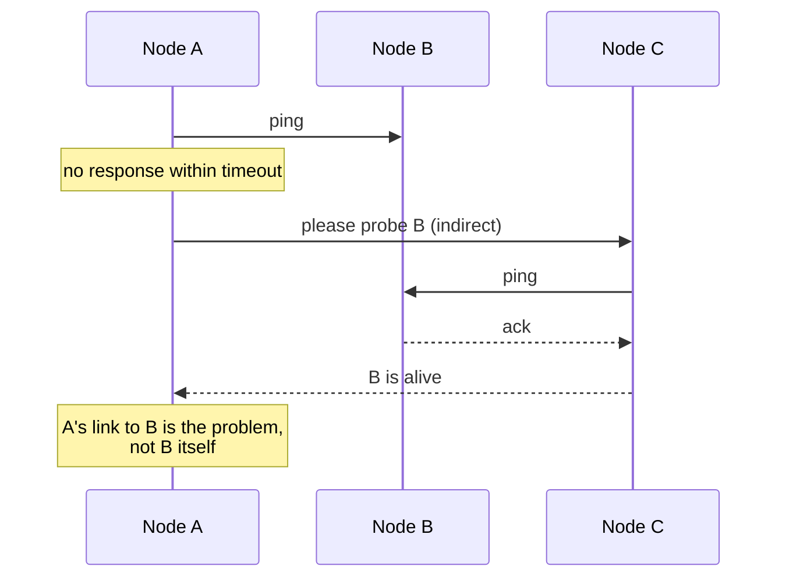

# Failure Detection

## Learning Goals

- [ ] Explain completeness and accuracy, and why you cannot have both
- [ ] Choose a heartbeat interval and timeout from measured latency
- [ ] Describe how gossip-based detection scales better than all-to-all

## What Is It?

Deciding that a node has failed. In an asynchronous network this is
**provably impossible to do perfectly**: a crashed node and an
arbitrarily-slow node are indistinguishable. Every failure detector is
therefore a *heuristic* trading two properties:

- **Completeness** — every genuinely failed node is eventually suspected
- **Accuracy** — no live node is ever wrongly suspected

Shorter timeouts buy completeness at the cost of accuracy. Longer timeouts do
the reverse. There is no setting that gives both.

## Core Concepts

- **Heartbeats** — periodic "I am alive" messages; absence implies suspicion
- **Timeout** — how much silence is tolerated. Should be derived from the
  observed p99.9 round-trip time, plus GC pause budget
- **Phi Accrual detector** — instead of a boolean, output a *suspicion level*
  based on the statistical distribution of past heartbeat intervals, and let
  each consumer choose its own threshold
- **Gossip / SWIM** — nodes probe a random subset and disseminate suspicion,
  giving O(n) total traffic rather than O(n²)
- **Indirect probing** — before declaring a node dead, ask other nodes to probe
  it; distinguishes "the node is down" from "my link to it is down"

## Failure Scenarios

| Failure | Bad detector behaviour | Mitigation |
| --- | --- | --- |
| GC pause > timeout | Healthy node evicted; work reassigned needlessly | Timeout > worst-case pause; phi accrual |
| Asymmetric partition | A suspects B, B does not suspect A | Indirect probing; gossip |
| Slow node passing health checks | Gray failure, never detected | Probe with real work, not `/healthz` returning 200 |
| Cascading eviction | Detector overload during an incident | Rate-limit evictions; require quorum agreement |

!!! tip "Liveness checks should do real work"
    A `/healthz` endpoint that returns 200 unconditionally proves the process
    is scheduled, not that it can serve. Have it exercise a dependency —
    carefully, so a dependency blip does not evict your whole fleet.

## Real-World Systems

- Kubernetes: `livenessProbe`/`readinessProbe`, node lease renewal, then
  `NotReady` after `node-monitor-grace-period`
- Cassandra and Akka: phi accrual failure detectors
- Consul and Serf: SWIM gossip with indirect probes

## Hands-on Experiment

Run a 3-node cluster; `SIGSTOP` one node (simulating a long pause) rather than
killing it. Measure how long until it is suspected and what happens when it is
resumed.

## My Understanding

> Sources closed. Explain why a perfect failure detector cannot exist, and
> what systems do instead.

## Questions

- [ ] What are the actual default detection windows in Kubernetes, and what do
      they imply for the job platform's recovery time?
- [ ] Should the workers use liveness probes that touch Kafka and PostgreSQL?

## Related Concepts

- [Partial Failure](../Fundamentals/Partial%20Failure.md)
- [Leader Election](../Consensus/Leader%20Election.md)
- [Failure Recovery](Failure%20Recovery.md)
- [Timeouts and Retries](../Fundamentals/Timeouts%20and%20Retries.md)

## Resources

- Chandra & Toueg, *Unreliable Failure Detectors for Reliable Distributed Systems*
- Hayashibara et al., *The φ Accrual Failure Detector*
- Das, Gupta & Motivala, *SWIM*
