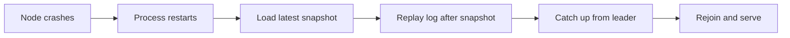

# Failure Recovery

## Learning Goals

- [ ] Explain what must be persisted before an RPC is answered, and why
- [ ] Describe snapshot + log replay as a recovery strategy
- [ ] Distinguish crash-stop from crash-recovery failure models

## What Is It?

Bringing a node back to a correct, current state after it has failed — and
doing so without violating any guarantee the cluster made while it was gone.

## Core Concepts

### Failure models

| Model | Assumption | Implication |
| --- | --- | --- |
| Crash-stop | A failed node never returns | Simple; unrealistic |
| **Crash-recovery** | A node may return with its stable storage intact | The usual model; requires durable state |
| Byzantine | A node may behave arbitrarily | Needs 3f+1 nodes; usually out of scope |

### What must be durable

In Raft: `currentTerm`, `votedFor`, and the `log` — all written to stable
storage **before** replying to any RPC. Losing `votedFor` lets a node vote
twice in a term, which permits two leaders, which breaks safety. A node whose
disk is lost must be re-added as a *new* member, never restarted in place.

### Recovery mechanisms

- **Snapshot + replay** — restore the last snapshot, then replay the log from
  that point. Recovery time is bounded by snapshot frequency
- **WAL replay** — the database equivalent; redo committed transactions, undo
  uncommitted ones
- **Catch-up replication** — a returning follower streams what it missed; if
  the leader has compacted past that point, it receives a full snapshot
- **Fencing on return** — a returning node must not act on stale authority.
  See [Leader Election](../Consensus/Leader%20Election.md)

## Failure Scenarios

| Failure | Consequence | Mitigation |
| --- | --- | --- |
| State not flushed before ack | Acknowledged data lost | `fsync` before responding |
| Snapshot too infrequent | Very slow restart | Tune snapshot interval against restart SLO |
| Leader compacted needed entries | Follower cannot catch up incrementally | `InstallSnapshot` |
| Disk lost, node restarted in place | Double voting → two leaders | Treat as a new member |
| Recovery storm | All nodes restart and catch up at once | Stagger restarts; rate-limit catch-up |

## Real-World Systems

- etcd snapshots (`--snapshot-count`) and `etcdctl snapshot restore`
- PostgreSQL crash recovery from the WAL; PITR from base backup + WAL archive
- Kafka: log recovery on unclean shutdown, and the unclean-leader-election flag

## Hands-on Experiment

Kill a node with `kill -9` during sustained writes. Restart it and measure:
time to rejoin, whether any acknowledged write was lost, and how far behind it
was on return.

## My Understanding

> Sources closed. Explain the exact sequence a Raft node performs on restart,
> and which single missing piece of state would break safety.

## Questions

- [ ] What is the restart time of a 2 GB etcd data set, and does that meet the
      RTO defined in [Disaster Recovery](../../Cloud/Reliability/Disaster%20Recovery.md)?
- [ ] Where does the job platform depend on state that is not actually durable?

## Related Concepts

- [Raft](../Consensus/Raft.md)
- [Replicated Log](../Consensus/Replicated%20Log.md)
- [Write-Ahead Log](../../Databases/Transactions/Write-Ahead%20Log.md)
- [Failure Detection](Failure%20Detection.md)
- [Disaster Recovery](../../Cloud/Reliability/Disaster%20Recovery.md)

## Resources

- Ongaro, *Consensus: Bridging Theory and Practice*, ch. 5 (log compaction)
- [PostgreSQL: Continuous Archiving and PITR](https://www.postgresql.org/docs/current/continuous-archiving.html)
