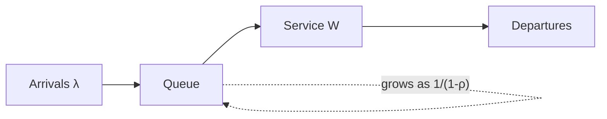

# Latency and Throughput

## Learning Goals

- [ ] Distinguish latency, throughput, and utilisation, and relate them
- [ ] Explain why averages are the wrong way to report latency
- [ ] Predict what happens to latency as utilisation approaches 100%

## What Is It?

- **Latency** — how long one operation takes, measured end to end.
- **Throughput** — how many operations complete per unit time.
- **Utilisation** — the fraction of capacity currently in use.

They are not independent. Queueing theory gives the relationship that matters
in practice: as utilisation `ρ` approaches 1, queueing delay grows as
`1/(1-ρ)`. At 90% utilisation, waiting time is roughly 10x the service time;
at 99%, roughly 100x. **Latency does not degrade linearly — it degrades as a
hyperbola, and the knee arrives sooner than intuition suggests.**

## Why Does It Matter?

Capacity planning, timeout selection, retry budgets, autoscaling thresholds
and SLOs all depend on understanding that a system at 85% utilisation is not
"85% as good as" a system at 50%.

## Core Concepts

- **Tail latency.** Report p50, p95, p99, p99.9 — never the mean. A mean hides
  the requests that make users leave.
- **Tail amplification.** A request that fans out to 100 services and waits for
  all of them experiences roughly the *p99* of the slowest dependency, not the
  p50. Fan-out turns rare slowness into common slowness.
- **Little's Law.** `L = λ × W` — concurrency equals arrival rate times
  latency. Useful for sizing connection pools and worker counts.
- **Latency numbers.** Memory ~100 ns, SSD ~100 µs, same-datacentre round trip
  ~0.5 ms, cross-continent round trip ~100 ms. The last one is bounded by the
  speed of light and no amount of engineering removes it.

## How It Works

## Failure Scenarios

| Situation | Effect | Mitigation |
| --- | --- | --- |
| Utilisation > 80% | Tail latency explodes | Headroom, autoscaling |
| Unbounded queues | Latency grows without limit | Bounded queues, load shedding |
| Large fan-out | p99 of dependencies becomes p50 of request | Hedged requests, fewer hops |
| Retries during overload | Effective load multiplies | Retry budgets, backoff, circuit breakers |

## Real-World Systems

- Dean & Barroso, *The Tail at Scale* — the canonical description of tail
  amplification at Google
- AWS load balancers surface `TargetResponseTime` percentiles rather than means

## Hands-on Experiment

Drive a service with a load generator at 50%, 80%, 95% and 99% of measured
capacity. Plot p50/p99 against utilisation and find the knee. Compare against
the `1/(1-ρ)` prediction.

## My Understanding

> Sources closed. Explain why adding one more server sometimes fixes latency
> dramatically and sometimes does nothing at all.

## Questions

- [ ] What utilisation target should the Month 5 project be sized for?
- [ ] Where in that project does a single slow dependency get amplified?

## Related Concepts

- [Timeouts and Retries](Timeouts%20and%20Retries.md)
- [Load Balancing](../../Cloud/Networking/Load%20Balancing.md)
- [High Availability](../../Cloud/Reliability/High%20Availability.md)

## Resources

- Dean & Barroso, *The Tail at Scale*, CACM 2013
- Gregg, *Systems Performance* — the USE method
- [AWS Builders' Library: Using load shedding to avoid overload](https://aws.amazon.com/builders-library/using-load-shedding-to-avoid-overload/)
