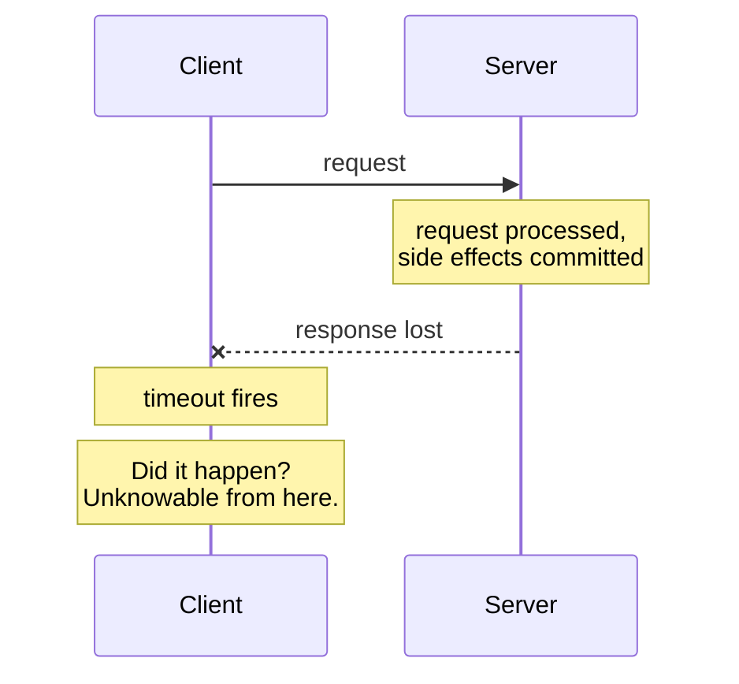

# Partial Failure

## Learning Goals

- [ ] Explain why a distributed system has no "all or nothing" execution
- [ ] Describe the two-generals problem in one paragraph
- [ ] List what a client can conclude from a timeout (answer: very little)

## What Is It?

Partial failure is the condition where **some components of a system have
failed while others continue to operate**, and no component has a complete
or timely picture of which is which. A single-machine program has total
failure: the process either runs or it does not. A distributed system almost
never has that luxury.

## Why Does It Matter?

Partial failure is the reason distributed systems need consensus, quorums,
idempotency, timeouts and retries. Every one of those mechanisms exists to
make progress despite an incomplete picture of the world.

## Core Concepts

- **Failure is not observable, only suspected.** A node that does not reply is
  crashed, overloaded, garbage-collecting, or behind a partition. From the
  outside these are identical.
- **The end-to-end argument.** Only the endpoints can confirm an operation
  happened; intermediate acknowledgements prove nothing about final effect.
- **Gray failure.** The worst case is not "down". It is "up, passing health
  checks, and serving 40% errors".

## How It Works

The client's three possibilities after a timeout:

1. The request never arrived.
2. The request arrived and was processed; the response was lost.
3. The request arrived and is still being processed.

No amount of client-side cleverness distinguishes them. The only fix is to
make retrying safe — see [Idempotency](Idempotency.md).

## Failure Scenarios

| Failure | Observed as | Correct response |
| --- | --- | --- |
| Crash-stop | Timeout | Retry elsewhere; fence the old node |
| Crash-recovery | Timeout, then node returns | Persistent state, epoch numbers |
| Omission | Some messages lost | Retries with idempotency |
| Partition | Timeout in both directions | Quorum to decide who may proceed |
| Byzantine | Wrong answers | Usually out of scope; assume trusted nodes |

## Real-World Systems

- Kubernetes marks a node `NotReady` after a grace period — an explicit,
  configurable guess about the difference between slow and dead
- TCP retransmits and eventually gives up; it never tells you whether the
  peer application processed the bytes

## Hands-on Experiment

[Lab 03 — Idempotency](../../../04-Labs/03-Idempotency/README.md): make a
payment-like request, kill the connection after the server commits but before
it replies, retry, and count the side effects.

## My Understanding

> Sources closed. Explain to a colleague why "just check if it succeeded"
> is not an available option.

## Questions

- [ ] What is the shortest timeout that is still safe for a given dependency?
      What does "safe" even mean here?
- [ ] Which failures in systems I maintain are actually gray failures being
      misdiagnosed as crashes?

## Related Concepts

- [Distributed System](Distributed%20System.md)
- [Timeouts and Retries](Timeouts%20and%20Retries.md)
- [Idempotency](Idempotency.md)
- [Failure Detection](../Fault-Tolerance/Failure%20Detection.md)

## Resources

- Kleppmann, *DDIA*, ch. 8 §"Faults and Partial Failures"
- Huang et al., *Gray Failure: The Achilles' Heel of Cloud-Scale Systems*
- Saltzer, Reed & Clark, *End-to-End Arguments in System Design*
