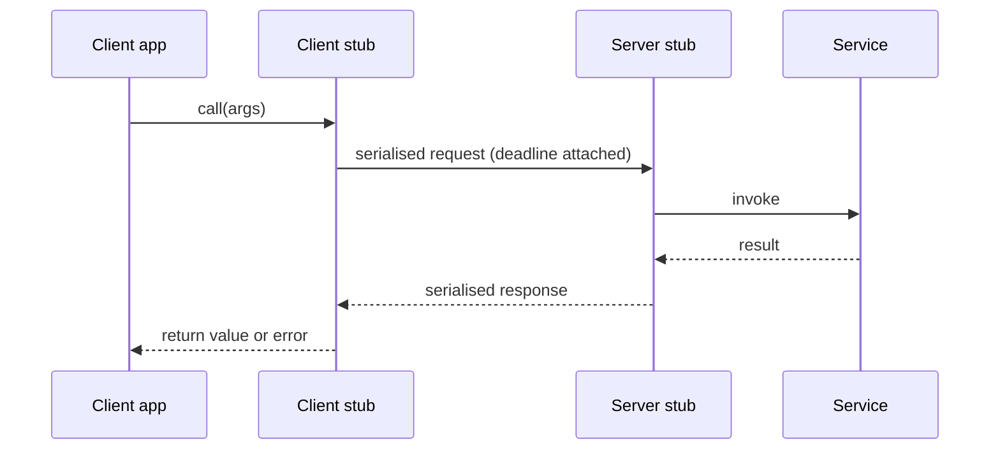

# RPC

## Learning Goals

- [ ] Explain what an RPC framework hides and why hiding it is dangerous
- [ ] Compare REST/HTTP and gRPC on the axes that actually differ
- [ ] Describe the delivery semantics an RPC call can offer

## What Is It?

Remote Procedure Call makes calling a function on another machine look like
calling a local function: marshal the arguments, send them over a network,
execute remotely, send the result back, unmarshal.

The abstraction is convenient and **leaky by construction**. A local call
cannot time out, cannot be executed twice, and cannot succeed on the callee
while appearing to fail to the caller. A remote call can do all three.

## Why Does It Matter?

Almost every distributed system is built out of RPCs. The failure modes of the
whole system are largely the failure modes of its RPCs, compounded.

## Core Concepts

- **Stub / marshalling** — client stub serialises, server stub deserialises
- **Interface definition** — Protobuf, Thrift, OpenAPI; the contract
- **Transport** — HTTP/1.1, HTTP/2, raw TCP, QUIC
- **Delivery semantics** — at-most-once (no retry), at-least-once (retry, needs
  [Idempotency](Idempotency.md)), exactly-once (only achievable as
  at-least-once + deduplication)
- **Deadlines** — an absolute time by which the response is useless; must
  propagate through the whole call chain

## How It Works

## HTTP/REST vs. gRPC

| | REST over HTTP/1.1 | gRPC over HTTP/2 |
| --- | --- | --- |
| Encoding | JSON (human-readable, verbose) | Protobuf (compact, typed) |
| Schema | Optional (OpenAPI) | Mandatory (`.proto`) |
| Streaming | Awkward (SSE, chunking) | Native, bidirectional |
| Browser support | Native | Needs a proxy (grpc-web) |
| Debuggability | `curl` | `grpcurl` |
| Good for | Public APIs, browsers | Internal service-to-service |

## Failure Scenarios

| Failure | Client sees | What to do |
| --- | --- | --- |
| Response lost | Timeout | Retry **only if** idempotent |
| Server slow | Deadline exceeded | Propagate deadline; fail fast |
| Connection reset mid-call | Error | Same as timeout — unknown outcome |
| Version skew | Deserialisation error | Backward-compatible schema evolution |

!!! warning "Deadlines must propagate"
    If service A gives B 5 seconds and B gives C 5 seconds, C can still be
    working after A has given up. Pass the *remaining* budget down the chain,
    not a fresh one.

## Real-World Systems

- gRPC (Google), Thrift (Meta), Kubernetes API (REST over HTTP/2 with watches)

## Hands-on Experiment

[Lab 01 — RPC](../../../04-Labs/01-RPC/README.md)

## My Understanding

> Sources closed. Explain what a caller genuinely knows when an RPC returns
> `DEADLINE_EXCEEDED`.

## Questions

- [ ] When is the extra weight of a schema-first protocol not worth it?
- [ ] How should deadline budgets be split across a 4-hop call chain?

## Related Concepts

- [Timeouts and Retries](Timeouts%20and%20Retries.md)
- [Idempotency](Idempotency.md)
- [Partial Failure](Partial%20Failure.md)
- [Message Delivery Semantics](../../Messaging/Delivery-Semantics/Message%20Delivery%20Semantics.md)

## Resources

- Birrell & Nelson, *Implementing Remote Procedure Calls* (1984)
- Waldo et al., *A Note on Distributed Computing* (1994) — why RPC transparency fails
- [gRPC documentation](https://grpc.io/docs/)
