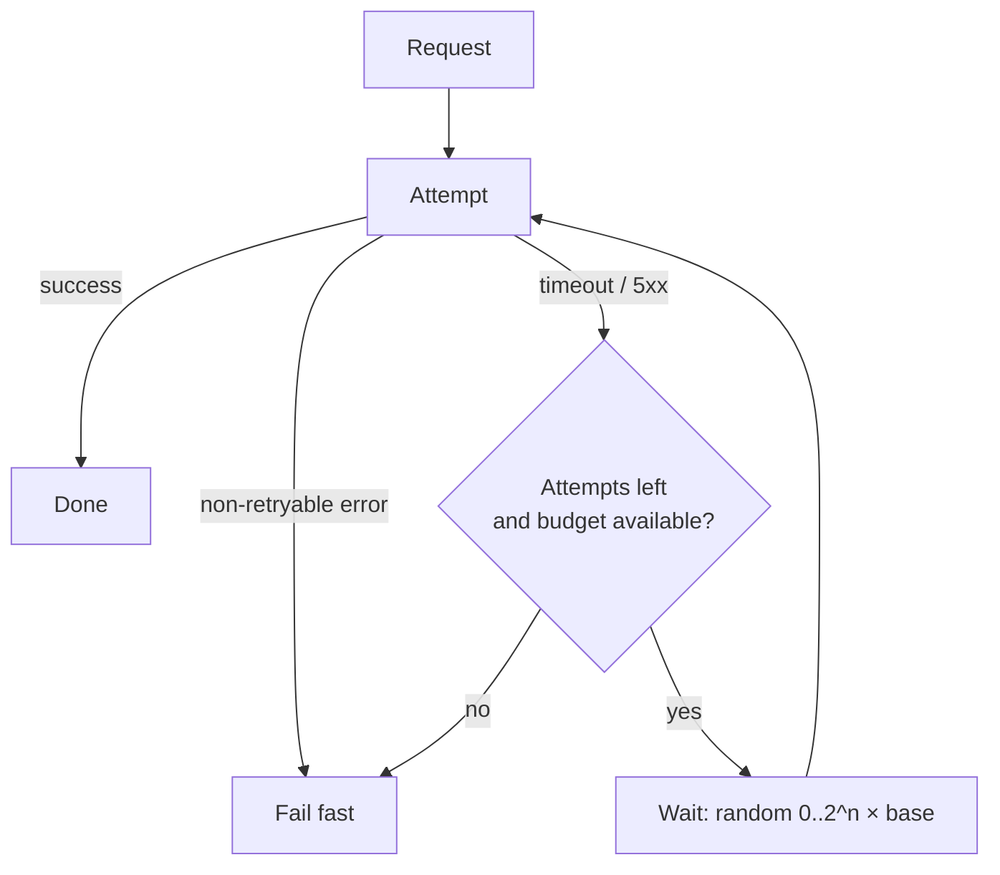

# Timeouts and Retries

## Learning Goals

- [ ] Choose a timeout from a latency distribution rather than by guessing
- [ ] Explain why naive retries turn a brownout into an outage
- [ ] Implement exponential backoff **with jitter** and say why jitter matters
- [ ] Describe what a retry budget and a circuit breaker each protect against

## What Is It?

A **timeout** is a client-side decision to stop waiting. A **retry** is a
decision to try again. Together they are the primary tool for surviving
transient failure — and the primary way a struggling system is pushed over
the edge.

## Why Does It Matter?

Retries are load multipliers. A service at 100% capacity that starts failing
10% of requests will, with 3 unconditional retries, receive up to 4x its
normal traffic exactly when it can least handle it. This is the classic
**retry storm**, and it converts a partial degradation into a total outage.

## Core Concepts

### Timeouts

- Set from the observed latency distribution, typically just above p99, not
  from a round number someone liked
- A timeout that is too long ties up client resources and propagates slowness
- A timeout that is too short converts slow-but-successful into failed, and
  generates load that was never needed
- **Deadlines beat timeouts**: an absolute deadline propagated through the call
  chain prevents each hop from restarting the clock

### Retries

- Retry only **idempotent** operations, or operations made idempotent by an
  idempotency key — see [Idempotency](Idempotency.md)
- Retry only **retryable** errors: timeouts, 429, 503, connection resets.
  Never retry 400 or 404; the answer will not change
- Cap the number of attempts, and cap the total elapsed time as well

### Backoff and jitter

Exponential backoff spaces attempts out: `1s, 2s, 4s, 8s`. Without jitter,
every client that failed at the same instant retries at the same instant —
a synchronised thundering herd. Jitter breaks the synchronisation.

```python
import random

def full_jitter_delay(attempt: int, base: float = 0.1, cap: float = 20.0) -> float:
    """AWS 'full jitter': sleep a uniformly random time in [0, backoff]."""
    return random.uniform(0, min(cap, base * (2 ** attempt)))
```

### Retry budgets and circuit breakers

- A **retry budget** caps retries as a fraction of total requests (e.g. 10%),
  so retries can never multiply load by more than 1.1x
- A **circuit breaker** stops calling a dependency entirely after a failure
  threshold, then probes occasionally to see whether it has recovered

## How It Works



## Failure Scenarios

| Failure | Naive behaviour | Correct behaviour |
| --- | --- | --- |
| Dependency at 100% CPU | Retries multiply load 4x | Budget + circuit breaker sheds load |
| Simultaneous client failure | Synchronised herd on retry | Full jitter |
| Timeout shorter than p99 | Healthy requests marked failed | Timeout above p99 |
| Retry of non-idempotent write | Duplicate side effects | Idempotency key |
| Retries at every layer | Multiplicative: 3×3×3 = 27 attempts | Retry at **one** layer only |

!!! danger "Retry at exactly one layer"
    Retries in the SDK, the service mesh, and the application compound
    multiplicatively. Pick one layer, and disable the others explicitly.

## Real-World Systems

- AWS SDKs: adaptive retry mode with a token-bucket retry budget
- Envoy / Istio: `x-envoy-max-retries`, retry budgets as a percentage
- gRPC: `retryPolicy` in the service config, with `maxAttempts`

## Hands-on Experiment

[Lab 02 — Timeouts and Retries](../../../04-Labs/02-Timeouts-Retries/README.md)
measures the retry storm directly.

## My Understanding

> Sources closed. Explain to an on-call engineer why the fix for a struggling
> dependency is sometimes to retry *less*.

## Questions

- [ ] What is the right timeout for each dependency in the Month 5 project?
- [ ] Where in that project are retries currently layered more than once?

## Related Concepts

- [Idempotency](Idempotency.md)
- [Partial Failure](Partial%20Failure.md)
- [Latency and Throughput](Latency%20and%20Throughput.md)
- [RPC](RPC.md)

## Resources

- [AWS Builders' Library: Timeouts, retries, and backoff with jitter](https://aws.amazon.com/builders-library/timeouts-retries-and-backoff-with-jitter/)
- [Exponential Backoff and Jitter (AWS Architecture Blog)](https://aws.amazon.com/blogs/architecture/exponential-backoff-and-jitter/)
- Google SRE Book, ch. 22 "Addressing Cascading Failures"
