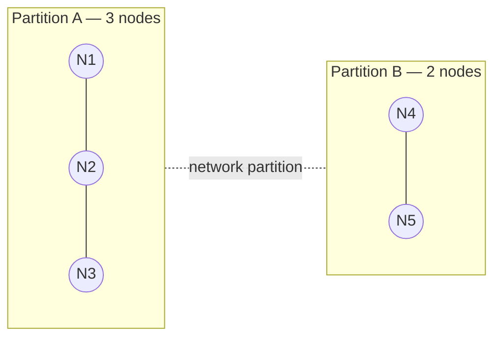

# Quorum

## Learning Goals

- [ ] Derive the `w + r > n` rule and explain what it guarantees
- [ ] Say why consensus systems use odd cluster sizes
- [ ] Explain how quorums prevent split brain

## What Is It?

A quorum is the minimum number of nodes that must participate for an operation
to be considered successful. The point is **overlap**: if every write reaches
`w` nodes and every read consults `r` nodes out of `n`, then

```text
w + r > n
```

guarantees at least one node in every read set also took part in the latest
write. That one node is enough to find the newest value.

The most common special case is the **majority quorum**,
`w = r = ⌊n/2⌋ + 1`, whose defining property is that **two majorities of the
same cluster always intersect** — so two conflicting decisions cannot both be
committed.

## Core Concepts

| n | Majority | Failures tolerated |
| --- | --- | --- |
| 3 | 2 | 1 |
| 4 | 3 | 1 |
| 5 | 3 | 2 |
| 6 | 4 | 2 |
| 7 | 4 | 3 |

Note that `n = 4` tolerates no more failures than `n = 3`, while costing more
and making every write slower. **This is why consensus clusters are odd-sized.**

### Why quorums stop split brain

A network partition splits a 5-node cluster into 3 and 2. Only the side with 3
can form a majority, so only that side may elect a leader or commit writes.
The minority side must stop accepting writes — it cannot know it is not the
one that has been cut off.



Partition A: majority, keeps serving. Partition B: minority, must refuse writes.

## Failure Scenarios

| Failure | Consequence | Mitigation |
| --- | --- | --- |
| `w + r ≤ n` | Reads may miss the latest write | Fix the arithmetic, or accept eventual consistency |
| Even cluster size | Wasted node, possible tie | Use odd `n` |
| Sloppy quorum | Writes succeed on nodes outside the home set | Understand that `w + r > n` no longer holds |
| Losing a majority | Cluster unavailable for writes | Spread across failure domains |

## Real-World Systems

- Raft and Paxos: majority for elections and for commit
- etcd, ZooKeeper, Consul: odd cluster sizes for exactly this reason
- Cassandra / DynamoDB: tunable `w` and `r` per query (`ONE`, `QUORUM`, `ALL`)

## Hands-on Experiment

Take a 5-node etcd cluster, stop 2 nodes (still writable), then stop a 3rd and
observe writes fail while reads may still be served stale.

## My Understanding

> Sources closed. Explain why 4 nodes are no more fault-tolerant than 3.

## Questions

- [ ] What does `w + r > n` *not* guarantee? (Hint: concurrent writes.)
- [ ] How do quorums behave when nodes are spread across 2 availability zones?

## Related Concepts

- [Replication](Replication.md)
- [CAP Theorem](../Consistency/CAP%20Theorem.md)
- [Raft](../Consensus/Raft.md)
- [Leader Election](../Consensus/Leader%20Election.md)

## Resources

- Kleppmann, *DDIA*, ch. 5 §"Quorums for reading and writing"
- [etcd FAQ: Why an odd number of cluster members?](https://etcd.io/docs/latest/faq/)
