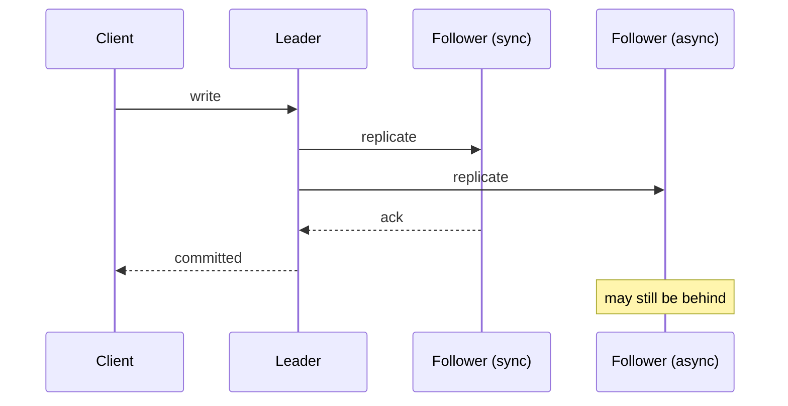

# Replication

## Learning Goals

- [ ] State the three reasons to replicate and which one you are buying
- [ ] Explain the durability/latency trade-off in sync vs. async replication
- [ ] Predict how much data an async replica can lose on failover

## What Is It?

Keeping copies of the same data on multiple machines. The hard part is not
copying data — it is keeping the copies consistent while writes continue and
machines fail.

## Why Does It Matter?

Replication buys three distinct things, and conflating them causes bad designs:

1. **Availability** — survive the loss of a node
2. **Read scalability** — serve reads from more machines
3. **Locality** — put data near users to cut latency

A replica added for read scalability does not automatically give you
availability, because failover may not be automatic or safe.

## Core Concepts

### Topologies

| Topology | Writes go to | Trade-off |
| --- | --- | --- |
| Single leader | One node | Simple, no write conflicts; leader is a bottleneck and a failover problem |
| Multi-leader | Any leader | Writes survive partitions; **conflict resolution required** |
| Leaderless (Dynamo-style) | Any replica, quorum | High availability; needs read repair and [Quorum](Quorum.md) arithmetic |

### Synchronous vs. asynchronous

- **Synchronous** — leader waits for the follower to acknowledge before
  confirming the write. No data loss on failover; write latency includes the
  slowest follower, and a dead follower blocks all writes.
- **Asynchronous** — leader confirms immediately. Fast, always available for
  writes, but a failover loses everything not yet shipped.
- **Semi-synchronous** — wait for *one* follower. The usual compromise.

**Replication lag** is the age of the data on a follower. It is normally
milliseconds and occasionally minutes, and every design must answer what
happens during the "occasionally".

## Failure Scenarios

| Failure | Consequence | Mitigation |
| --- | --- | --- |
| Leader dies, async replication | Acknowledged writes lost | Sync/semi-sync for critical data |
| Follower falls behind | Stale reads | Read-your-writes routing; monitor lag |
| Failover with a lagging replica | Silent data loss | Refuse promotion beyond a lag threshold |
| Old leader returns | **Split brain**, two leaders | Fencing tokens, [Quorum](Quorum.md) |

## Real-World Systems

- PostgreSQL streaming replication (`synchronous_commit`, `synchronous_standby_names`)
- Kafka in-sync replicas (`acks=all`, `min.insync.replicas`)
- Raft-based systems, where replication and consensus are the same mechanism

## Hands-on Experiment

[Lab 04 — Replication](../../../04-Labs/04-Replication/README.md): measure how
much acknowledged data an async replica loses when the primary is killed.

## My Understanding

> Sources closed. Explain the exact moment at which a write becomes
> "durable", for each replication mode.

## Questions

- [ ] What is the acceptable RPO for the job platform's job records?
- [ ] Should replicas serve reads there, and what staleness is tolerable?

## Related Concepts

- [Quorum](Quorum.md)
- [Consistency Models](../Consistency/Consistency%20Models.md)
- [Database Replication](../../Databases/Replication/Database%20Replication.md)
- [Raft](../Consensus/Raft.md)

## Resources

- Kleppmann, *DDIA*, ch. 5
- [PostgreSQL: High Availability, Load Balancing and Replication](https://www.postgresql.org/docs/current/high-availability.html)
