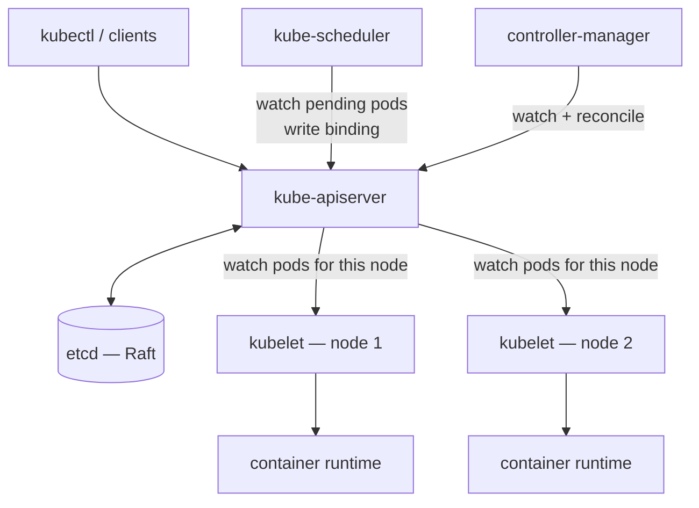

# Kubernetes Control Plane

## Learning Goals

- [ ] Name each control-plane component and its single responsibility
- [ ] Explain why only the API server talks to etcd
- [ ] Explain what keeps running when the control plane is down

## What Is It?

The set of components that maintain the cluster's **desired state** and drive
the **observed state** towards it.

| Component | Responsibility |
| --- | --- |
| **kube-apiserver** | The only component that reads/writes [etcd](../etcd/etcd.md). Validation, admission, authn/authz, and the watch API. Stateless and horizontally scalable |
| **etcd** | The single source of truth. Raft-replicated, consistent, and the cluster's real durability boundary |
| **kube-scheduler** | Assigns pending pods to nodes. Writes a binding; does not start anything |
| **kube-controller-manager** | Runs the built-in controllers (deployment, replicaset, node, endpoint, ...) |
| **cloud-controller-manager** | Cloud-specific controllers (load balancers, routes, volumes) |
| **kubelet** | On each node. Watches for pods bound to its node and makes the container runtime match |

## Why Does It Matter?

The architecture is a textbook distributed system: a consensus-backed store, a
single gateway enforcing invariants, and a set of independent
[reconciliation](../Reconciliation/Reconciliation.md) loops communicating only
through that store. No component calls another directly. That is what makes it
resilient to any single component failing.

## Key properties

- **Components never talk to each other.** They all read and write the API
  server. This is the level-triggered, shared-state pattern
- **The API server is the only etcd client**, which centralises validation,
  authorisation and etcd's operational complexity
- **The data plane survives the control plane.** If every control-plane
  component dies, running pods keep serving traffic. What stops is *change*:
  no scheduling, no scaling, no rollouts, no self-healing

## Failure Scenarios

| Failure | Effect | Mitigation |
| --- | --- | --- |
| API server down | No changes accepted; running workloads unaffected | Multiple replicas behind a load balancer |
| etcd loses quorum | **Cluster read-only or unavailable**; the worst case | Odd-sized cluster across failure domains; monitor and back up |
| Scheduler down | New pods stay `Pending` | Leader-elected replicas |
| Controller-manager down | No self-healing, no rollouts | Leader-elected replicas |
| kubelet down | That node's pods are eventually rescheduled elsewhere | Node monitoring; pod disruption budgets |
| etcd slow disk | API latency across the whole cluster | Dedicated SSDs; watch `etcd_disk_wal_fsync_duration` |

## Real-World Systems

Managed control planes (EKS, GKE, AKS) hide etcd entirely and sell an API
server SLA — a useful hint about which part is operationally hardest.

## Hands-on Experiment

Run a local cluster. `kubectl get --raw /metrics` on the API server, stop the
scheduler, create a Deployment, and observe pods sitting `Pending`. Restart it
and watch them bind.

## My Understanding

> Sources closed. Explain what actually breaks, minute by minute, when etcd
> loses quorum.

## Questions

- [ ] What is the blast radius of a slow etcd disk?
- [ ] How does the API server's watch mechanism avoid hammering etcd?

## Related Concepts

- [etcd](../etcd/etcd.md)
- [Controllers and Operators](../Controllers/Controllers%20and%20Operators.md)
- [Reconciliation](../Reconciliation/Reconciliation.md)
- [Raft](../../Distributed-Systems/Consensus/Raft.md)

## Resources

- [Kubernetes: Cluster Architecture](https://kubernetes.io/docs/concepts/architecture/)
- [Kubernetes: Components](https://kubernetes.io/docs/concepts/overview/components/)
