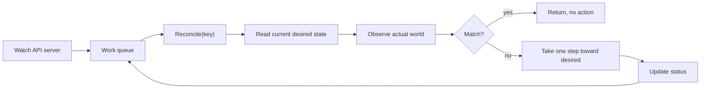

# Controllers and Operators

## Learning Goals

- [ ] Explain the controller pattern in terms of desired vs. observed state
- [ ] Explain why controllers must be level-triggered, not edge-triggered
- [ ] Describe what an operator adds beyond a controller

## What Is It?

A **controller** is a loop that watches a resource, compares desired state to
observed state, and takes action to close the gap. An **operator** is a
controller for a *custom* resource that encodes operational knowledge about a
specific application — how to back up a database, how to do a safe rolling
upgrade of a cluster.

## Level-triggered, not edge-triggered

This is the single most important property.

- **Edge-triggered**: react to the *event* ("a pod was deleted"). If the event
  is missed — controller restart, watch disconnect — the system stays wrong
  forever.
- **Level-triggered**: react to the *current state* ("3 desired, 2 present").
  A missed event is harmless: the next resync sees the same discrepancy and
  fixes it.

Kubernetes controllers use events only as a **hint to re-examine state**, never
as the state itself. That is why a controller can be killed at any point and
restarted without any recovery logic.

## Core Concepts

- **Reconcile(key)** — must be idempotent and must not assume why it was called
- **Informer / watch cache** — a local cache of resources kept current by a
  watch, with a periodic full resync as a safety net
- **Work queue with rate limiting** — deduplicates keys and applies exponential
  backoff on failure
- **Status subresource** — the controller reports observed state back; users
  set `spec`, controllers set `status`
- **Leader election** — replicas for availability, but only one active writer.
  See [Leader Election](../../Distributed-Systems/Consensus/Leader%20Election.md)
- **Finalizers** — block deletion until cleanup completes; a stuck finalizer is
  a classic cause of a namespace that will not delete

## Failure Scenarios

| Failure | Consequence | Mitigation |
| --- | --- | --- |
| Edge-triggered logic | Permanent drift after a missed event | Level-triggered reconcile |
| Non-idempotent reconcile | Duplicate resources | Reconcile must be safe to call repeatedly |
| Two active controllers | Fighting writes, resource flapping | Leader election |
| Reconcile too slow | Queue backs up, drift persists | Bound the work; requeue instead of blocking |
| Hot loop (status update triggers a watch event) | CPU burn, API server load | Only update status when it actually changed |
| Stuck finalizer | Resource cannot be deleted | Ensure the cleanup path always terminates |

## Real-World Systems

- Built-in: Deployment, ReplicaSet, Node, Endpoint, Job controllers
- Operators: Prometheus Operator, cert-manager, Strimzi (Kafka), CloudNativePG
- Frameworks: controller-runtime / Kubebuilder, Operator SDK

## Hands-on Experiment

Week 22: write a controller that ensures a ConfigMap always contains a given
key. Kill it mid-reconcile, restart it, and confirm convergence without any
special recovery code. Then delete the ConfigMap by hand and watch it return.

## My Understanding

> Sources closed. Explain why "the controller missed the event" is not a
> failure mode a well-written controller has.

## Questions

- [ ] Where would an operator help the job platform, and where is it overkill?
- [ ] How do finalizers interact with the reconcile loop's idempotency?

## Related Concepts

- [Reconciliation](../Reconciliation/Reconciliation.md)
- [Kubernetes Control Plane](../Architecture/Kubernetes%20Control%20Plane.md)
- [Leader Election](../../Distributed-Systems/Consensus/Leader%20Election.md)
- [etcd](../etcd/etcd.md)

## Resources

- [Kubernetes: Controllers](https://kubernetes.io/docs/concepts/architecture/controller/)
- [Kubernetes: Operator pattern](https://kubernetes.io/docs/concepts/extend-kubernetes/operator/)
- [Hausenblas & Schimanski, *Programming Kubernetes*](https://programming-kubernetes.info/)
