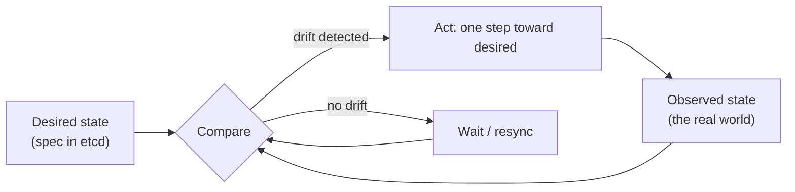

# Reconciliation

## Learning Goals

- [ ] Explain the desired/observed state loop as a general pattern
- [ ] Explain why eventual consistency is acceptable here
- [ ] Recognise the same pattern outside Kubernetes

## What Is It?

A control loop that continuously drives observed state towards declared desired
state. It is a control system, not a workflow: there is no "install" step and
no "upgrade" step, only *what should be true* and a loop that keeps making it
true.

## Why Does It Matter?

Reconciliation is what makes declarative infrastructure self-healing. A deleted
pod comes back not because something detected the deletion, but because the
next comparison finds 2 pods where 3 are wanted. **Failures do not need
explicit handling; they are simply drift, and drift is the normal case.**

The trade-off is honest and worth stating: the system is **eventually
consistent by design**. `kubectl apply` returns as soon as the desired state is
recorded, not when reality matches it. Anything that waits for the effect must
poll `status`.

## Core Concepts

- **Declarative over imperative** — describe the end state, not the steps
- **Level-triggered** — act on current state, not on events
- **Idempotent actions** — the loop will run again; every action must be safe
  to repeat
- **Convergence** — each iteration moves closer; the loop must not oscillate
- **Backoff** — a failing reconcile must slow down, or it will hammer both the
  API server and the external system
- **spec vs. status** — humans and higher controllers write `spec`; the owning
  controller writes `status`

## Failure Scenarios

| Failure | Consequence | Mitigation |
| --- | --- | --- |
| Two controllers own the same field | Oscillation; resources flip forever | One owner per field; server-side apply field ownership |
| Non-convergent logic | Loop never settles | Ensure each step strictly reduces the difference |
| No backoff on failure | API server overload during an outage | Rate-limited work queue |
| Desired state impossible | Infinite retry (unschedulable pod) | Surface it in `status`/events, keep retrying, alert |
| Manual change outside the loop | Silently reverted | Expected behaviour — GitOps: change the source, not the cluster |

## The pattern outside Kubernetes

Once recognised, it appears everywhere:

- **Terraform** — plan is the comparison, apply is the action (but manually
  triggered, not a loop)
- **Argo CD / Flux** — reconcile a cluster against a Git repository
- **DNS/DHCP with TTLs**, autoscalers, thermostats, TCP congestion control

## Hands-on Experiment

Create a Deployment with 3 replicas, then `kubectl delete pod` one of them and
watch it return. Then edit the underlying ReplicaSet directly and watch the
Deployment controller overwrite the change.

## My Understanding

> Sources closed. Explain the difference between a reconciliation loop and a
> retry loop.

## Questions

- [ ] Would the job platform's job state machine benefit from being
      reconciliation-based rather than event-driven?
- [ ] What is the cost of the periodic full resync at large scale?

## Related Concepts

- [Controllers and Operators](../Controllers/Controllers%20and%20Operators.md)
- [Kubernetes Control Plane](../Architecture/Kubernetes%20Control%20Plane.md)
- [Consistency Models](../../Distributed-Systems/Consistency/Consistency%20Models.md)

## Resources

- [Kubernetes: Controllers](https://kubernetes.io/docs/concepts/architecture/controller/)
- [Hightower, *Kubernetes The Hard Way*](https://github.com/kelseyhightower/kubernetes-the-hard-way)
