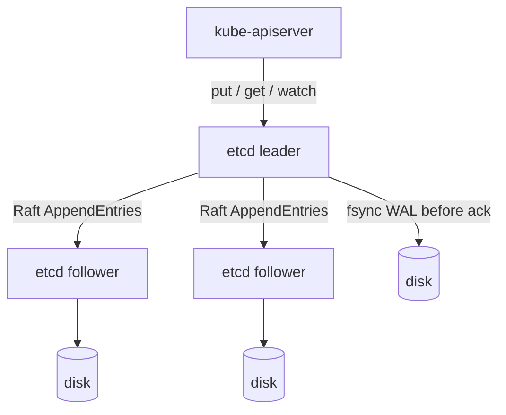

# etcd

## Learning Goals

- [ ] Explain what etcd guarantees and what it deliberately does not
- [ ] Describe the watch API and resource versions
- [ ] Explain why etcd is sensitive to disk latency above all else

## What Is It?

A distributed, strongly consistent key-value store built on
[Raft](../../Distributed-Systems/Consensus/Raft.md). It stores the entire state
of a Kubernetes cluster and is the reason Kubernetes behaves as a CP system.

## Core Concepts

- **Linearizable reads and writes** by default. Serializable (local, possibly
  stale) reads are available and cheaper
- **MVCC with a global revision** — every mutation increments a cluster-wide
  revision, so any historical revision can be read until compaction
- **Watch** — clients stream changes *from a given revision*, which is what
  makes Kubernetes controllers efficient and, critically, **resumable after a
  disconnect without missing events**
- **Leases** — keys with a TTL that must be renewed. The primitive underneath
  Kubernetes `Lease` objects and controller
  [leader election](../../Distributed-Systems/Consensus/Leader%20Election.md)
- **Compaction and defragmentation** — old revisions must be compacted, and the
  freed space must be defragmented separately or the database keeps growing

## Operational realities

etcd is unusually sensitive to **disk write latency**, because every Raft log
append is `fsync`ed before it can be acknowledged. The metric to watch is
`etcd_disk_wal_fsync_duration_seconds`; a p99 above ~10 ms causes visible
Kubernetes API slowness, and network latency between members matters for the
same reason.

| Constraint | Practical consequence |
| --- | --- |
| Default DB size limit 2 GB (`--quota-backend-bytes`) | Exceeding it puts the cluster into a read-only alarm state |
| Odd member count | 3 for most clusters, 5 for large ones; never even |
| Members should be co-located by latency | Stretching etcd across regions is usually a mistake |

## Failure Scenarios

| Failure | Consequence | Mitigation |
| --- | --- | --- |
| Loses quorum | Cluster cannot accept writes | Odd size, spread across failure domains |
| Slow disk | API latency cluster-wide | Dedicated SSD, monitor fsync duration |
| DB exceeds quota | `NOSPACE` alarm, read-only | Compact + defrag, raise quota, alert early |
| Compaction never run | Unbounded growth | `--auto-compaction-retention` |
| No backups | Total cluster state loss | `etcdctl snapshot save` on a schedule, **tested restores** |
| Member restarted with a wiped disk | Risk of double voting | Remove and re-add as a new member |

!!! danger "An untested backup is not a backup"
    `etcdctl snapshot save` is easy. `etcdctl snapshot restore` into a working
    cluster is the part that must be rehearsed. See
    [Disaster Recovery](../../Cloud/Reliability/Disaster%20Recovery.md).

## Real-World Systems

Kubernetes (all state), and etcd standalone as a coordination store for
service discovery, distributed locks and leader election.

## Hands-on Experiment

Run a 3-node etcd cluster locally. Identify the leader, kill it and time the
election. Kill a second node and confirm writes fail while stale reads may
still succeed. Take a snapshot and restore it into a fresh cluster.

## My Understanding

> Sources closed. Explain why the API server's watch mechanism needs etcd's
> revision numbers rather than just a message queue.

## Questions

- [ ] What is the etcd fsync p99 in the local cluster, and on what storage?
- [ ] How does the API server's watch cache reduce etcd load?

## Related Concepts

- [Raft](../../Distributed-Systems/Consensus/Raft.md)
- [Kubernetes Control Plane](../Architecture/Kubernetes%20Control%20Plane.md)
- [Linearizability](../../Distributed-Systems/Consistency/Linearizability.md)
- [Quorum](../../Distributed-Systems/Replication/Quorum.md)

## Resources

- [etcd documentation](https://etcd.io/docs/)
- [etcd: Hardware recommendations and tuning](https://etcd.io/docs/latest/op-guide/hardware/)
- [Kubernetes: Operating etcd clusters](https://kubernetes.io/docs/tasks/administer-cluster/configure-upgrade-etcd/)
