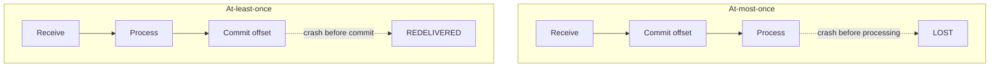

# Message Delivery Semantics

## Learning Goals

- [ ] Explain the three semantics and what each costs
- [ ] Explain why exactly-once *delivery* is impossible
- [ ] Describe how exactly-once *processing* is achieved in practice

## What Is It?

The guarantee a messaging system makes about how many times a message is
delivered. The choice is made almost entirely by **when the consumer commits
its position relative to when it does the work**.

| Semantic | Commit order | Failure result | Use when |
| --- | --- | --- | --- |
| **At-most-once** | Commit, then process | Message **lost** | Metrics, telemetry — loss is cheaper than duplication |
| **At-least-once** | Process, then commit | Message **duplicated** | Almost everything. The default |
| **Exactly-once** | At-least-once + deduplication | Neither | Financial and stateful processing |

## Why exactly-once delivery is impossible

It reduces to the Two Generals Problem: the sender cannot know the receiver got
the message without an acknowledgement, the acknowledgement can itself be lost,
and no finite exchange of messages resolves the ambiguity.

What *is* achievable is **exactly-once processing**: deliver at least once, and
make processing idempotent so duplicates have no additional effect. Two
mechanisms:

1. **Deduplication** — record processed message IDs and skip repeats. Needs a
   store with a retention window
2. **Atomic commit of work and position** — write the result and the offset in
   one transaction, so they cannot diverge

Kafka's "exactly-once semantics" is mechanism 2, and only works when the output
is also Kafka (transactional producer, `read_committed` consumer). Writing to
an external database requires
[Idempotency](../../Distributed-Systems/Fundamentals/Idempotency.md) or the
[Outbox Pattern](Outbox%20Pattern.md).

## Failure Scenarios

| Failure | Semantic delivered | Fix |
| --- | --- | --- |
| Crash after commit, before processing | At-most-once, silently | Commit after processing |
| Crash after processing, before commit | Duplicate | Idempotent consumer |
| Duplicate arrives after dedup window expired | Duplicate side effect | Window > max redelivery delay |
| Result written to DB, offset commit fails | Duplicate on replay | Store offset in the same DB transaction |

## Real-World Systems

- Kafka: idempotent producer (dedup by PID + sequence), transactions for
  read-process-write within Kafka
- SQS: at-least-once standard queues; FIFO queues offer a 5-minute dedup window
- Kafka Streams / Flink: exactly-once via checkpointed state plus transactions

## Hands-on Experiment

[Lab 06 — Kafka Delivery](../../../04-Labs/06-Kafka-Delivery/README.md), then
[Lab 03 — Idempotency](../../../04-Labs/03-Idempotency/README.md).

## My Understanding

> Sources closed. Explain to a product manager why "we need exactly-once" is
> a requirement about *effects*, not about *delivery*.

## Questions

- [ ] Where does the job platform's dedup state live, and how long is it kept?
- [ ] What happens if a job is executed twice — is it actually harmful?

## Related Concepts

- [Idempotency](../../Distributed-Systems/Fundamentals/Idempotency.md)
- [Outbox Pattern](Outbox%20Pattern.md)
- [Kafka](../Kafka/Kafka.md)
- [Partial Failure](../../Distributed-Systems/Fundamentals/Partial%20Failure.md)

## Resources

- [Confluent: Exactly-once semantics in Kafka](https://www.confluent.io/blog/exactly-once-semantics-are-possible-heres-how-apache-kafka-does-it/)
- Kleppmann, *DDIA*, ch. 11 §"Exactly-once message processing"
