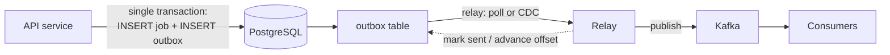

# Outbox Pattern

## Learning Goals

- [ ] State the dual-write problem precisely
- [ ] Explain how the outbox converts it into one local transaction
- [ ] Compare polling and CDC as relay mechanisms

## What Is It?

A way to update a database **and** publish a message without a distributed
transaction: write the message into an `outbox` table **in the same local
transaction** as the business data, and have a separate relay process read that
table and publish to the broker.

## The problem it solves: the dual write

```python
# BROKEN — two systems, no atomicity.
db.insert(job)          # succeeds
kafka.publish(event)    # crashes here => DB has the job, nobody knows about it
```

Reversing the order is no better: publish-then-crash means consumers act on a
job that does not exist. There is no ordering of two independent writes that is
safe, and [Two-Phase Commit](../../Databases/Distributed-Transactions/Two-Phase%20Commit.md)
across a database and a broker is slow, blocking and poorly supported.

## How It Works



```sql
BEGIN;
  INSERT INTO jobs (id, status, payload) VALUES ($1, 'pending', $2);
  INSERT INTO outbox (id, topic, key, payload, created_at)
    VALUES ($3, 'jobs.created', $1, $4, now());
COMMIT;
```

One transaction, one system, ordinary ACID atomicity. Either both rows exist or
neither does.

## Relay mechanisms

| Mechanism | How | Trade-offs |
| --- | --- | --- |
| **Polling** | `SELECT ... WHERE sent = false ORDER BY id LIMIT n` | Trivial to build; adds load and latency; needs `FOR UPDATE SKIP LOCKED` for multiple relays |
| **CDC** (Debezium) | Tail the [WAL](../../Databases/Transactions/Write-Ahead%20Log.md) | Low latency, no polling load; another system to operate |

Either way, the relay gives **at-least-once** publication: it may crash after
publishing but before marking the row sent. Consumers must therefore be
idempotent — the outbox solves atomicity, not deduplication.

## Failure Scenarios

| Failure | Consequence | Mitigation |
| --- | --- | --- |
| Relay crashes after publish, before marking sent | Duplicate publish | Idempotent consumers; producer dedup |
| Relay stops | Messages accumulate, silently | Alert on outbox age and depth |
| Outbox table grows forever | Bloat, slow queries | Delete or archive sent rows |
| Multiple relays | Duplicate publishes | `FOR UPDATE SKIP LOCKED`, or leader election |
| Ordering required | Polling by `id` can reorder under concurrency | Order by a sequence; partition by key |

## Real-World Systems

- Debezium Outbox Event Router — the reference CDC implementation
- Common in .NET/Java service templates as "transactional outbox"
- The **inbox** pattern is the mirror image: record consumed message IDs in the
  same transaction as the side effect, giving consumer-side deduplication

## Hands-on Experiment

In the Month 5 project, implement the naive dual write and kill the process
between the two writes to produce an orphaned job. Then implement the outbox
and show the orphan is impossible.

## My Understanding

> Sources closed. Explain why the outbox does not give exactly-once delivery,
> and why that is fine.

## Questions

- [ ] Polling or CDC for the job platform? What is the added operational cost?
- [ ] What retention should the outbox table have?

## Related Concepts

- [Message Delivery Semantics](Message%20Delivery%20Semantics.md)
- [Idempotency](../../Distributed-Systems/Fundamentals/Idempotency.md)
- [Two-Phase Commit](../../Databases/Distributed-Transactions/Two-Phase%20Commit.md)
- [Write-Ahead Log](../../Databases/Transactions/Write-Ahead%20Log.md)

## Resources

- [Microservices.io: Transactional outbox](https://microservices.io/patterns/data/transactional-outbox.html)
- [Debezium: Reliable microservices data exchange with the outbox pattern](https://debezium.io/blog/2019/02/19/reliable-microservices-data-exchange-with-the-outbox-pattern/)
