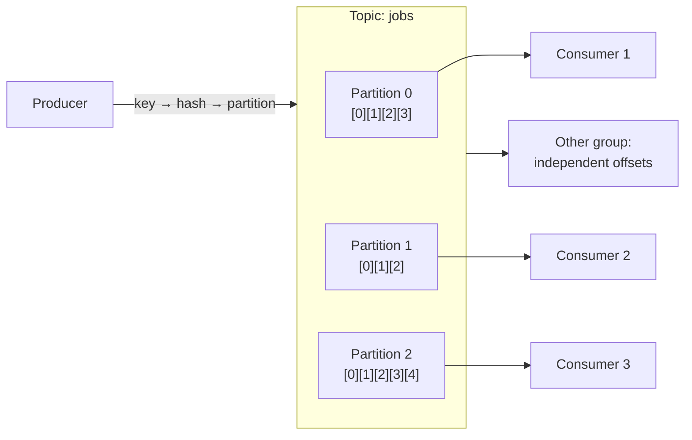

# Kafka

## Learning Goals

- [ ] Explain why a partition, not a topic, is the unit of parallelism
- [ ] Describe what `acks=all` plus `min.insync.replicas` actually guarantees
- [ ] Explain how offset commit timing determines delivery semantics

## What Is It?

A distributed, partitioned, replicated **commit log**. Not a traditional
message broker: Kafka does not delete a message when it is consumed. It retains
messages for a configured period, and each consumer tracks its own position
(**offset**) in the log.

That single design choice explains most of Kafka's behaviour — replay,
multiple independent consumers, and consumer-controlled delivery semantics all
fall out of it.

## Core Concepts

| Concept | Meaning |
| --- | --- |
| **Topic** | A named stream of records |
| **Partition** | An ordered, immutable, append-only log. **Ordering is guaranteed only within a partition** |
| **Offset** | A record's position within its partition |
| **Consumer group** | A set of consumers that split the partitions between them |
| **ISR** | In-sync replicas — those caught up with the leader |
| **Retention** | Time- or size-based; log compaction keeps the latest value per key |

### Parallelism is bounded by partitions

Each partition is consumed by **at most one consumer in a group**. Ten
partitions means at most ten useful consumers; an eleventh sits idle. Partition
count is the throughput ceiling, and increasing it later breaks key-to-partition
affinity.

### Durability settings that matter

| Setting | Effect |
| --- | --- |
| `acks=0` | Fire and forget. Data loss is expected |
| `acks=1` | Leader only. Loses data if the leader fails before replication |
| `acks=all` + `min.insync.replicas=2` | Committed to a quorum of replicas. **The only durable configuration** |
| `enable.idempotence=true` | Producer dedup via PID + sequence number; prevents duplicates from producer retries |
| `unclean.leader.election.enable=true` | Allows an out-of-sync replica to become leader — **trades data loss for availability** |

## Failure Scenarios

| Failure | Consequence | Mitigation |
| --- | --- | --- |
| Broker fails, `acks=1` | Acknowledged records lost | `acks=all`, `min.insync.replicas=2` |
| Consumer commits offset before processing | Message lost on crash | Commit after processing |
| Consumer commits after processing | Message reprocessed on crash | Idempotent consumers |
| Consumer too slow | Rebalance kicks it out, duplicates | `max.poll.interval.ms`, smaller batches |
| Rebalance storm | Throughput collapses | Static membership, cooperative rebalancing |
| Partition count increased | Key ordering broken for existing keys | Plan partition count up front |

!!! warning "Rebalances are the most common Kafka operational problem"
    Every consumer join, leave or timeout can pause the whole group. Tune
    `session.timeout.ms` and `max.poll.interval.ms` against actual processing
    time, and use cooperative sticky assignment.

## Real-World Systems

Kafka as event backbone (LinkedIn, its origin), as a database changelog sink
via CDC/Debezium, and as the ingestion layer for stream processing (Flink,
Kafka Streams).

## Hands-on Experiment

[Lab 06 — Kafka Delivery](../../../04-Labs/06-Kafka-Delivery/README.md):
can a consumer lose or duplicate messages depending on when it commits offsets?

## My Understanding

> Sources closed. Explain why Kafka is better described as a log than a queue.

## Questions

- [ ] How many partitions does the job platform's `jobs` topic need, and what
      is the key?
- [ ] Do jobs need ordering at all? If per-tenant, what does that force?

## Related Concepts

- [Queues and Pub-Sub](../Queues/Queues%20and%20Pub-Sub.md)
- [Message Delivery Semantics](../Delivery-Semantics/Message%20Delivery%20Semantics.md)
- [Replicated Log](../../Distributed-Systems/Consensus/Replicated%20Log.md)
- [Sharding and Partitioning](../../Databases/Sharding/Sharding%20and%20Partitioning.md)

## Resources

- [Apache Kafka documentation — Design](https://kafka.apache.org/documentation/#design)
- Narkhede, Shapira & Palino, *Kafka: The Definitive Guide*
- Kleppmann, *DDIA*, ch. 11
