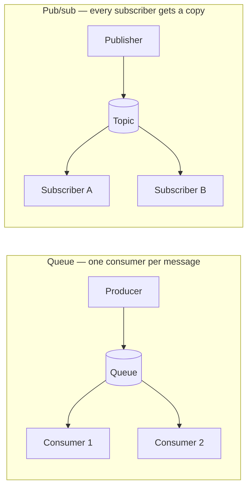

# Queues and Pub-Sub

## Learning Goals

- [ ] Distinguish point-to-point queues from publish/subscribe
- [ ] Explain what asynchrony buys and what it costs
- [ ] Describe backpressure and dead-letter handling

## What Is It?

Two messaging shapes:

- **Queue (point-to-point)** — each message is delivered to exactly one
  consumer. Used for **work distribution**.
- **Pub/sub (topic)** — each message is delivered to every subscriber. Used for
  **event notification**.

Kafka blurs the line deliberately: a topic is pub/sub across consumer *groups*
and a queue within a group.

## Why Does It Matter?

Asynchrony buys **decoupling**, **load levelling** (a queue absorbs a spike the
workers cannot), and **independent scaling**. It costs **eventual consistency**,
**harder debugging** (causality is no longer a stack trace), **ordering
complications**, and a new failure domain.

## Core Concepts

- **Acknowledgement** — the consumer confirms processing; unacked messages are
  redelivered. Ack *after* processing, never before
- **Visibility timeout / lease** — how long a message is hidden while being
  processed. Too short means duplicate processing; too long means slow recovery
- **Backpressure** — signalling upstream to slow down. Without it, queues grow
  until memory or disk runs out
- **Dead-letter queue (DLQ)** — where a message goes after N failed attempts,
  so one poison message cannot block the pipeline forever
- **Ordering** — global ordering is expensive; per-key ordering is usually what
  is actually needed

## Failure Scenarios

| Failure | Consequence | Mitigation |
| --- | --- | --- |
| Consumer crashes mid-processing | Message redelivered | Idempotent consumers |
| Ack before processing | **Message lost** | Ack after the side effect is durable |
| Poison message | Infinite retry loop, pipeline stalls | DLQ with a retry limit |
| Producers outpace consumers | Unbounded queue growth | Backpressure, rate limits, autoscaling |
| Consumer slower than visibility timeout | Duplicate processing | Extend the lease, or shorten the work |

## Real-World Systems

- [Kafka](../Kafka/Kafka.md) — partitioned log, consumer groups, retention
- RabbitMQ — flexible routing, per-message ack, built-in DLQ
- SQS — managed queue, visibility timeouts, FIFO option
- Google Pub/Sub, NATS, Redis Streams

## Hands-on Experiment

Run a consumer that acks *before* processing, then kill it mid-message and
count the lost work. Move the ack after processing and repeat.

## My Understanding

> Sources closed. Explain when a queue is the wrong tool.

## Questions

- [ ] Does the job platform need per-key ordering, or none at all?
- [ ] What should the DLQ policy be, and who looks at it?

## Related Concepts

- [Kafka](../Kafka/Kafka.md)
- [Message Delivery Semantics](../Delivery-Semantics/Message%20Delivery%20Semantics.md)
- [Idempotency](../../Distributed-Systems/Fundamentals/Idempotency.md)
- [Outbox Pattern](../Delivery-Semantics/Outbox%20Pattern.md)

## Resources

- Kleppmann, *DDIA*, ch. 11
- [Enterprise Integration Patterns](https://www.enterpriseintegrationpatterns.com/)
