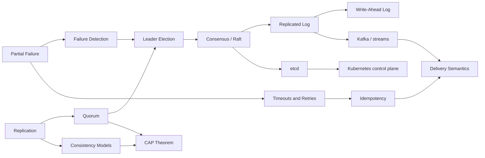
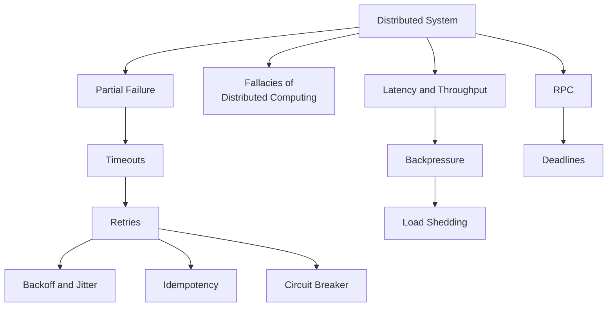
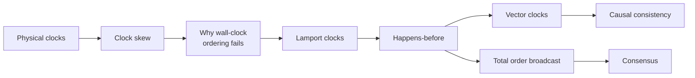
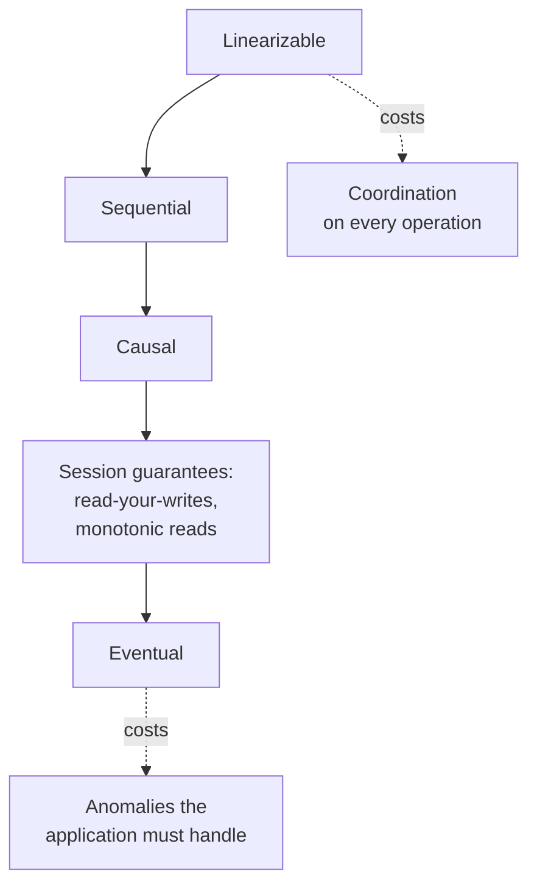
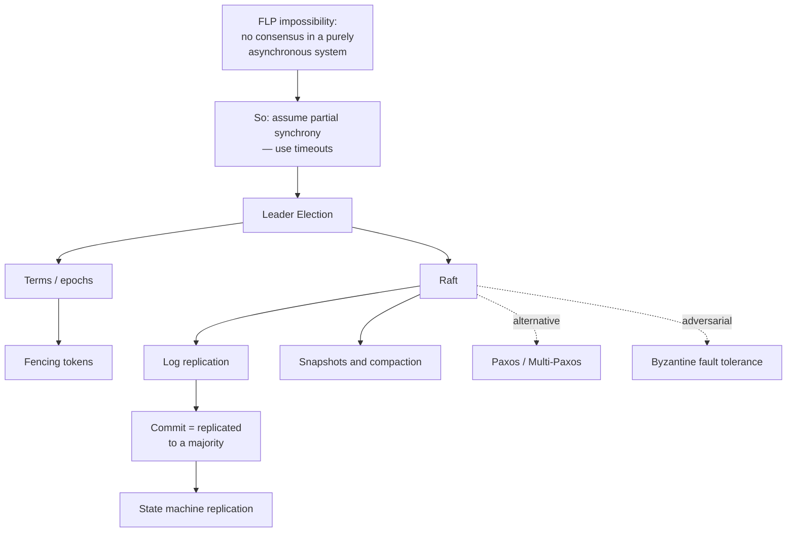
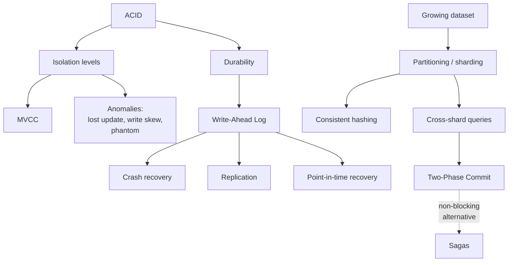
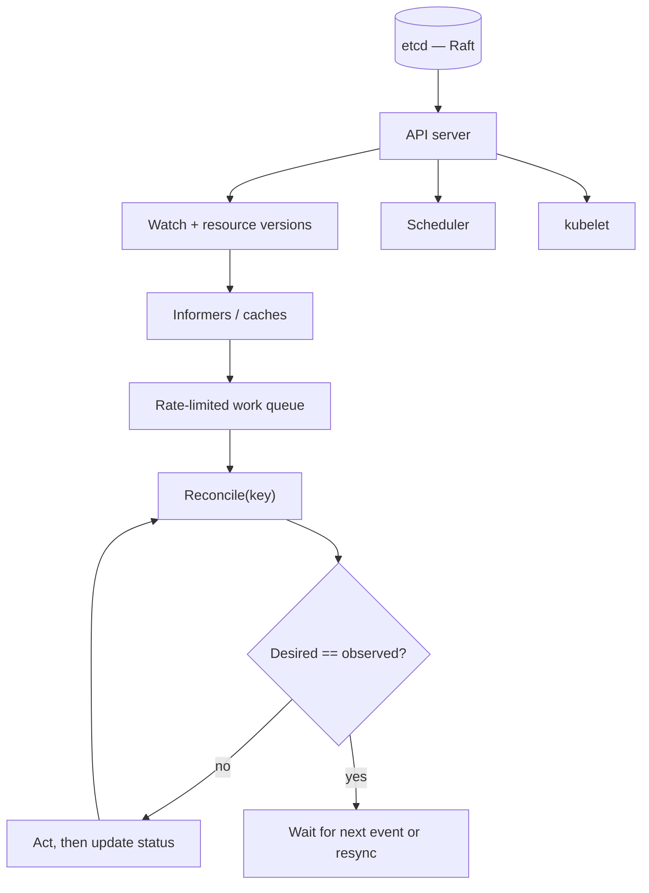
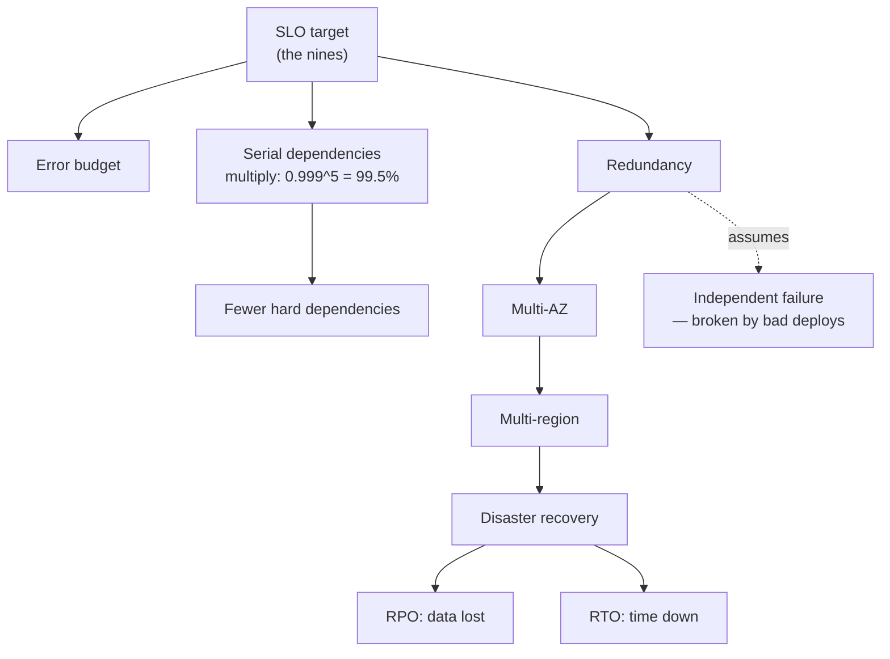

# Distributed Systems Knowledge Map

The single general page for the whole subject: **what the concepts are, how
they depend on each other, and which ones have a note yet.**

Legend used throughout:

- **[Linked](Distributed-Systems/Consensus/Raft.md)** — a note exists. Some are
  seeds: real skeletons with the research done, waiting for a
  **My Understanding** section
- **Plain text** — deliberately not created yet. Empty files add noise to search
  and to the graph; create the note when the roadmap week arrives, from
  `99-Templates/Learning-Note.md`

**37 of ~120 concepts have notes.** That ratio is intentional — the map is the
territory of the subject, not a to-do list of files to create.

---

## 1. The learning spine

The dependency order that actually matters. Everything to the right needs
everything to its left first; skipping an arrow is where confusion comes from.

Three observations worth internalising early:

1. **Partial failure is the root.** Almost everything else is a response to it.
2. **Quorum is the hinge.** Replication, consensus and CAP all pass through it.
3. **The log appears three times** — as Raft's replicated log, as the database
   WAL, and as Kafka. It is one idea wearing three hats.

---

## 2. Distributed systems

### 2.1 Fundamentals

| Concept | Note | Roadmap |
| --- | --- | --- |
| Distributed system | [note](Distributed-Systems/Fundamentals/Distributed%20System.md) | Week 1 |
| Partial failure | [note](Distributed-Systems/Fundamentals/Partial%20Failure.md) | Week 1 |
| Latency and throughput | [note](Distributed-Systems/Fundamentals/Latency%20and%20Throughput.md) | Week 1 |
| RPC | [note](Distributed-Systems/Fundamentals/RPC.md) | Week 2 |
| Timeouts and retries | [note](Distributed-Systems/Fundamentals/Timeouts%20and%20Retries.md) | Week 2 |
| Idempotency | [note](Distributed-Systems/Fundamentals/Idempotency.md) | Week 2 |
| Fallacies of distributed computing | covered in *Distributed System* | Week 1 |
| Scalability · Availability · Reliability | — | Week 1 |
| Backpressure · Load shedding · Circuit breaker | — | Week 2 |
| Two Generals · End-to-end argument | covered in *Partial Failure* | Week 1 |
| Tail latency · Little's Law · Fan-out amplification | covered in *Latency and Throughput* | Week 1 |

### 2.2 Time and order

Nothing here has a note yet — this is the largest genuine gap in the map, and
it lands in Week 6.

| Concept | Note | Roadmap |
| --- | --- | --- |
| Happens-before · Lamport clocks · Vector clocks | — | Week 6 |
| Total order broadcast · Causal broadcast | — | Week 6 |
| Clock skew · NTP · TrueTime · Hybrid logical clocks | — | Week 6 |

> Primary source: Lamport, *Time, Clocks, and the Ordering of Events* — see
> [Papers](../07-Resources/Papers.md).

### 2.3 Replication

| Concept | Note | Roadmap |
| --- | --- | --- |
| Replication | [note](Distributed-Systems/Replication/Replication.md) | Week 5 |
| Quorum · `w + r > n` · majorities | [note](Distributed-Systems/Replication/Quorum.md) | Week 8 |
| Single-leader · Multi-leader · Leaderless | covered in *Replication* | Week 5 |
| Synchronous vs. asynchronous · replication lag | covered in *Replication* | Week 5 |
| Anti-entropy · Read repair · Hinted handoff | — | Week 8 |
| Conflict resolution · Last-write-wins · CRDTs | — | Week 6 |
| Consistent hashing · Virtual nodes | — | Week 14 |

### 2.4 Consistency

| Concept | Note | Roadmap |
| --- | --- | --- |
| Consistency models | [note](Distributed-Systems/Consistency/Consistency%20Models.md) | Week 6 |
| Linearizability | [note](Distributed-Systems/Consistency/Linearizability.md) | Week 6 |
| CAP theorem · PACELC · split brain | [note](Distributed-Systems/Consistency/CAP%20Theorem.md) | Week 7 |
| Causal consistency | covered in *Consistency Models* | Week 6 |
| Session guarantees — read-your-writes, monotonic reads/writes | — | Week 6 |
| Strong eventual consistency · CRDTs | — | Week 6 |
| Serializability vs. linearizability | covered in *Linearizability* | Week 6 |

### 2.5 Consensus

| Concept | Note | Roadmap |
| --- | --- | --- |
| Raft | [**worked example**](Distributed-Systems/Consensus/Raft.md) | Week 10 |
| Leader election · leases · fencing tokens | [note](Distributed-Systems/Consensus/Leader%20Election.md) | Week 9 |
| Replicated log · state machine replication | [note](Distributed-Systems/Consensus/Replicated%20Log.md) | Week 10 |
| FLP impossibility · partial synchrony | — | Week 9 |
| Paxos · Multi-Paxos · Zab | — | Week 12 |
| Membership change · joint consensus | open question in *Raft* | Week 11 |
| Byzantine fault tolerance · PBFT · 3f+1 | — | — |
| Snapshots · log compaction | covered in *Failure Recovery* | Week 11 |

### 2.6 Fault tolerance

| Concept | Note | Roadmap |
| --- | --- | --- |
| Failure detection · completeness vs. accuracy | [note](Distributed-Systems/Fault-Tolerance/Failure%20Detection.md) | Week 9 |
| Failure recovery · crash-recovery model | [note](Distributed-Systems/Fault-Tolerance/Failure%20Recovery.md) | Week 11 |
| Heartbeats · phi accrual · SWIM / gossip | covered in *Failure Detection* | Week 9 |
| Gray failure | covered in *Partial Failure* | Week 1 |
| Bulkhead · cell-based architecture · shuffle sharding | — | Week 23 |
| Chaos engineering · fault injection · Jepsen | — | Week 20 |
| Graceful degradation · static stability | — | Week 23 |

---

## 3. Databases

| Concept | Note | Roadmap |
| --- | --- | --- |
| ACID · isolation levels | [note](Databases/Transactions/ACID.md) | Week 13 |
| MVCC · snapshots · vacuum | [note](Databases/Transactions/MVCC.md) | Week 13 |
| Write-ahead log · checkpoints · PITR | [note](Databases/Transactions/Write-Ahead%20Log.md) | Week 13 |
| Database replication · failover | [note](Databases/Replication/Database%20Replication.md) | Week 5 |
| Sharding and partitioning | [note](Databases/Sharding/Sharding%20and%20Partitioning.md) | Week 14 |
| Two-phase commit · sagas | [note](Databases/Distributed-Transactions/Two-Phase%20Commit.md) | Week 14 |
| Write skew · lost update · phantoms | covered in *ACID* | Week 13 |
| Serializable snapshot isolation | — | Week 13 |
| Local vs. global secondary indexes | covered in *Sharding* | Week 14 |
| Rebalancing · hot partitions | covered in *Sharding* | Week 14 |
| B-trees vs. LSM trees · compaction | — | — |
| Change data capture | covered in *Outbox Pattern* | Week 16 |
| TrueTime · external consistency | — | Week 14 |

---

## 4. Messaging

```mermaid
flowchart TD
    Q[Queue: one consumer] --> WORK[Work distribution]
    PS[Pub/sub: every subscriber] --> EVT[Event notification]
    Q --> LOG["Kafka: a log<br/>— both, plus replay"]
    PS --> LOG
    LOG --> PART[Partitions]
    PART --> ORD["Ordering<br/>(per partition only)"]
    PART --> CG[Consumer groups]
    CG --> OFF[Offsets]
    OFF --> WHEN{Commit before or<br/>after processing?}
    WHEN -->|before| AMO["At-most-once<br/>(lose messages)"]
    WHEN -->|after| ALO["At-least-once<br/>(duplicate messages)"]
    ALO --> IDEM[Idempotent consumers]
    IDEM --> EO[Exactly-once *effect*]
    DW[Dual write problem] --> OB[Outbox pattern]
    OB --> LOG
```

| Concept | Note | Roadmap |
| --- | --- | --- |
| Queues and pub/sub · DLQ · backpressure | [note](Messaging/Queues/Queues%20and%20Pub-Sub.md) | Week 15 |
| Kafka · partitions · consumer groups · offsets · ISR | [note](Messaging/Kafka/Kafka.md) | Week 15 |
| Delivery semantics — at-most/least/exactly-once | [note](Messaging/Delivery-Semantics/Message%20Delivery%20Semantics.md) | Week 16 |
| Outbox pattern · dual writes · CDC | [note](Messaging/Delivery-Semantics/Outbox%20Pattern.md) | Week 16 |
| Ordering guarantees · partition keys | covered in *Kafka* | Week 15 |
| Log compaction · retention | covered in *Kafka* | Week 15 |
| Inbox pattern · consumer-side dedup | covered in *Delivery Semantics* | Week 16 |
| Rebalancing · cooperative assignment | covered in *Kafka* | Week 15 |
| Stream processing · windowing · watermarks | — | — |
| Event sourcing · CQRS | — | — |

---

## 5. Kubernetes

| Concept | Note | Roadmap |
| --- | --- | --- |
| Control plane — API server, scheduler, kubelet | [note](Kubernetes/Architecture/Kubernetes%20Control%20Plane.md) | Week 21 |
| etcd · leases · compaction · quotas | [note](Kubernetes/etcd/etcd.md) | Week 21 |
| Controllers and operators | [note](Kubernetes/Controllers/Controllers%20and%20Operators.md) | Week 22 |
| Reconciliation · level vs. edge triggered | [note](Kubernetes/Reconciliation/Reconciliation.md) | Week 21 |
| Watch · informers · resource versions | covered in *Controllers* | Week 22 |
| Controller leader election | covered in *Leader Election* | Week 22 |
| Finalizers · owner references · garbage collection | — | Week 22 |
| Admission control · CRDs · server-side apply | — | Week 22 |
| Scheduler · affinity · topology spread · PDBs | — | Week 21 |
| Service · Ingress · Gateway API | — | Week 21 |

---

## 6. Cloud

| Concept | Note | Roadmap |
| --- | --- | --- |
| Compute models — VM, container, serverless | [note](Cloud/Compute/Compute%20Models.md) | Week 3 |
| Storage models — object, block, file | [note](Cloud/Storage/Storage%20Models.md) | Week 3 |
| VPC · subnets · routing · NAT · security groups | [note](Cloud/Networking/VPC%20and%20Subnets.md) | Week 4 |
| Load balancing · L4 vs. L7 · health checks | [note](Cloud/Networking/Load%20Balancing.md) | Week 4 |
| High availability · AZs · error budgets | [note](Cloud/Reliability/High%20Availability.md) | Week 23 |
| Disaster recovery · RPO · RTO · 3-2-1 | [note](Cloud/Reliability/Disaster%20Recovery.md) | Week 23 |
| DNS · CDN · anycast | — | Week 4 |
| Autoscaling — horizontal, vertical, predictive | — | Week 3 |
| Observability — metrics, logs, traces | — | Week 20 |
| Distributed tracing · spans · sampling | — | Week 20 |
| SLI / SLO / SLA | covered in *High Availability* | Week 23 |
| Shared responsibility model | covered in *Compute Models* | Week 3 |
| Cost — egress, request pricing, spot | covered in *Storage* and *Compute* | Week 3 |

---

## 7. Cross-cutting: where one idea reappears

The most useful thing this map shows is that a handful of ideas keep recurring
under different names. Recognising them is most of what expertise is.

| Idea | Appears as |
| --- | --- |
| **The log** | Raft's [replicated log](Distributed-Systems/Consensus/Replicated%20Log.md) · the database [WAL](Databases/Transactions/Write-Ahead%20Log.md) · a [Kafka](Messaging/Kafka/Kafka.md) partition · event sourcing |
| **Majority overlap** | [Quorum](Distributed-Systems/Replication/Quorum.md) reads/writes · Raft elections · Kafka's `min.insync.replicas` · odd-sized etcd clusters |
| **Retry needs idempotence** | [RPC](Distributed-Systems/Fundamentals/RPC.md) retries · [message redelivery](Messaging/Delivery-Semantics/Message%20Delivery%20Semantics.md) · controller [reconcile loops](Kubernetes/Reconciliation/Reconciliation.md) · the [outbox](Messaging/Delivery-Semantics/Outbox%20Pattern.md) relay |
| **You cannot tell slow from dead** | [Partial failure](Distributed-Systems/Fundamentals/Partial%20Failure.md) · [failure detection](Distributed-Systems/Fault-Tolerance/Failure%20Detection.md) · [timeouts](Distributed-Systems/Fundamentals/Timeouts%20and%20Retries.md) · load balancer [health checks](Cloud/Networking/Load%20Balancing.md) · Kubernetes probes |
| **Coordination costs latency** | [Linearizability](Distributed-Systems/Consistency/Linearizability.md) · synchronous [replication](Distributed-Systems/Replication/Replication.md) · [2PC](Databases/Distributed-Transactions/Two-Phase%20Commit.md) · `acks=all` |
| **Desired vs. observed state** | [Reconciliation](Kubernetes/Reconciliation/Reconciliation.md) · Terraform plan/apply · autoscalers · TCP congestion control |
| **Fencing a stale actor** | [Leader election](Distributed-Systems/Consensus/Leader%20Election.md) tokens · Raft [terms](Distributed-Systems/Consensus/Raft.md) · Kafka producer epochs · database failover |

---

## 8. Adding a concept

1. Create the file in the right folder with a human-readable name —
   `Consistent Hashing.md`, not `consistent-hashing-v2.md`
2. Apply `99-Templates/Learning-Note.md` and fill in the frontmatter
3. Write it, including **My Understanding** with sources closed
4. Link related concepts in **both** directions
5. Add the row to the table above, and to a graph if it belongs on one
6. `mkdocs build --strict`, then commit

Conventions: [Conventions](../docs/conventions.md) ·
Study method: [Learning Principles](../01-Roadmap/learning-principles.md) ·
Sources: [Resources](../07-Resources/README.md)
