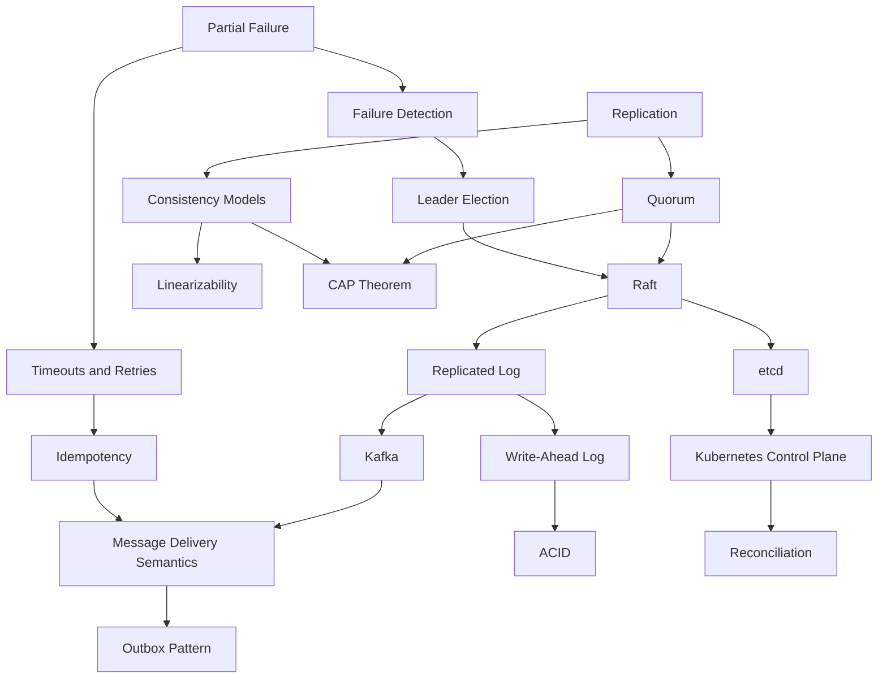

# Concept Index

The master list of concepts for the six-month plan.

- **Linked** entries have a note. Some are seeds — a real skeleton with the
  research done, waiting for the **My Understanding** section.
- **Plain text** entries are deliberately not created yet. Empty files add
  noise to search and the graph; create the note when the week arrives, using
  `99-Templates/Learning-Note.md`.

!!! tip "Adding a concept"
    Create the file in the right folder with a human-readable name
    (`Consistent Hashing.md`), fill in the frontmatter, then add a line here.
    See [Conventions](../docs/conventions.md).

## Distributed Systems

### Fundamentals

- [Distributed System](Distributed-Systems/Fundamentals/Distributed%20System.md)
- [Partial Failure](Distributed-Systems/Fundamentals/Partial%20Failure.md)
- [Latency and Throughput](Distributed-Systems/Fundamentals/Latency%20and%20Throughput.md)
- [RPC](Distributed-Systems/Fundamentals/RPC.md)
- [Timeouts and Retries](Distributed-Systems/Fundamentals/Timeouts%20and%20Retries.md)
- [Idempotency](Distributed-Systems/Fundamentals/Idempotency.md)
- Scalability · Backpressure · Load Shedding · Circuit Breaker

### Replication

- [Replication](Distributed-Systems/Replication/Replication.md)
- [Quorum](Distributed-Systems/Replication/Quorum.md)
- Anti-Entropy · Read Repair · Conflict Resolution · CRDTs

### Consistency

- [Consistency Models](Distributed-Systems/Consistency/Consistency%20Models.md)
- [Linearizability](Distributed-Systems/Consistency/Linearizability.md)
- [CAP Theorem](Distributed-Systems/Consistency/CAP%20Theorem.md)
- Causal Consistency · Vector Clocks · Lamport Clocks · Happens-Before

### Consensus

- [Raft](Distributed-Systems/Consensus/Raft.md) — the worked example note
- [Leader Election](Distributed-Systems/Consensus/Leader%20Election.md)
- [Replicated Log](Distributed-Systems/Consensus/Replicated%20Log.md)
- Paxos · Zab · Byzantine Fault Tolerance · Membership Change

### Fault Tolerance

- [Failure Detection](Distributed-Systems/Fault-Tolerance/Failure%20Detection.md)
- [Failure Recovery](Distributed-Systems/Fault-Tolerance/Failure%20Recovery.md)
- Bulkhead · Cell-Based Architecture · Chaos Engineering · Graceful Degradation

## Databases

### Transactions

- [ACID](Databases/Transactions/ACID.md)
- [MVCC](Databases/Transactions/MVCC.md)
- [Write-Ahead Log](Databases/Transactions/Write-Ahead%20Log.md)
- Isolation Levels · Serializability · Write Skew · Deadlock

### Replication and Partitioning

- [Database Replication](Databases/Replication/Database%20Replication.md)
- [Sharding and Partitioning](Databases/Sharding/Sharding%20and%20Partitioning.md)
- Consistent Hashing · Rebalancing · Secondary Indexes · Hot Partitions

### Distributed Transactions

- [Two-Phase Commit](Databases/Distributed-Transactions/Two-Phase%20Commit.md)
- Saga · Compensating Transaction · Three-Phase Commit · Spanner/TrueTime

## Messaging

- [Queues and Pub-Sub](Messaging/Queues/Queues%20and%20Pub-Sub.md)
- [Kafka](Messaging/Kafka/Kafka.md)
- [Message Delivery Semantics](Messaging/Delivery-Semantics/Message%20Delivery%20Semantics.md)
- [Outbox Pattern](Messaging/Delivery-Semantics/Outbox%20Pattern.md)
- Partition · Consumer Group · Offset · Ordering · Dead-Letter Queue ·
  Log Compaction · Inbox Pattern · Change Data Capture

## Kubernetes

- [Kubernetes Control Plane](Kubernetes/Architecture/Kubernetes%20Control%20Plane.md)
- [etcd](Kubernetes/etcd/etcd.md)
- [Controllers and Operators](Kubernetes/Controllers/Controllers%20and%20Operators.md)
- [Reconciliation](Kubernetes/Reconciliation/Reconciliation.md)
- Scheduler · Watch and Informers · Admission Control · Custom Resources ·
  Pod Disruption Budgets · Service and Ingress

## Cloud

- [Compute Models](Cloud/Compute/Compute%20Models.md)
- [Storage Models](Cloud/Storage/Storage%20Models.md)
- [VPC and Subnets](Cloud/Networking/VPC%20and%20Subnets.md)
- [Load Balancing](Cloud/Networking/Load%20Balancing.md)
- [High Availability](Cloud/Reliability/High%20Availability.md)
- [Disaster Recovery](Cloud/Reliability/Disaster%20Recovery.md)
- Autoscaling · DNS · CDN · NAT · Observability · SLO and Error Budgets ·
  Cost Optimisation · Shared Responsibility Model

## How the concepts connect

