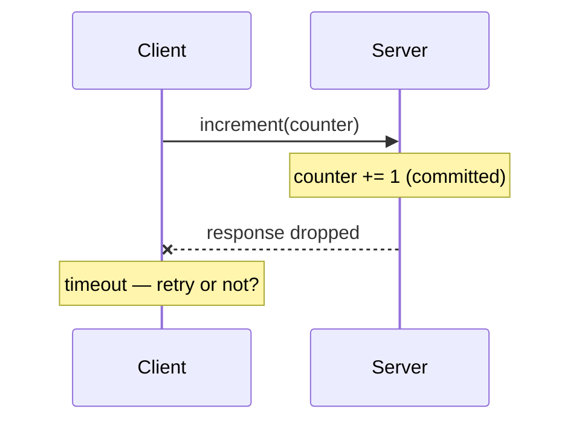

# Lab 01 — RPC

## Goal

> **When an RPC times out, what can the client actually conclude about whether
> the server processed the request?**

## Concepts

- [RPC](../../03-Concepts/Distributed-Systems/Fundamentals/RPC.md)
- [Partial Failure](../../03-Concepts/Distributed-Systems/Fundamentals/Partial%20Failure.md)

## Prerequisites

- [ ] Go 1.22+ or Python 3.11+
- [ ] `tcpdump` or Wireshark (optional but instructive)

## Architecture



## Setup

Build a minimal client/server exposing `increment()` on a shared counter, over
plain HTTP and then over gRPC. Log every server-side increment with a request
ID so the ground truth is known.

```bash
# sketch — fill in during the lab
mkdir -p lab01 && cd lab01
```

## Experiment

1. Normal call: confirm the counter increments once.
2. Kill the server **after** it increments but **before** it responds
   (`sleep` between the two, then `kill -9`).
3. Restart, inspect the server log, and compare with what the client believed.
4. Repeat over gRPC and compare the error codes.

## Failure Injection

```bash
# Drop the response only, leaving the request path intact
sudo tc qdisc add dev lo root netem loss 100%    # Linux, after the request lands
# Or simply kill the server between commit and reply
```

## Expected Result

<!-- Write this BEFORE running. -->

## Observations

## Actual Result

## Lessons Learned

- [ ] Which gRPC status codes are safe to retry, and which are not?
- [ ] What would make this operation safe to retry unconditionally?

## Related Concepts

- [Idempotency](../../03-Concepts/Distributed-Systems/Fundamentals/Idempotency.md)
- [Timeouts and Retries](../../03-Concepts/Distributed-Systems/Fundamentals/Timeouts%20and%20Retries.md)

## Cleanup

```bash
sudo tc qdisc del dev lo root 2>/dev/null || true
```
