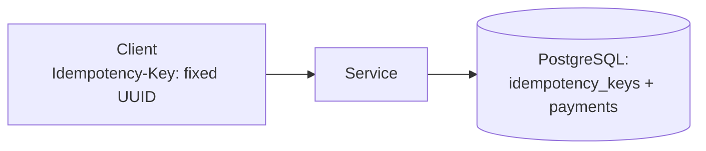

# Lab 03 — Idempotency

## Goal

> **Does an idempotency key actually prevent duplicate side effects when the
> client retries after a timeout — including when the server crashes between
> committing the work and recording the key?**

The second clause is the real question. The naive implementation passes the
easy test and fails this one.

## Concepts

- [Idempotency](../../03-Concepts/Distributed-Systems/Fundamentals/Idempotency.md)
- [ACID](../../03-Concepts/Databases/Transactions/ACID.md)
- [Partial Failure](../../03-Concepts/Distributed-Systems/Fundamentals/Partial%20Failure.md)

## Prerequisites

- [ ] PostgreSQL (Docker is fine)
- [ ] An HTTP service with a `POST /payments`-style endpoint

## Architecture



## Setup

```sql
CREATE TABLE idempotency_keys (
  key         uuid PRIMARY KEY,
  response    jsonb,
  created_at  timestamptz NOT NULL DEFAULT now()
);

CREATE TABLE payments (
  id      uuid PRIMARY KEY,
  amount  numeric NOT NULL,
  key     uuid REFERENCES idempotency_keys(key)
);
```

Implement three variants:

- **A — no key**: insert the payment, return.
- **B — key, separate transactions**: insert the payment, commit, then record
  the key.
- **C — key, one transaction**: insert key and payment in a single transaction.

## Experiment

For each variant: send the request, kill the service before the response is
sent, retry with the **same** key, then `SELECT count(*) FROM payments`.

## Failure Injection

```bash
# Kill between the two writes in variant B
kill -9 $(pgrep -f payment-service)
```

Also test concurrency: fire two simultaneous requests with the same key and
observe what the unique constraint does.

## Expected Result

<!-- Write this BEFORE running. Predict the count for A, B and C, and for the
     concurrent case. -->

## Observations

| Variant | Payments after retry | Concurrent duplicates |
| --- | --- | --- |
| A — no key |  |  |
| B — two transactions |  |  |
| C — one transaction |  |  |

## Actual Result

## Lessons Learned

- [ ] Exactly which crash window does variant B leave open?
- [ ] What should the API return on the second request — 200 with the original
      response, or 409?
- [ ] What happens if the same key arrives with a *different* payload?

## Related Concepts

- [Message Delivery Semantics](../../03-Concepts/Messaging/Delivery-Semantics/Message%20Delivery%20Semantics.md)
- [Outbox Pattern](../../03-Concepts/Messaging/Delivery-Semantics/Outbox%20Pattern.md)

## Cleanup

```bash
docker rm -f lab03-postgres
```
