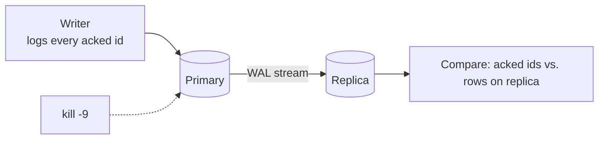

# Lab 04 — Replication

## Goal

> **How much acknowledged data does an asynchronous replica lose when the
> primary is killed under sustained write load — and what does turning on
> synchronous replication cost in write throughput?**

## Concepts

- [Replication](../../03-Concepts/Distributed-Systems/Replication/Replication.md)
- [Database Replication](../../03-Concepts/Databases/Replication/Database%20Replication.md)
- [Write-Ahead Log](../../03-Concepts/Databases/Transactions/Write-Ahead%20Log.md)

## Prerequisites

- [ ] Docker with two PostgreSQL containers
- [ ] `pgbench` or a small writer script that records every acknowledged ID

## Architecture



## Setup

```bash
docker network create lab04
docker run -d --name pg-primary --network lab04 \
  -e POSTGRES_PASSWORD=lab -e POSTGRES_DB=lab postgres:16 \
  -c wal_level=replica -c max_wal_senders=4 -c synchronous_commit=on
# Take a base backup and start the replica from it (pg_basebackup -R).
```

Record every ID the writer receives an acknowledgement for in a local file.
That file is the ground truth for "acknowledged".

## Experiment

1. Run the writer at a steady rate; let replication lag stabilise.
2. `docker kill -s KILL pg-primary` mid-write.
3. Promote the replica.
4. Diff acknowledged IDs against rows present on the promoted replica.
5. Repeat with `synchronous_standby_names` set, and measure throughput.

## Failure Injection

```bash
docker kill -s KILL pg-primary
# Variant: add latency to the replication link first
docker exec pg-primary tc qdisc add dev eth0 root netem delay 200ms
```

## Expected Result

<!-- Predict: how many acknowledged rows are missing in async mode?
     What is the throughput ratio between async and sync? -->

## Observations

| Mode | Acked writes | Present on replica | Lost | Writes/sec |
| --- | --- | --- | --- | --- |
| async |  |  |  |  |
| sync |  |  |  |  |
| async + 200 ms link |  |  |  |  |

## Actual Result

## Lessons Learned

- [ ] What RPO does async replication actually deliver at this write rate?
- [ ] What lag threshold should block promotion?
- [ ] What happens to writes when the synchronous standby is killed?

## Related Concepts

- [Quorum](../../03-Concepts/Distributed-Systems/Replication/Quorum.md)
- [Disaster Recovery](../../03-Concepts/Cloud/Reliability/Disaster%20Recovery.md)

## Cleanup

```bash
docker rm -f pg-primary pg-replica && docker network rm lab04
```
