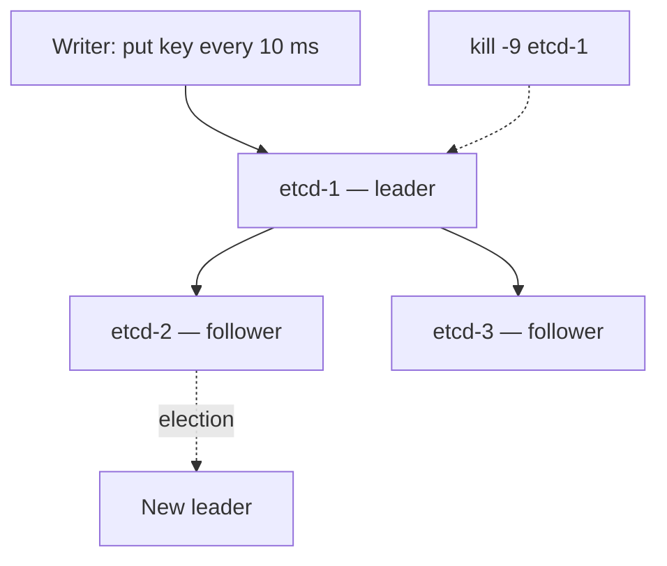

# Lab 05 — Leader Election

## Goal

> **What happens when the leader node crashes?**

Concretely: in a 3-node etcd cluster under continuous writes, how long is the
cluster unavailable, what do in-flight clients observe, and what happens to the
old leader when it returns?

## Concepts

- [Leader Election](../../03-Concepts/Distributed-Systems/Consensus/Leader%20Election.md)
- [Raft](../../03-Concepts/Distributed-Systems/Consensus/Raft.md)
- [Quorum](../../03-Concepts/Distributed-Systems/Replication/Quorum.md)
- [Failure Detection](../../03-Concepts/Distributed-Systems/Fault-Tolerance/Failure%20Detection.md)

## Prerequisites

- [ ] `etcd` and `etcdctl` (3 local nodes, or Docker Compose)
- [ ] A writer that timestamps every successful and failed write

## Architecture



## Setup

```bash
# Three nodes, election timeout 1000 ms, heartbeat 100 ms (defaults)
etcd --name n1 --initial-cluster n1=...,n2=...,n3=... ...
etcdctl endpoint status --cluster -w table   # identify the leader
```

## Experiment

1. Start the writer; confirm a steady success rate.
2. `kill -9` the leader.
3. Measure: time to first failure, time to first success afterwards, and the
   number of failed writes in between.
4. Restart the old leader; confirm it rejoins as a follower in a higher term.
5. Kill a second node and observe the cluster refuse writes entirely.
6. Vary `--election-timeout` and repeat step 3.

## Failure Injection

```bash
kill -9 $(pgrep -f 'etcd --name n1')

# Variant: pause rather than kill, to test the failure detector
kill -STOP <pid> ; sleep 5 ; kill -CONT <pid>

# Variant: partition instead of crash
sudo iptables -A INPUT -p tcp --dport 2380 -s <peer> -j DROP
```

## Expected Result

<!-- Predict the unavailability window from the election timeout, the client
     error codes, and what the old leader does on return. -->

## Observations

| Scenario | Unavailability | Failed writes | Client error |
| --- | --- | --- | --- |
| Leader `kill -9` |  |  |  |
| Leader `SIGSTOP` 5 s |  |  |  |
| Leader partitioned |  |  |  |
| Two nodes down |  |  |  |

## Actual Result

## Lessons Learned

- [ ] How closely does the measured window match the election timeout?
- [ ] Did a paused leader behave differently from a killed one? Why?
- [ ] What did the partitioned old leader do with writes it had accepted?

## Related Concepts

- [etcd](../../03-Concepts/Kubernetes/etcd/etcd.md)
- [Failure Recovery](../../03-Concepts/Distributed-Systems/Fault-Tolerance/Failure%20Recovery.md)

## Cleanup

```bash
pkill -f etcd
sudo iptables -F
rm -rf n1.etcd n2.etcd n3.etcd
```
