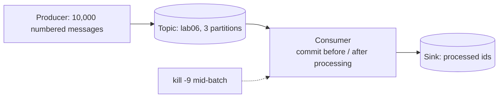

# Lab 06 — Kafka Delivery

## Goal

> **Does the moment a consumer commits its offset — before or after processing —
> determine whether messages are lost or duplicated when the consumer crashes?**

## Concepts

- [Kafka](../../03-Concepts/Messaging/Kafka/Kafka.md)
- [Message Delivery Semantics](../../03-Concepts/Messaging/Delivery-Semantics/Message%20Delivery%20Semantics.md)
- [Idempotency](../../03-Concepts/Distributed-Systems/Fundamentals/Idempotency.md)

## Prerequisites

- [ ] Kafka via Docker Compose (KRaft mode, single broker is fine)
- [ ] A Python or Go consumer with manual offset commits

## Architecture



## Setup

```bash
docker compose up -d kafka
kafka-topics --create --topic lab06 --partitions 3 --replication-factor 1 \
  --bootstrap-server localhost:9092
```

Producer sends 10,000 messages numbered 1..10000. The consumer appends each
processed ID to a file — that file is the evidence.

## Experiment

For each variant, kill the consumer mid-batch, restart it, let it drain, then
compare the processed-ID file against 1..10000.

- **A — commit before processing** (`enable.auto.commit=true`, or explicit
  commit first)
- **B — commit after processing**
- **C — commit after processing + idempotent sink** (dedupe on message ID)

Also vary producer `acks` (`0`, `1`, `all`) with a broker restart to see the
producer-side half of the problem.

## Failure Injection

```bash
kill -9 $(pgrep -f consumer.py)          # mid-batch
docker compose restart kafka             # for the acks variants
```

## Expected Result

<!-- Predict, for each variant: gaps (lost) and repeats (duplicated). -->

## Observations

| Variant | Missing IDs | Duplicate IDs | Semantic delivered |
| --- | --- | --- | --- |
| A — commit first |  |  |  |
| B — commit after |  |  |  |
| C — commit after + dedupe |  |  |  |

## Actual Result

## Lessons Learned

- [ ] How large was the duplicate window in variant B, and what set its size?
- [ ] What did a consumer-group rebalance do to the counts?
- [ ] What did `acks=1` cost during a broker restart?

## Related Concepts

- [Queues and Pub-Sub](../../03-Concepts/Messaging/Queues/Queues%20and%20Pub-Sub.md)
- [Outbox Pattern](../../03-Concepts/Messaging/Delivery-Semantics/Outbox%20Pattern.md)

## Cleanup

```bash
docker compose down -v
```
