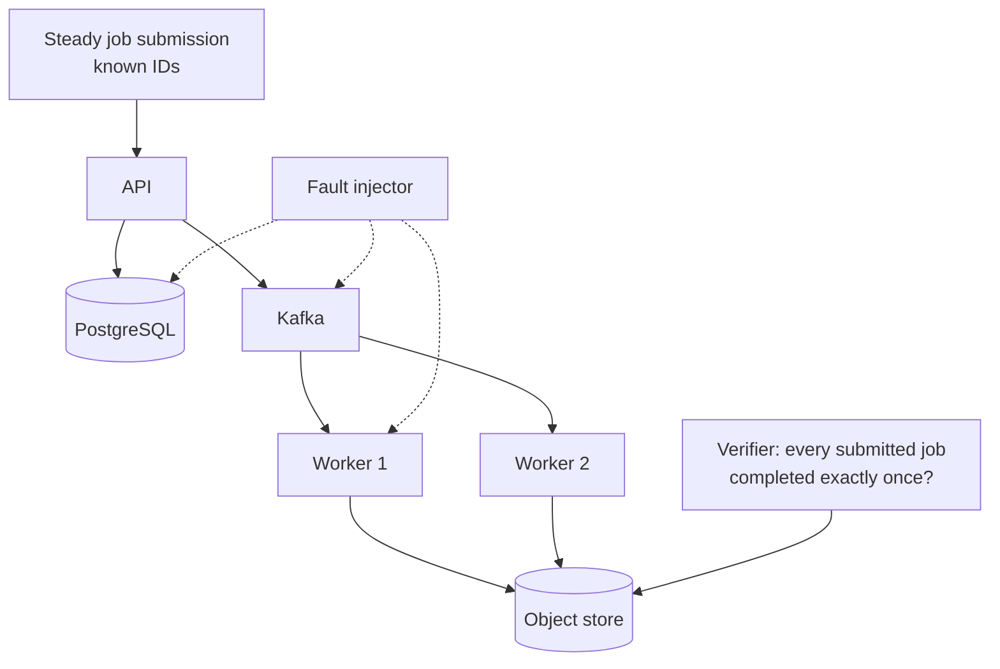

# Lab 07 — Failure Testing

## Goal

> **Under injected network latency, packet loss and process kills, does the
> Distributed Job Platform lose jobs, duplicate side effects, or merely get
> slower — and do its dashboards make that visible within one minute?**

Two questions in one, deliberately: the second is the observability test, and
failing it is as interesting as failing the first.

## Concepts

- [Partial Failure](../../03-Concepts/Distributed-Systems/Fundamentals/Partial%20Failure.md)
- [Timeouts and Retries](../../03-Concepts/Distributed-Systems/Fundamentals/Timeouts%20and%20Retries.md)
- [Message Delivery Semantics](../../03-Concepts/Messaging/Delivery-Semantics/Message%20Delivery%20Semantics.md)
- [High Availability](../../03-Concepts/Cloud/Reliability/High%20Availability.md)

## Prerequisites

- [ ] The [Distributed Job Platform](../../05-Projects/Distributed-Job-Platform/README.md)
      running end to end (Weeks 17–20)
- [ ] Metrics and structured logs in place
- [ ] `tc`/`netem`, or Toxiproxy for finer control

## Architecture



## Setup

Submit jobs at a steady rate with known IDs. A verifier checks, at the end,
that every submitted job produced exactly one result object.

## Experiment

Run each scenario for 5 minutes under steady load; record the verifier result
and the time to *notice* from dashboards alone.

| # | Injection | Target |
| --- | --- | --- |
| 1 | 200 ms latency | API → PostgreSQL |
| 2 | 5% packet loss | Worker → Kafka |
| 3 | `kill -9` mid-job | One worker |
| 4 | Broker restart | Kafka |
| 5 | Connection pool exhausted | PostgreSQL (`max_connections` lowered) |
| 6 | Object store returns 503 for 60 s | Worker → object store |
| 7 | Clock skew of 30 s | One worker |

## Failure Injection

```bash
# Latency and loss
sudo tc qdisc add dev eth0 root netem delay 200ms
sudo tc qdisc change dev eth0 root netem loss 5%

# Or with Toxiproxy, per-dependency and scriptable
toxiproxy-cli toxic add postgres -t latency -a latency=200
toxiproxy-cli toxic add kafka -t timeout -a timeout=5000

# Process kill
docker kill -s KILL job-worker-1
```

## Expected Result

<!-- For each scenario predict: jobs lost, jobs duplicated, p99 impact, and
     whether an alert fires. Write it all down first. -->

## Observations

| # | Jobs lost | Jobs duplicated | p99 impact | Alert fired? | Time to notice |
| --- | --- | --- | --- | --- | --- |
| 1 |  |  |  |  |  |
| 2 |  |  |  |  |  |
| 3 |  |  |  |  |  |
| 4 |  |  |  |  |  |
| 5 |  |  |  |  |  |
| 6 |  |  |  |  |  |
| 7 |  |  |  |  |  |

## Actual Result

## Lessons Learned

- [ ] Which failure was invisible on the dashboards? What signal was missing?
- [ ] Which retry policy needed changing after this?
- [ ] Did any scenario cause *silent* data loss — the worst outcome?

## Related Concepts

- [Failure Detection](../../03-Concepts/Distributed-Systems/Fault-Tolerance/Failure%20Detection.md)
- [Idempotency](../../03-Concepts/Distributed-Systems/Fundamentals/Idempotency.md)

## Cleanup

```bash
sudo tc qdisc del dev eth0 root 2>/dev/null || true
toxiproxy-cli toxic remove --toxicName latency postgres 2>/dev/null || true
docker compose down -v
```
