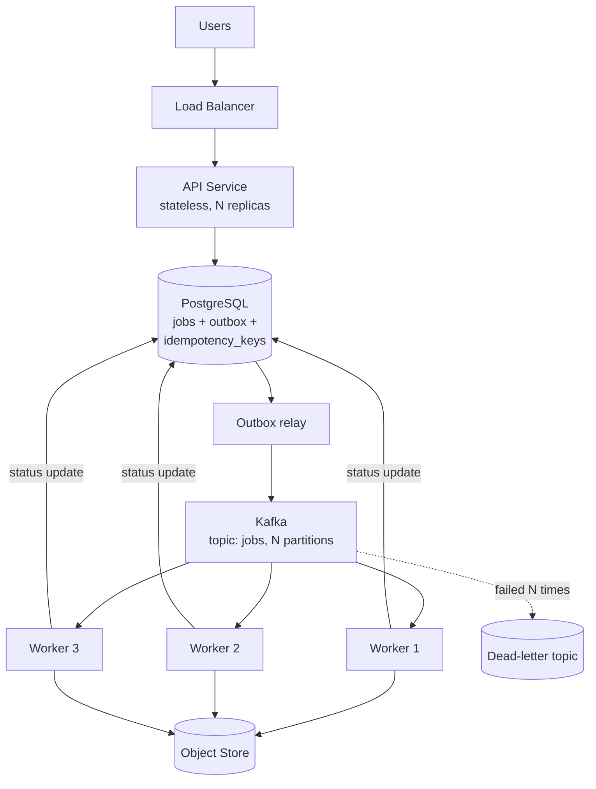

# Distributed Job Processing Platform

The Month 5–6 capstone. Everything from Months 1–4 either gets used here or
gets exposed as not-actually-understood.

## Problem

Users need to submit long-running jobs (image processing, report generation)
and retrieve results later. Jobs take seconds to minutes, arrive in bursts, and
must not be lost or silently executed twice.

## Motivation

A synchronous API cannot do this: a request that takes four minutes ties up a
connection, cannot survive a deploy, and gives the user nothing to look at.
Making it asynchronous introduces exactly the problems this knowledge base is
about — delivery semantics, idempotency, partial failure, observability.

## Goals

- [ ] Submit a job and receive an ID immediately
- [ ] Poll job status; retrieve the result when complete
- [ ] Workers scale horizontally
- [ ] **A submitted job is executed exactly once in effect**, even when workers
      crash mid-job
- [ ] No job is ever silently lost
- [ ] Failure behaviour is documented and *measured*, not assumed

## Non-Goals

Explicitly out of scope, so the project can be finished:

- Multi-tenancy, quotas and billing
- A user interface beyond `curl`
- Multi-region deployment
- Job dependencies / DAGs (that is a different, much larger project)
- Autoscaling based on queue depth (nice to have, cut first if time runs short)

## Requirements

### Functional

| ID | Requirement |
| --- | --- |
| F1 | `POST /jobs` accepts a payload and an `Idempotency-Key`, returns a job ID |
| F2 | `GET /jobs/{id}` returns status: `pending`, `running`, `succeeded`, `failed` |
| F3 | `GET /jobs/{id}/result` returns a link to the result object |
| F4 | Failed jobs retry up to N times, then move to a dead-letter topic |
| F5 | Job state transitions are recorded with timestamps |

### Non-Functional

| Dimension | Target | Measured |
| --- | --- | --- |
| Submission latency (p99) | < 100 ms |  |
| Throughput | 100 jobs/s sustained |  |
| Job loss | 0 |  |
| Duplicate side effects | 0 |  |
| Worker recovery | < 30 s after `kill -9` |  |
| RPO / RTO | 5 min / 30 min |  |

## Architecture

Note the deviation from the naive design: the API does **not** write to
PostgreSQL and publish to Kafka directly. It writes both the job and an outbox
row in one transaction, and a relay publishes. See
[Outbox Pattern](../../03-Concepts/Messaging/Delivery-Semantics/Outbox%20Pattern.md)
for why the naive version is broken.

## Components

| Component | Responsibility | Technology |
| --- | --- | --- |
| API service | Validate, deduplicate, persist, enqueue | FastAPI or Go |
| PostgreSQL | Job records, outbox, idempotency keys | PostgreSQL 16 |
| Outbox relay | Publish outbox rows to Kafka | Poller, or Debezium CDC |
| Kafka | Durable work distribution | Kafka (KRaft) |
| Workers | Execute jobs, write results, report status | Consumer group |
| Object store | Job results | MinIO locally, S3 in cloud |
| Observability | Metrics, logs, traces | Prometheus, Grafana, OpenTelemetry |

## Data Flow

1. Client `POST /jobs` with an `Idempotency-Key`.
2. API opens one transaction: insert idempotency key, insert job (`pending`),
   insert outbox row. Commit. Return `202` with the job ID.
3. Relay reads unsent outbox rows and publishes to Kafka, keyed by job ID.
4. A worker consumes, sets `running`, executes, writes the result to object
   storage, sets `succeeded`, **then** commits its offset.
5. On failure: retry with backoff; after N attempts, publish to the DLQ and set
   `failed`.

## Failure Scenarios

| Failure | Blast radius | Mitigation | Verified in |
| --- | --- | --- | --- |
| API crashes after DB commit, before response | One client, unknown outcome | Idempotency key makes the retry safe | Lab 03 |
| Relay crashes after publish, before marking sent | Duplicate Kafka message | Idempotent workers | Lab 06 |
| Worker crashes mid-job | One job re-executed | Commit offset after processing; idempotent results | Lab 06 |
| Kafka broker down | No new work dispatched; submissions still accepted | Outbox buffers in PostgreSQL | Lab 07 |
| PostgreSQL primary fails | Submissions fail | Multi-AZ standby; measure the window | Lab 04 |
| Object store 503s | Jobs fail late, after the work is done | Retry with backoff; keep the job `running` | Lab 07 |
| Poison job | One partition stalls | Attempt limit → DLQ | Lab 07 |

## Scaling Strategy

What breaks first at 10x:

1. **Kafka partitions** — parallelism is capped by partition count. Size it up
   front; increasing it later breaks key ordering
2. **PostgreSQL connections** — the API's pool exhausts before the database
   does. PgBouncer
3. **Outbox polling** — becomes the bottleneck; switch to CDC
4. **Object store request rate** — key-prefix design starts to matter

## Observability

| Signal | Question it answers |
| --- | --- |
| `jobs_submitted_total`, `jobs_completed_total` | Are submissions and completions balanced? |
| `job_duration_seconds` histogram | Is processing getting slower? |
| Consumer group lag | Are workers keeping up? |
| `outbox_oldest_unsent_seconds` | Has the relay stopped? |
| DLQ depth | Are jobs failing permanently? |
| Trace: API → relay → Kafka → worker | Where did *this* job go? |

The Lab 07 test is not whether these exist, but whether they make an injected
failure visible within one minute.

## Security

- No secrets in the repository — environment variables or a secrets manager
- Database in a private subnet; no route to an internet gateway
- TLS between all components; SASL for Kafka
- Job payloads are untrusted input: validate, sandbox execution, cap resources
- Least-privilege object-store credentials, scoped to one prefix

## Cost Considerations

Runs locally on Docker Compose for free. If deployed:

- Kafka is the expensive component — managed Kafka has a high floor
- NAT gateway data processing charges (see
  [VPC and Subnets](../../03-Concepts/Cloud/Networking/VPC%20and%20Subnets.md))
- Spot instances are ideal for workers, given jobs are retryable

## Design Decisions

Recorded as ADRs in [06-Architecture/ADRs](../../06-Architecture/ADRs/README.md):

- [ADR-0001 — Use Kafka for job dispatch](../../06-Architecture/ADRs/0001-use-kafka-for-job-dispatch.md)
- [ ] ADR-0002 — Outbox pattern instead of dual writes
- [ ] ADR-0003 — Idempotency key scheme and retention
- [ ] ADR-0004 — Job state machine and status ownership

## Experiments

See [`experiments/`](experiments/README.md) and
[Lab 07 — Failure Testing](../../04-Labs/07-Failure-Testing/README.md).

## Lessons Learned

<!-- Written at the end of Month 6, as part of the capstone. -->
