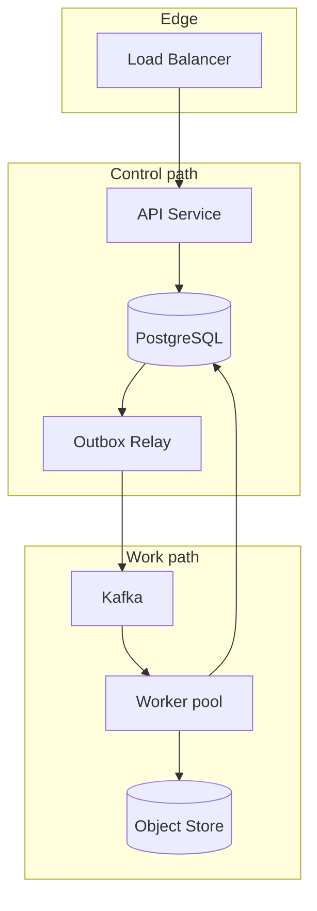
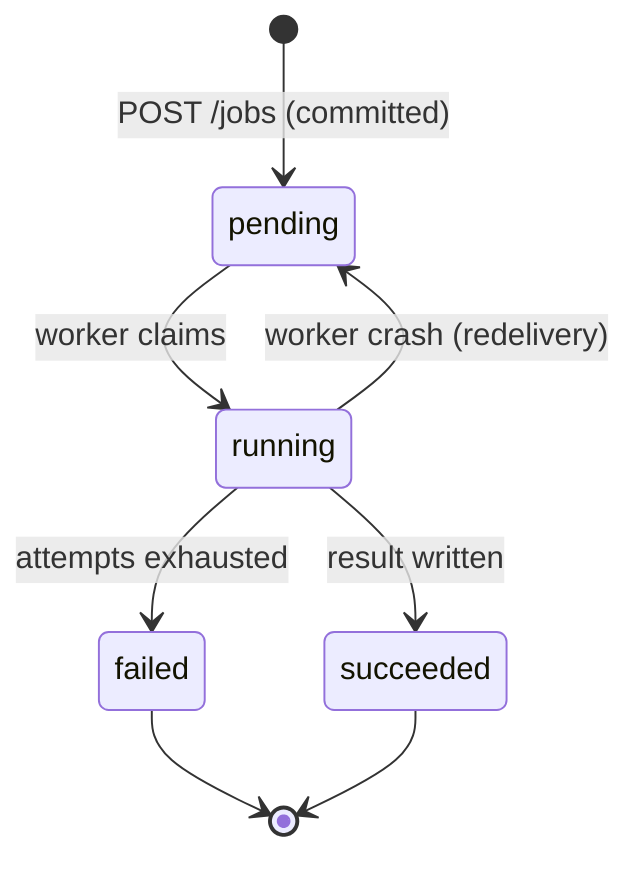
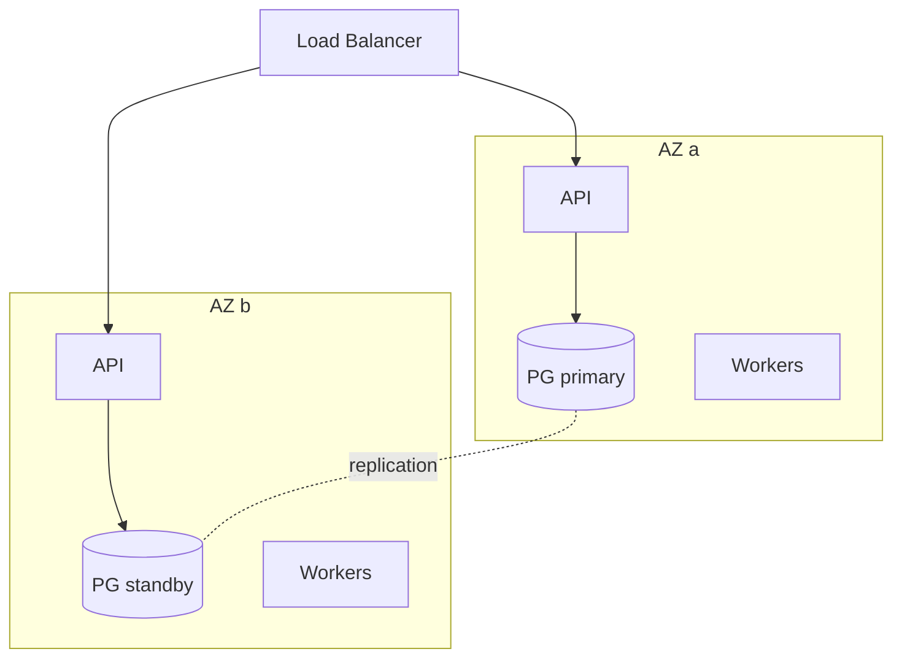

# Job Platform — Architecture

Diagrams and structural descriptions. Design *arguments* go in
[`design/`](../design/README.md); decisions become
[ADRs](../../../06-Architecture/ADRs/README.md).

## Component view

## Job state machine

The `running → pending` edge is the important one: it is not an error path, it
is the normal consequence of at-least-once delivery. Every transition must be
idempotent because it can be replayed.

## Deployment view

## Open architecture questions

- [ ] How many Kafka partitions, and what is the message key?
- [ ] Outbox relay: polling or CDC? (ADR-0002)
- [ ] Where does job status live — PostgreSQL only, or also a cache?
- [ ] Do workers need leader election, or is the consumer group sufficient?
