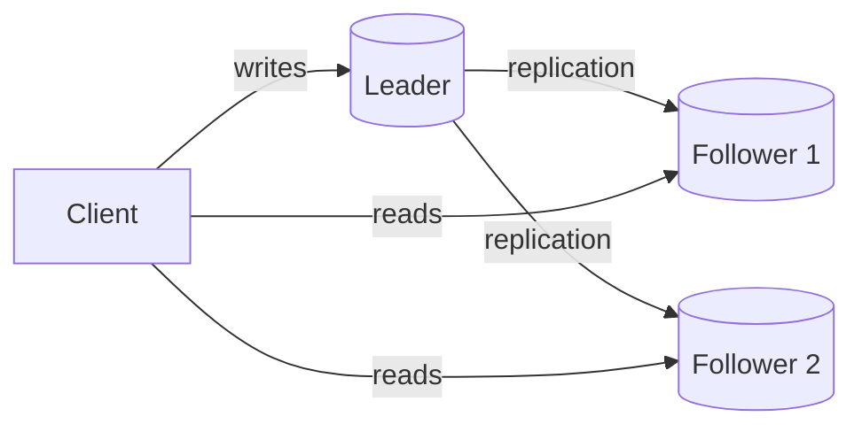
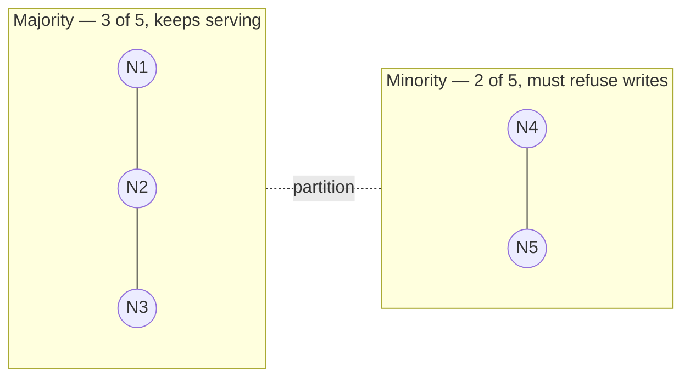
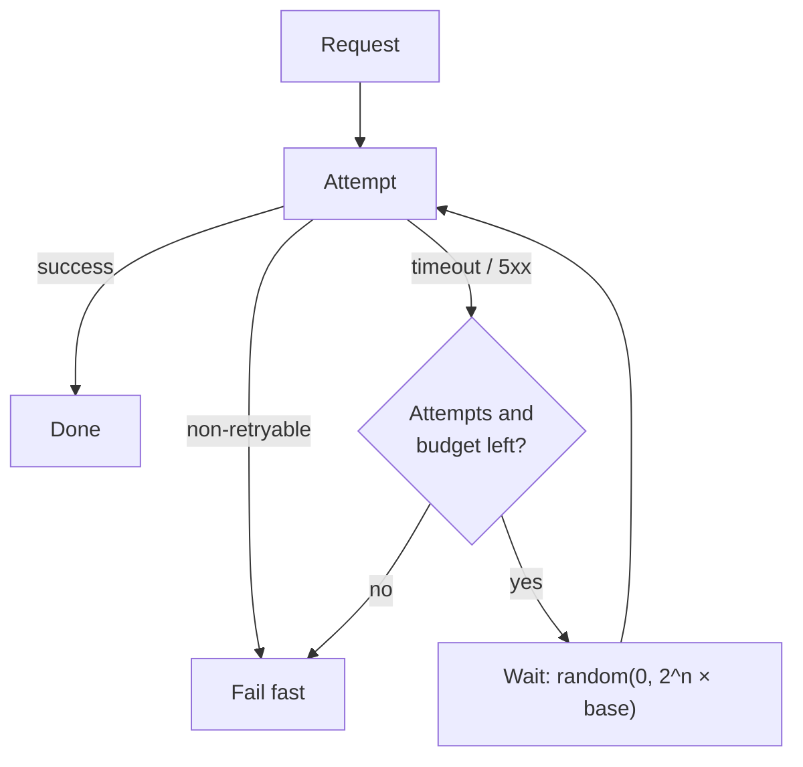
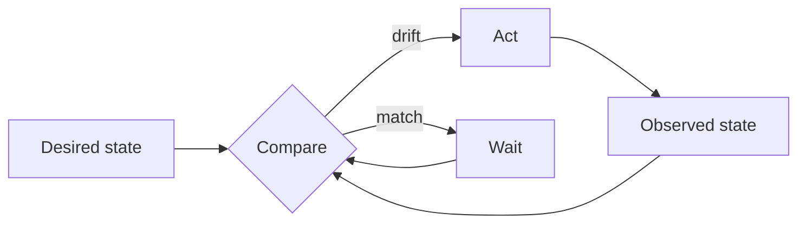
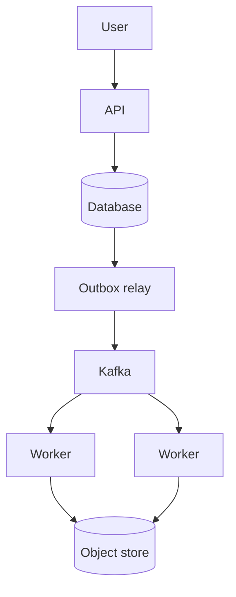

# Diagrams

All diagrams in this repository are [Mermaid](https://mermaid.js.org/) in
fenced code blocks. They render natively in **both** Obsidian and MkDocs
Material, stay diffable in Git, and need no binary assets.

Full authoring guidance is in [docs/mermaid.md](../../docs/mermaid.md).

## Conventions used here

| Element | Convention |
| --- | --- |
| Data stores | `[(Cylinder)]` — `PG[(PostgreSQL)]` |
| Services | `[Rectangle]` |
| Decisions | `{Diamond}` |
| External actors | `((Circle))` |
| Failures / removed paths | Dotted arrows `-.->` |
| Multi-line labels | ` ` inside quotes |

Quote any label containing punctuation: `A["hash(key) mod n"]`.

## Reusable diagrams

### Leader/follower replication

### Quorum under partition

### Request with retry and backoff

### Reconciliation loop

### Async job pipeline

