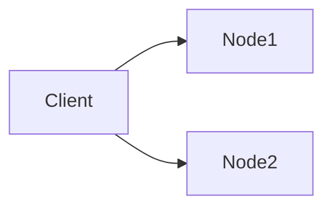

---
title:
type: lab
status: learning
topic:
difficulty:
tags:
created: "{{date:YYYY-MM-DD}}"
updated: "{{date:YYYY-MM-DD}}"
---

# {{title}}

## Goal

> One specific engineering question this lab answers.
> Good: "What happens to in-flight requests when the leader node crashes?"
> Bad: "Learn distributed systems."

## Concepts

Concepts this lab exercises.

## Prerequisites

- [ ] Tooling installed
- [ ] Concept notes read

## Architecture



## Setup

```bash
# Reproducible from a clean machine.
```

## Experiment

1.
2.
3.

## Failure Injection

How the failure is caused: process kill, network partition, added latency,
disk full, clock skew, dropped packets.

```bash
```

## Expected Result

What I predict *before* running it. Write this first — it is the whole point.

## Observations

Raw output, metrics, logs, timings.

## Actual Result

## Lessons Learned

Especially: where the prediction was wrong, and why.

## Related Concepts

## Cleanup

```bash
# Tear down containers, clusters, cloud resources. Check for anything billable.
```
