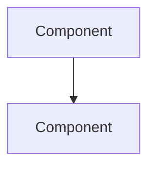

---
title:
type: concept
status: learning
topic:
difficulty:
tags:
created: "{{date:YYYY-MM-DD}}"
updated: "{{date:YYYY-MM-DD}}"
---

# {{title}}

## Learning Goals

- [ ]

## What Is It?

## Why Does It Matter?

## Core Concepts

## Architecture

## How It Works

## Failure Scenarios

| Failure | What breaks | How the system responds |
| --- | --- | --- |
|  |  |  |

## Real-World Systems

## Hands-on Experiment

> One concrete thing I can run or break to see this concept behave.

## My Understanding

> Write this section **without looking at any source**. If you cannot explain
> it here in your own words, you have read about the concept but not learned
> it. Come back and rewrite this after the hands-on experiment.

## Questions

- [ ]

## Related Concepts

## Resources
