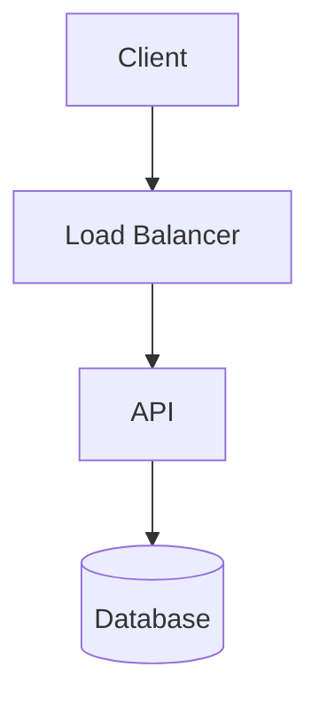

---
title:
type: project
status: learning
topic:
difficulty:
tags:
created: "{{date:YYYY-MM-DD}}"
updated: "{{date:YYYY-MM-DD}}"
---

# {{title}}

## Problem

## Motivation

Why this is worth building, and what it teaches that reading cannot.

## Goals

- [ ]

## Non-Goals

Explicitly out of scope. This section prevents the project from growing
without limit.

## Requirements

### Functional

### Non-Functional

| Dimension | Target |
| --- | --- |
| Throughput |  |
| Latency (p99) |  |
| Durability |  |
| Availability |  |

## Architecture

## Components

| Component | Responsibility | Technology |
| --- | --- | --- |
|  |  |  |

## Data Flow

## Failure Scenarios

| Failure | Blast radius | Mitigation |
| --- | --- | --- |
|  |  |  |

## Scaling Strategy

What breaks first at 10x, and what to do about it.

## Observability

Metrics, logs, traces. What question does each signal answer?

## Security

AuthN/AuthZ, secrets handling, network exposure, data at rest.

## Cost Considerations

## Design Decisions

Link to ADRs in `06-Architecture/ADRs/`.

## Experiments

## Lessons Learned
