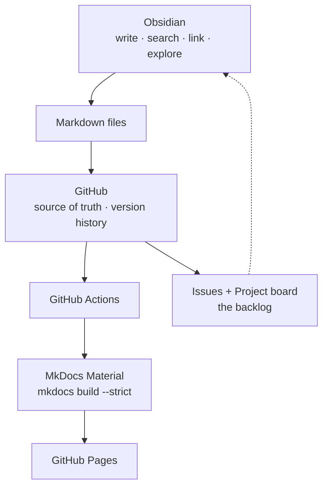

# Cloud & Distributed Systems Learning

A personal knowledge base for a six-month study of cloud computing and
distributed systems: written in **Obsidian**, versioned in **Git**, tracked
with **GitHub Issues and Projects**, and published as a static site with
**MkDocs Material** and **GitHub Pages**.

Plain Markdown all the way down. No database, no backend, no CMS.

---

## Purpose

Three jobs, one set of files:

| Purpose | Tool | What it does |
| --- | --- | --- |
| **Personal knowledge base** | Obsidian | Write, search, link, backlink, explore the graph |
| **Learning management** | GitHub Issues + Projects | What to do next, and what is in progress |
| **Public documentation** | MkDocs Material + Pages | The mature notes as a readable website |



**The Markdown files are the source of truth.** Obsidian is a user interface,
not a storage layer: there is no Obsidian database, no plugin store holding
knowledge, and nothing here stops working if Obsidian is uninstalled tomorrow.

---

## Learning objectives

By the end of six months:

- Explain consensus, replication and consistency models without notes
- Implement Raft leader election, log replication and persistence (MIT 6.5840)
- Build and operate a distributed job platform that survives worker crashes,
  broker restarts and database failover without losing or duplicating work
- Reason about cloud architecture: VPCs, load balancing, availability zones,
  RPO/RTO, and what each guarantee costs
- Explain Kubernetes as a distributed system — reconciliation on top of
  consensus — rather than as a set of commands
- Predict failure behaviour *before* injecting the failure, and be right more
  often than not

---

## Progress

**Started:** 2026-08-31 · **Currently:** Month 1, Week 1 · **Target:** 8–10 h/week

```text
Month 1  Foundations                    ░░░░░░░░░░░░   0%
Month 2  Replication and Consistency    ░░░░░░░░░░░░   0%
Month 3  Consensus                      ░░░░░░░░░░░░   0%
Month 4  Distributed Data Systems       ░░░░░░░░░░░░   0%
Month 5  Build the Job Platform         ░░░░░░░░░░░░   0%
Month 6  Kubernetes and Cloud           ░░░░░░░░░░░░   0%
```

| Artefact | Done | Target |
| --- | --- | --- |
| Concept notes with **My Understanding** written | 1 | ~40 |
| Labs with an **Actual Result** | 0 | 7 |
| ADRs | 1 | ~8 |
| MIT 6.5840 labs passing | 0 | 5 |

Current week: [`01-Roadmap/current-week.md`](01-Roadmap/current-week.md)

<!-- Update the bars above at each end-of-week review.
     Twelve cells: █ = done, ░ = remaining. -->

---

## Repository structure

```text
distributed-systems-learning-resources/
├── README.md                  ← this file; also the site home page
├── mkdocs.yml                 ← site configuration
├── requirements.txt           ← documentation toolchain
├── hooks/publishing.py        ← keeps drafts off the website
│
├── 00-Inbox/                  ← quick capture (never published)
├── 01-Roadmap/                ← the six-month plan, principles, current week
├── 02-Courses/                ← MIT 6.5840, UIUC Cloud Computing
├── 03-Concepts/               ← the knowledge base itself
│   ├── Distributed-Systems/   ← fundamentals, replication, consistency,
│   │                             consensus, fault tolerance
│   ├── Cloud/                 ← compute, networking, storage, reliability
│   ├── Databases/             ← transactions, replication, sharding, 2PC
│   ├── Messaging/             ← queues, Kafka, delivery semantics
│   └── Kubernetes/            ← control plane, etcd, controllers, reconciliation
├── 04-Labs/                   ← one experiment per engineering question
├── 05-Projects/               ← the Distributed Job Platform
├── 06-Architecture/           ← system design, diagrams, ADRs
├── 07-Resources/              ← courses, books, papers, videos, documentation
├── 99-Templates/              ← note templates (never published)
├── docs/                      ← handbook: conventions, publishing, setup
├── .github/                   ← Actions workflow, issue and PR templates
└── .obsidian/                 ← shared vault settings (see its README)
```

### Start here

| I want to... | Go to |
| --- | --- |
| See the plan | [Six-Month Roadmap](01-Roadmap/6-month-roadmap.md) |
| **See the whole subject at once** | [**Knowledge Map**](03-Concepts/README.md) — graphs + every concept |
| See a finished note | [Raft](03-Concepts/Distributed-Systems/Consensus/Raft.md) |
| See a finished lab | [Lab 02 — Timeouts and Retries](04-Labs/02-Timeouts-Retries/README.md) |
| See a decision recorded | [ADR-0001 — Use Kafka for job dispatch](06-Architecture/ADRs/0001-use-kafka-for-job-dispatch.md) |
| Set up Obsidian | [Setup — Obsidian](docs/setup/obsidian.md) |
| Understand the conventions | [Conventions](docs/conventions.md) |
| Find good resources | [Resources](07-Resources/README.md) |

---

## The six-month roadmap

| Month | Theme | Key output |
| --- | --- | --- |
| **1** | Foundations — partial failure, RPC, retries, cloud basics, networking | Concept notes; Labs 01–02 |
| **2** | Replication and consistency — CAP, quorums, consistency models | Lab 04; the consistency map |
| **3** | Consensus — leader election, Raft, recovery | MIT 6.5840 Labs 3A–3C; Lab 05 |
| **4** | Distributed data — transactions, sharding, Kafka, delivery semantics | Labs 03, 06 |
| **5** | Build — the Distributed Job Platform | A running system; Lab 07 |
| **6** | Kubernetes and cloud architecture — control plane, HA, DR | Capstone documentation |

Full week-by-week detail: [`01-Roadmap/6-month-roadmap.md`](01-Roadmap/6-month-roadmap.md).

---

## How to use Obsidian with this repository

Full guide: [`docs/setup/obsidian.md`](docs/setup/obsidian.md). In short:

1. Install [Obsidian](https://obsidian.md) — free, no account needed
2. Clone this repository (**not** into Dropbox/iCloud/OneDrive — Git is the
   sync mechanism)
3. **Open folder as vault** → select the cloned directory. That is the whole
   import step; the repository *is* the vault
4. Verify **Settings → Files and links**: wikilinks **off**, new link format
   **relative**. These ship in `.obsidian/app.json` and are the settings that
   keep links working outside Obsidian
5. Verify **Settings → Templates** → `99-Templates`
6. Configure Git — CLI recommended; the Obsidian Git plugin is optional and its
   trade-offs are documented

Daily use:

- `Cmd/Ctrl + O` — jump to any note
- `Cmd/Ctrl + N` then `Cmd/Ctrl + T` — new note from a template
- **Backlinks** pane — what links here. The most useful panel in the app
- **Graph view** — see which concepts are isolated; those are the gaps

---

## How to run MkDocs locally

```bash
python3 -m venv .venv
source .venv/bin/activate          # Windows: .venv\Scripts\activate
pip install -r requirements.txt

mkdocs serve                       # http://127.0.0.1:8000, live reload
mkdocs build --strict              # what CI runs; output in site/
```

`site/` is git-ignored and regenerated on every build — never edit or commit
it. More detail: [`docs/setup/local-mkdocs.md`](docs/setup/local-mkdocs.md).

---

## How to commit changes

```bash
git pull --rebase                  # start of session

# ... write in Obsidian ...

git status
git diff                           # read this — it is where you catch mistakes
git add -A
git commit -m "Raft: write My Understanding after Lab 3B"
git push                           # Actions rebuilds and deploys
```

Write commit messages as study-log entries; `git log -p` on a note then shows
how your understanding changed over six months. Full guide, including which
`.obsidian` files to version and which to ignore:
[`docs/git-workflow.md`](docs/git-workflow.md).

---

## What gets published

The repository root **is** the MkDocs docs directory — one copy of every file,
no duplication, no export step. Two filters decide what reaches the website:

| Filter | Mechanism | Excludes |
| --- | --- | --- |
| Path | `exclude_docs` in `mkdocs.yml` | `00-Inbox/`, `99-Templates/`, `.obsidian/`, `.github/`, tooling |
| Frontmatter | `hooks/publishing.py` | `status: draft`, `status: inbox`, `publish: false` |

To keep a note off the site: put it in `00-Inbox/`, or set `status: draft`, or
set `publish: false`.

!!! danger "Unpublished is not private"
    Every file here is still committed to Git. On a public repository, a note
    excluded from the website is still readable in the repository. Genuinely
    confidential material does not belong in this repository at all.

Details: [`docs/publishing.md`](docs/publishing.md).

---

## How to contribute to the learning system

This is a personal knowledge base, but it is designed to be extended
predictably — by future-you, or by anyone who forks it.

**Adding a concept note**

1. Create the file in the right folder with a human-readable name
   (`Consistent Hashing.md`)
2. Apply `99-Templates/Learning-Note.md`
3. Fill the frontmatter; set `status: learning`
4. Write the content — and **My Understanding** with sources closed
5. Link related concepts in both directions
6. Add it to [`03-Concepts/README.md`](03-Concepts/README.md)
7. `mkdocs build --strict`, then commit

**Adding a lab**

Create `04-Labs/NN-Name/README.md` from `99-Templates/Lab-Note.md`. One
question. Prediction written before the run. Row added to the labs index.

**Recording a decision**

`06-Architecture/ADRs/NNNN-title.md` from `99-Templates/ADR.md`. Accepted ADRs
are never edited — supersede them with a new one.

**House rules**

- Relative Markdown links with `.md`, never wikilinks
- Mermaid checked in **both** Obsidian and `mkdocs serve` before committing
- `mkdocs build --strict` passes before pushing
- Keep the frontmatter schema at seven fields. A note is a document, not a
  database record

The full conventions are in [`docs/conventions.md`](docs/conventions.md), and
the reasoning behind the study method is in
[`01-Roadmap/learning-principles.md`](01-Roadmap/learning-principles.md).

---

## Security

This repository is intended to be public, and everything committed is
permanent — history survives deletion of the file.

**Never commit:**

- API keys, access tokens, personal access tokens
- Cloud credentials (`~/.aws/credentials`, service account JSON, `kubeconfig`)
- Passwords or connection strings containing them
- `.env` files
- Private SSH keys or TLS private keys
- Terraform state or `.tfvars` files
- Employer-internal architecture, hostnames or data

`.gitignore` blocks the common shapes of all of these, but **`.gitignore` is a
convenience, not a control**. The control is reading `git diff` before you
commit.

**In lab notes, use placeholders:**

```bash
export DB_PASSWORD="<from your password manager>"   # not the real value
export AWS_PROFILE=learning                          # a profile name is fine
```

**A quick check before pushing:**

```bash
git diff --cached | grep -nEi '(api[_-]?key|secret|password|token|BEGIN [A-Z ]*PRIVATE KEY)'
```

**If a secret is committed:** rotate it at the provider *first* — before
touching Git. Cleaning history with `git filter-repo` or BFG is worth doing
afterwards, but it does not un-leak anything. Assume anything pushed is
compromised.

For cloud labs, use a dedicated learning account with a hard billing alarm, and
run the cleanup step at the end of every lab.

---

## Design constraints

Deliberately **not** built here: a custom note editor, a database, a backend
API, an authentication system, a CMS, metadata automation, or a complicated
publishing pipeline. The entire system is:

```text
Obsidian + Markdown + Git + GitHub + MkDocs + GitHub Actions
```

Every part is replaceable, and the content outlives all of them. That is the
point.

---

## Licence

Personal learning notes. No licence is asserted over quoted material from the
courses, books and papers cited in [`07-Resources/`](07-Resources/README.md);
those belong to their authors.
