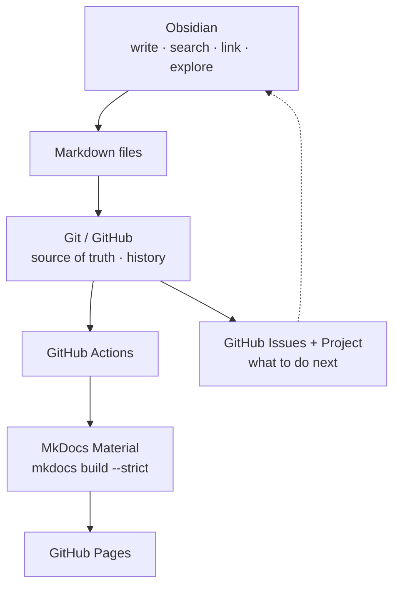

# Handbook

How this knowledge base works. Everything here is about the *system*, not the
subject matter.

| Document | Answers |
| --- | --- |
| [Conventions](conventions.md) | How do I name files, write frontmatter and link notes? |
| [Publishing](publishing.md) | Which notes appear on the website, and how do I keep one private? |
| [Git Workflow](git-workflow.md) | How do I get a note from Obsidian to the published site? |
| [Mermaid](mermaid.md) | How do I draw diagrams that work in both Obsidian and MkDocs? |
| [Setup — Obsidian](setup/obsidian.md) | What do I do manually after cloning? |
| [Setup — MkDocs locally](setup/local-mkdocs.md) | How do I preview and build the site? |
| [Setup — GitHub](setup/github.md) | Repository, Pages, Issues, Project board |

## The architecture in one diagram

The property that matters: **there is exactly one copy of every Markdown
file.** Obsidian edits it, Git versions it, MkDocs publishes it. No sync step,
no duplicate `docs/` tree, no export.

## What this system is not

No custom editor, no database, no backend, no CMS, no metadata automation. If
something here starts to need one of those, the design has gone wrong — see
[Learning Principles](../01-Roadmap/learning-principles.md), principle 7.
